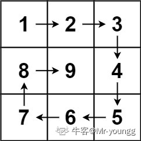
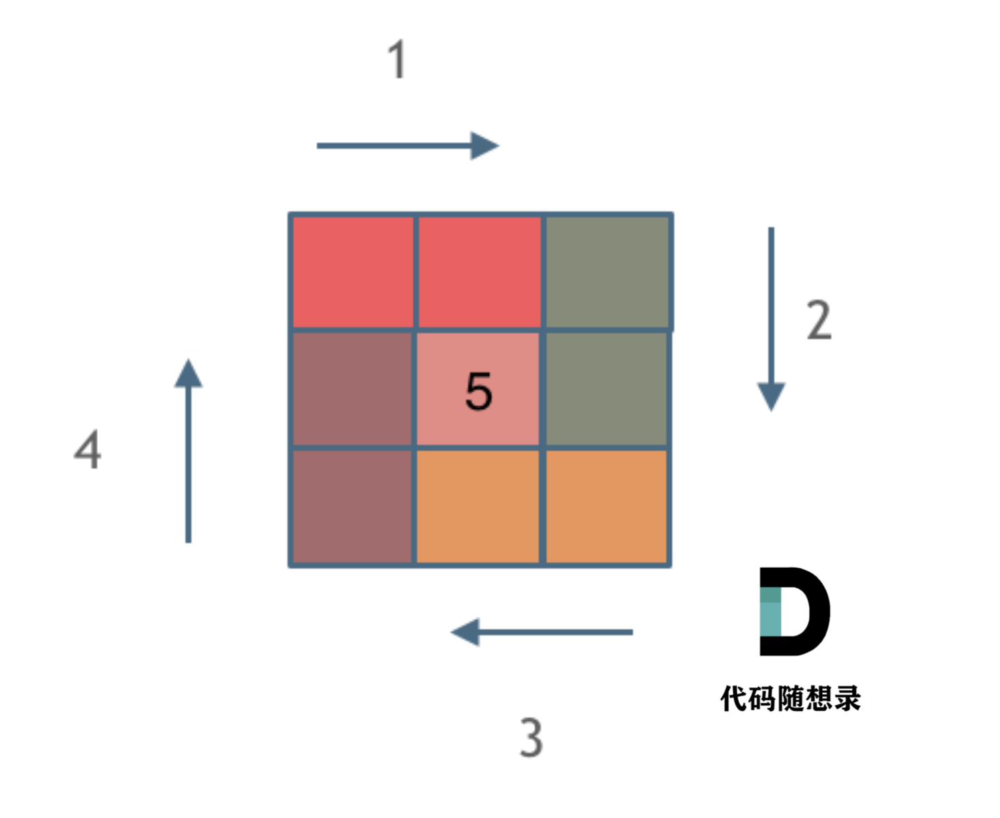

## 一、有序数组的平方

[977.有序数组的平方](https://leetcode.cn/problems/squares-of-a-sorted-array/)

[代码随想录文章讲解](https://programmercarl.com/0977.%E6%9C%89%E5%BA%8F%E6%95%B0%E7%BB%84%E7%9A%84%E5%B9%B3%E6%96%B9.html)

[代码随想录视频讲解](https://www.bilibili.com/video/BV1QB4y1D7ep)

### 1、概述

​		给你一个按 **非递减顺序** 排序的整数数组 `nums`，返回 **每个数字的平方** 组成的新数组，要求也按 **非递减顺序** 排序。

### 2、思想

1. 观察数组结构不难发现，平方后较大的数必然在数组两头（首尾），考虑双指针法（前后指针）;
2. 定义一个新数组result，k指针初始指向result的末尾（因为新数组也要非递减排序）;
3. 前指针（front）初始指向nums首个元素，后指针（back）初始指向nums末尾元素，判断nums[front]^2和nums[back]^2的大小关系，将较大的移入result中，更新k值，同时更新front和back值。


### 3、代码

```c++
class Solution {
public:
    vector<int> sortedSquares(vector<int>& nums) {
    
     // 定义储存结果的数组
    vector<int> result(nums.size(), 0);

    // 定义头尾指针
    int head = 0;
    int tail = nums.size() - 1;

    // 定义结果数组指针，从末尾开始遍历；
    int result_p = result.size() - 1;

    // 循环判断，平方值较大的放入result中；尾指针小于头指针时停止循环；
    while (head <= tail)
    {
        if (nums[head] * nums[head] >
            nums[tail] * nums[tail])
        {
            result[result_p] = nums[head] * nums[head];//注意要用平方后的值替代
            head++;
        }
        else
        {
            result[result_p] = nums[tail] * nums[tail];//注意要用平方后的值替代
            tail--;
        }
        result_p--;//注意结果数组指针是--
    }
    return result;
}
};
```

### 4、注意点

- while循环必须包含front=back的情况，否则会遗漏front=back同时指向的元素；
- result数组应该从后往前遍历；

## 二、长度最小的子数组

[209.长度最小的子数组](https://leetcode.cn/problems/minimum-size-subarray-sum/)

[文章讲解](https://programmercarl.com/0209.%E9%95%BF%E5%BA%A6%E6%9C%80%E5%B0%8F%E7%9A%84%E5%AD%90%E6%95%B0%E7%BB%84.html)

[视频讲解](https://www.bilibili.com/video/BV1tZ4y1q7XE)

### 1、概述

1. 给定一个含有 n个正整数的数组和一个正整数 target **。**
2. 找出该数组中满足 **其总和大于等于 target** 的长度最小的 **连续子数组** [numsl, numsl+1, ..., numsr-1, numsr] ，并返回其长度**。**如果不存在符合条件的子数组，返回 0 。

**示例 ：**

```
输入：target = 7, nums = [2,3,1,2,4,3]
输出：2
解释：子数组 [4,3] 是该条件下的长度最小的子数组。
```

### 2、题解

1. **暴力解法——双循环（超出时间限制）**

    ```c++
    class Solution {
    public:
        int minSubArrayLen(int target, vector<int>& nums) {
            int head = 0;           // 子数组头
            int tail = 0;           // 子数组末尾
            int length = INT32_MAX; // 子数组长度
    
            for (head; head < nums.size(); head++)
            {
                int sum = 0; // 子数组的和
                for (tail = head; tail < nums.size(); tail++)
                {
                    sum = sum + nums[tail];
                    if (sum >= target)
                    {
                        length = ((tail - head + 1) < length) ? (tail - head + 1) : length;
                        // cout << "head:" << head<<" ";
                        // cout << "tail:" << tail << " ";
                        // cout<<"length:"<<length<<endl;
                        break;//找到符合的即可跳出内层循环，不需要再关注更长的子数组
                    }
                }
            }
            return length == INT32_MAX ? 0 : length;
        }
    };
    ```

    

2. **优化解法——滑动窗口**

    1. 题目需要找到最短的连续子串，考虑滑动窗口（Slid Window），本质上也是双指针。

    2. 左边缘（left）和右边缘（right）分别指向滑动窗口的首尾元素，初始时均指向nums首元素，窗口长度Win_Length（Tail-Head+1）为1；定义Sum为窗口内元素的和，初始值为0。

    3. **自敲——26行有问题**

        ```c++
        class Solution
        {
        public:
            int minSubArrayLen(int target, vector<int> &nums)
            {
        
                int left = 0;
                int right = 0;
                int length = INT32_MAX;
                int sum = 0;
        
                while (right < nums.size())
                {
                    if (sum >= target)
                    {
                        length = (right - left + 1) < length ? (right - left + 1) : length;
                        sum -= nums[left];
                        cout << "left:" << left << " ";
                        cout << "right:" << right << " ";
                        cout << "sum:" << sum << " ";
                        cout << "length:" << length << endl;
                        left++;
                    }
                    else
                    {
                        right++; // 无法在right++的同时保证不越界
                        sum += nums[right];
                    }
                }
                return length == INT32_MAX ? 0 : length;
            }
        };
        ```

    4. **优化——AC**

        ```c++
        class Solution
        {
        public:
            int minSubArrayLen(int target, vector<int> &nums)
            {
                int left = 0;
                int right = 0;
                int length = INT32_MAX;
                int sum = 0;
        
                for (right; right < nums.size(); right++) // right在++的同时能够保证不越界
                {
                    sum += nums[right]; // 保证每次right++的同时sum改变
                    while (sum >= target)
                    {
        
                        length = (right - left + 1) < length ? (right - left + 1) : length;
                        // cout << "left:" << left << " ";
                        // cout << "right:" << right << " ";
                        // cout << "sum:" << sum << " ";
                        // cout << "length:" << length << endl;
                        sum -= nums[left];
                        left++;
                    }
                }
                return length == INT32_MAX ? 0 : length;
            }
        };
        ```

### 3、注意点

1. 在for循环中判断并更新right，可以保证right每次的++都不越界；
2. 善用双目运算符（：？）来取代if...else...逻辑；
3. 滑动窗口解法本质上是削去了“暴力解法”中——”内层循环“每次都从头部再次扫描的冗余；

## 三、螺旋矩阵Ⅱ

[59.长度最小的子数组](https://leetcode.cn/problems/spiral-matrix-ii/)

[文章讲解](https://programmercarl.com/0059.%E8%9E%BA%E6%97%8B%E7%9F%A9%E9%98%B5II.html)

[视频讲解](https://www.bilibili.com/video/BV1SL4y1N7mV/)

### 1、概述

​    给你一个正整数 n ，生成一个包含 1 到 n2 所有元素，且元素按顺时针顺序螺旋排列的 n x n 正方形矩阵 。

​    **示例 1：**


### 2、思想

1. 按照：上行、右列、下行、左列的顺序一圈圈依次给n阶矩阵赋值，若n为单数则在最后单独给矩阵中间位置赋值。

2. 关键在于考虑循环不变量：每一行（列）都遵循一种赋值方式——左闭右开或左开右闭。如左闭右开：当前行（列）的首个元素由当前行负责赋值，最后一个元素由下一列（行）负责赋值。
    

3. **自敲代码**

    ```c++
    #include <iostream>
    using namespace std;
    #include <vector>
    class Solution
    {
    public:
        vector<vector<int>> generateMatrix(int n)
        {
    
            // 声明且初始化数组，如果不初始化则不能直接用“=”赋值，需要用push_back
            vector<vector<int>> result(n, vector<int>(n, 0));
    
            int loops = n / 2;      // 循环次数（转几圈）
            int edge_loops = n - 1; // 每条边需要循环的次数（所谓的循环不变量！）个人感觉比用offset更简洁
            int current_row = 0;    // 当前行
            int current_col = 0;    // 当前列
            int current_num = 1;    // 填入的数字
    
            for (int i = 0; i < loops; i++)
            {
                // 上边
                for (int j = 0; j < edge_loops; j++)
                {
                    cout << "row:" << current_row << "; ";
                    cout << "col:" << current_col << "; ";
                    cout << "num:" << current_num << endl;
                    result[current_row][current_col] = current_num;
                    current_num++; // 填入的数字每次++
                    current_col++; // 改变列，行不变
                }
    
                // 右边
                for (int j = 0; j < edge_loops; j++)
                {
                    cout << "row:" << current_row << "; ";
                    cout << "col:" << current_col << "; ";
                    cout << "num:" << current_num << endl;
                    result[current_row][current_col] = current_num;
                    current_num++; // 填入的数字每次++
                    current_row++; // 改变行，列不变
                }
    
                // 下边
                for (int j = 0; j < edge_loops; j++)
                {
                    cout << "row:" << current_row << "; ";
                    cout << "col:" << current_col << "; ";
                    cout << "num:" << current_num << endl;
                    result[current_row][current_col] = current_num;
                    current_num++;
                    current_col--; // 改变列，行不变
                }
    
                // 左边
                for (int j = 0; j < edge_loops; j++)
                {
                    cout << "row:" << current_row << "; ";
                    cout << "col:" << current_col << "; ";
                    cout << "num:" << current_num << endl;
                    result[current_row][current_col] = current_num;
                    current_num++;
                    current_row--; // 改变行，列不变
                }
    
                // 将当前的行、列转移到内一层
                current_row++;
                current_col++;
                // 每条边的循环次数减2
                edge_loops -= 2;
            }
    
            // 处理中间的方格（n为单数时才存在）
            if (n % 2 == 1)
            {
                result[n / 2][n / 2] = n * n; // 赋值的数组索引为(n/2,n/2),列一下就找到规律了
            }
    
            return result;
        }
    };
    ```

### 3、注意点

1. 用vector创建二维数组：`vector<vector<int>> Result(n,vector<int>(n,0));`必须初始化，否则**不能用“=”逐元素赋值**，要用**push_back()方法**；
2. 每一行（列）都遵循一种赋值方式——**左闭右开（笔者选取）**或左开右闭；
3. 每转一圈，行、列均**+1**，每条边上的循环次数**-2**；
4. 最中间的位置，索引应该为**(n/2,n/2)**；n=1,(0,0)；n=3,(1,1)；n=5,(2,2)；

### 5、其他题目

#### （1）螺旋遍历二维数组

[力扣题目链接：螺旋遍历二维数组](https://leetcode.cn/problems/shun-shi-zhen-da-yin-ju-zhen-lcof/submissions/490202066/)

## 四、总结

#### 1、二分查找

关键在于循环条件（或者说跳出循环的条件）的确定；

#### 2、移除元素

快慢指针的思想，事实上可以将慢指针看成指向一个空数组的指针，更好理解；

#### 3、有序数组的平方

注意观利用题目给出的条件，利用其两头大中间小的特点，头尾指针解决；

#### 4、长度最小子数组

两层循环可以看成滑动窗口的冗余版，每次窗口前沿移动时，后沿都需要从前沿开始遍历；删掉这部分冗余即可；

#### 5、螺旋矩阵

紧抓每次循环中的循环不变量！！
