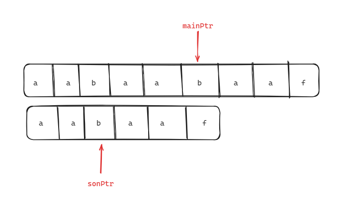
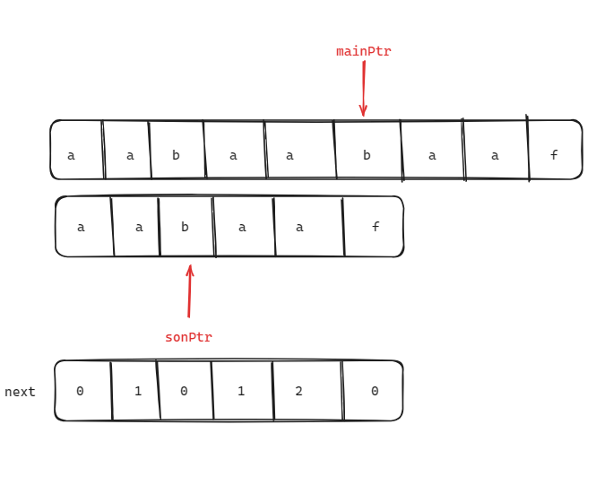

### 一、151.反转字符串里的单词

[151. 反转字符串中的单词 - 力扣（LeetCode）](https://leetcode.cn/problems/reverse-words-in-a-string/description/)

[代码随想录 (programmercarl.com)](https://programmercarl.com/0151.翻转字符串里的单词.html)

给你一个字符串 `s` ，请你反转字符串中 **单词** 的顺序。

**单词** 是由非空格字符组成的字符串。`s` 中使用至少一个空格将字符串中的 **单词** 分隔开。

返回 **单词** 顺序颠倒且 **单词** 之间用单个空格连接的结果字符串。

**注意：**输入字符串 `s`中可能会存在前导空格、尾随空格或者单词间的多个空格。返回的结果字符串中，单词间应当仅用单个空格分隔，且不包含任何额外的空格。

**示例 1：**

```
输入：s = "the sky is blue"
输出："blue is sky the"
```

**示例 2：**

```
输入：s = "  hello world  "
输出："world hello"
解释：反转后的字符串中不能存在前导空格和尾随空格。
```

**示例 3：**

```
输入：s = "a good   example"
输出："example good a"
解释：如果两个单词间有多余的空格，反转后的字符串需要将单词间的空格减少到仅有一个。
```

**提示：**

- `1 <= s.length <= 104`
- `s` 包含英文大小写字母、数字和空格 `' '`
- `s` 中 **至少存在一个** 单词

#### 1、思路

1. 先去除字符串中的多余空格；

    ```c++
     void removeExtraSpace(string &s)
        {
            int fast = 0, slow = 0;
            for (fast; fast < s.size(); fast++)
            {
                if (s[fast] != ' ')
                {
                    // 除第一个单词外，为其余单词之前加上空格
                    if (slow > 0)
                    {
                        s[slow++] = ' ';
                    }
                    while (s[fast] != ' ' && fast < s.size())
                    {
                        s[slow++] = s[fast++];
                    }
                }
            }
            s.resize(slow);
        }
    ```

2. 将整个字符串反转；

3. 再依次反转每个单词（以空格为界限）；

#### 2、注意点

1. 去除多余空格的代码可以参考**chap3：二、移除元素**，在这里就相当于移除空格；
2. 移除空格思路：移除所有空格，除第一个单词外，其余单词之前都加上一个空格（当fast遇到非空格时，先为slow指向的位置添加一个空格，再转移整个单词）；

#### 3、代码

```c++
/*
 * @lc app=leetcode.cn id=151 lang=cpp
 *
 * [151] 反转字符串中的单词
 */

// @lc code=start
#include <iostream>
#include <string>
using namespace std;

class Solution
{
public:
    // 实现左闭右闭的字符串交换函数
    void reverseStr(string &s, int left, int right)
    {
        while (left < right)
        {
            swap(s[left++], s[right--]);
        }
    }

    void removeExtraSpace(string &s)
    {
        int fast = 0, slow = 0;
        for (fast; fast < s.size(); fast++)
        {
            if (s[fast] != ' ')
            {
                // 除第一个单词外，为其余单词之前加上一个空格
                if (slow > 0)
                {
                    s[slow++] = ' ';
                }
                // 转移整个单词
                while (s[fast] != ' ' && fast < s.size())
                {
                    s[slow++] = s[fast++];
                }
            }
        }
        s.resize(slow);
    }

    string reverseWords(string s)
    {
        removeExtraSpace(s);
        reverseStr(s, 0, s.size() - 1);

        int left = 0;
        int right = 0;
        for (right; right <= s.size(); right++)
        {
            // 遇到空格或者走到末尾，代表需要反转当前两个指针之间的单词
            if (s[right] == ' ' || right == s.size())
            {
                reverseStr(s, left, right - 1); // 反转当前单词
                left = right + 1;               // 更新下一个单词的左边界
            }
        }
        return s;
    }
};
// @lc code=end

```

### 二、卡码网 55.右旋转字符串

[55. 右旋字符串（第八期模拟笔试） (kamacoder.com)](https://kamacoder.com/problempage.php?pid=1065)

[右旋字符串 | 代码随想录 (programmercarl.com)](https://programmercarl.com/kamacoder/0055.右旋字符串.html)

###### 题目描述

字符串的右旋转操作是把字符串尾部的若干个字符转移到字符串的前面。给定一个字符串 s 和一个正整数 k，请编写一个函数，将字符串中的后面 k 个字符移到字符串的前面，实现字符串的右旋转操作。 

例如，对于输入字符串 "abcdefg" 和整数 2，函数应该将其转换为 "fgabcde"。

###### 输入描述

输入共包含两行，第一行为一个正整数 k，代表右旋转的位数。第二行为字符串 s，代表需要旋转的字符串。

###### 输出描述

输出共一行，为进行了右旋转操作后的字符串。

###### 输入示例

```
2
abcdefg
```

###### 输出示例

```
fgabcde
```

###### 提示信息

数据范围：
1 <= k < 10000,
1 <= s.length < 10000;

#### 1、思路

1. 先将字符串整体反转；
2. 再将前k个反转；
3. 最后将剩余的后段字符串反转；

#### 2、注意点

​	注意字符串反转函数（revers）的区间，是左闭右开还是左闭右闭；

#### 3、代码

```c++
#include <iostream>
#include <vector>
#include <string>
using namespace std;

// 在左闭右闭区间实现字符串反转
void reverseStr(string &s, int begin, int end)
{
    if (begin < 0 || end >= s.size())
    {
        cout << "wrong range" << endl;
    }
    while (begin < end)
    {
        swap(s[begin++], s[end--]);
    }
}

int main()
{
    int k = 0;
    string s;
    cin >> k;
    cin >> s;

    reverseStr(s, 0, s.size() - 1);
    reverseStr(s, 0, k - 1);
    reverseStr(s, k, s.size() - 1);

    cout << s << endl;

    system("pause");
    return 0;
}
```

### 三、28. 找出字符串中第一个匹配项的下标

#### 1、KMP算法理论

1. 在字符串前缀和后缀存在相等子串时，可以利用这一点减少不必要的遍历；
2. 如图，当遍历到f和b失配时，由于f之前的子串有相同的前后缀“aa”，因此返回第3个字符b遍历即可（mainPtr不变，因此mainPtr只需要遍历一次）；
    
    
3. 关键在于失配时sonPtr应该去哪，这就是next数组的作用，也就是前缀表；
4. next[i]存储的是在i+1位置失配时，sonPtr应该跳转到的位置；也是子串中0~i元素中最长的相等前后缀；
    

#### 2、题目整体思路

1. 获取子串对应的next数组；
2. 遍历文本主串和子串，当遇到失配时，将子串的遍历指针sonPtr指向next[sonPtr-1]对应的位置；
3. 若sonPtr超出子串的范围，返回mainPtr-(sonPtr-1)；
4. 若mainPtr超出文本主串范围，返回-1；

#### 4、代码

```c++
/*
 * @lc app=leetcode.cn id=28 lang=cpp
 *
 * [28] 找出字符串中第一个匹配项的下标
 */

// @lc code=start
#include <iostream>
#include <vector>
#include <string>
#include <assert.h>
using namespace std;

class Solution
{
public:
    void getNextArr(const string &s, int *next)
    {
        next[0] = 0;
        int prefix = 0; // 前缀指针
        int suffix = 1; // 后缀指针

        for (suffix; suffix < s.size(); suffix++)
        {
            // 前后缀不匹配
            // 需要先执行，因为前缀更新后就可能出现匹配的情况
            while (prefix > 0 && s[prefix] != s[suffix])
            {
                prefix = next[prefix - 1];
            }
            // 前后缀匹配
            if (s[prefix] == s[suffix])
            {
                prefix++;
            }
            next[suffix] = prefix;
        }
    }
    int strStr(string haystack, string needle)
    {
        int next[needle.size()];
        // 获取next数组
        getNextArr(needle, next);

        int mainPtr = 0;
        int sonPtr = 0;
        for (mainPtr; mainPtr < haystack.size(); mainPtr++)
        {
            while (haystack[mainPtr] != needle[sonPtr] && sonPtr > 0)
            {
                sonPtr = next[sonPtr - 1];
            }

            if (haystack[mainPtr] == needle[sonPtr])
            {
                sonPtr++;
            }

            if (sonPtr == needle.size())
            {
                return mainPtr - (sonPtr - 1);
            }
        }
        return -1;
    }
};
// @lc code=end

```

