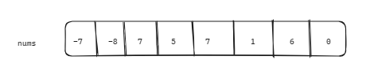
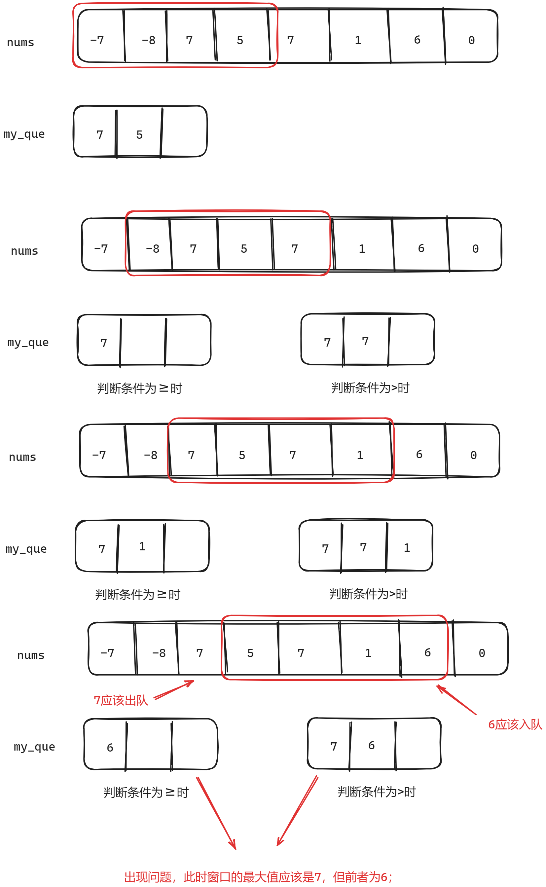
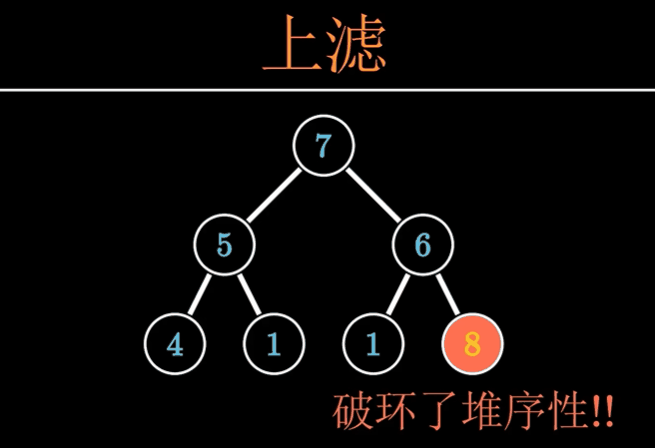
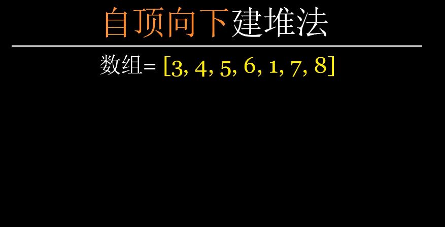
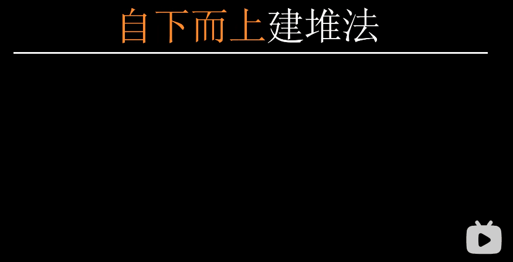

### 一、0150.逆波兰表达式求值

[150. 逆波兰表达式求值 - 力扣（LeetCode）](https://leetcode.cn/problems/evaluate-reverse-polish-notation/description/)

[代码随想录 (programmercarl.com)](https://programmercarl.com/0150.逆波兰表达式求值.html#算法公开课)

给你一个字符串数组 `tokens` ，表示一个根据 [逆波兰表示法](https://baike.baidu.com/item/逆波兰式/128437) 表示的算术表达式。

请你计算该表达式。返回一个表示表达式值的整数。

**注意：**

- 有效的算符为 `'+'`、`'-'`、`'*'` 和 `'/'` 。
- 每个操作数（运算对象）都可以是一个整数或者另一个表达式。
- 两个整数之间的除法总是 **向零截断** 。
- 表达式中不含除零运算。
- 输入是一个根据逆波兰表示法表示的算术表达式。
- 答案及所有中间计算结果可以用 **32 位** 整数表示。

**示例 1：**

```
输入：tokens = ["2","1","+","3","*"]
输出：9
解释：该算式转化为常见的中缀算术表达式为：((2 + 1) * 3) = 9
```

**示例 2：**

```
输入：tokens = ["4","13","5","/","+"]
输出：6
解释：该算式转化为常见的中缀算术表达式为：(4 + (13 / 5)) = 6
```

**示例 3：**

```
输入：tokens = ["10","6","9","3","+","-11","*","/","*","17","+","5","+"]
输出：22
解释：该算式转化为常见的中缀算术表达式为：
  ((10 * (6 / ((9 + 3) * -11))) + 17) + 5
= ((10 * (6 / (12 * -11))) + 17) + 5
= ((10 * (6 / -132)) + 17) + 5
= ((10 * 0) + 17) + 5
= (0 + 17) + 5
= 17 + 5
= 22
```

#### 1、逆波兰表达式

逆波兰表达式是一种后缀表达式，所谓后缀就是指算符写在后面。

- 平常使用的算式则是一种中缀表达式，如 `( 1 + 2 ) * ( 3 + 4 )` 。
- 该算式的逆波兰表达式写法为 `( ( 1 2 + ) ( 3 4 + ) * )` 。

逆波兰表达式主要有以下两个优点：

- 去掉括号后表达式无歧义，上式即便写成 `1 2 + 3 4 + * `也可以依据次序计算出正确结果。
- 适合用栈操作运算：遇到数字则入栈；遇到算符则取出栈顶两个数字进行计算，并将结果压入栈中

#### 2、思路

​	如上所述，遇到数字就入栈，遇到符号就取出栈顶的两个数字运算；

#### 3、注意点

1. 后取出的数作为首个运算数（在除法和减法中有区别）；
2. stoi()：将sting转为int；

#### 4、代码

```c++
/*
 * @lc app=leetcode.cn id=150 lang=cpp
 *
 * [150] 逆波兰表达式求值
 */

// @lc code=start
#include <iostream>
#include <vector>
#include <stack>
#include <string>
using namespace std;

class Solution
{
public:
    int evalRPN(vector<string> &tokens)
    {
        // 注意输入的vector内部是string
        stack<int> RPN_stack;
        for (string s : tokens)
        {
            int num1 = 0;
            int num2 = 0;

            // 如果是符号，则将栈顶的两个数字取出来运算
            // 注意后取出的作为首个运算数（除法和减法中有区别）
            if (s == "+" || s == "-" || s == "*" || s == "/")
            {
                num1 = RPN_stack.top();
                RPN_stack.pop();
                num2 = RPN_stack.top();
                RPN_stack.pop();

                if (s == "+")
                    RPN_stack.push(num2 + num1);
                else if (s == "-")
                    RPN_stack.push(num2 - num1);
                else if (s == "*")
                    RPN_stack.push(num2 * num1);
                else if (s == "/")
                    RPN_stack.push(num2 / num1);
            }
            // 如果是数字，则将其压栈
            else
            {
                // stoi:将sting转为int
                RPN_stack.push(stoi(s));
            }
        }
        
        int result = RPN_stack.top();
        return result;
    }
};
// @lc code=end

```

### 二、239. 滑动窗口的最大值-hard

[239. 滑动窗口最大值 - 力扣（LeetCode）](https://leetcode.cn/problems/sliding-window-maximum/description/)

[代码随想录 (programmercarl.com)](https://programmercarl.com/0239.滑动窗口最大值.html#算法公开课)

给你一个整数数组 `nums`，有一个大小为 `k` 的滑动窗口从数组的最左侧移动到数组的最右侧。你只可以看到在滑动窗口内的 `k` 个数字。滑动窗口每次只向右移动一位。

返回 *滑动窗口中的最大值* 。

**示例 1：**

```
输入：nums = [1,3,-1,-3,5,3,6,7], k = 3
输出：[3,3,5,5,6,7]
解释：
滑动窗口的位置                最大值
---------------               -----
[1  3  -1] -3  5  3  6  7       3
 1 [3  -1  -3] 5  3  6  7       3
 1  3 [-1  -3  5] 3  6  7       5
 1  3  -1 [-3  5  3] 6  7       5
 1  3  -1  -3 [5  3  6] 7       6
 1  3  -1  -3  5 [3  6  7]      7
```

**示例 2：**

```
输入：nums = [1], k = 1
输出：[1]
```

#### 1、思路

1. 用单调队列来解决，进入窗口的元素入队，离开窗口的元素出队；
2. 在单调队列中，仅有比队尾数据小的元素能接在队尾后面，如果比队尾元素大，说明队尾元素不可能作为窗口中的最大值，因此直接pop队尾元素，再将当前元素与前一个元素做比较；
3. 换句话说，在一个大数之前的小数是不用维护的；例如下图nums[2]=7，在它前面的-7和-8从7入队时起，就不可能作为后续窗口的最大值出现，因此不用维护；
    
4. 但大数后面的小数是需要维护的，例如7后面的5；因为当大数滑出窗口后，5有可能作为后续的最大数存在，因此需要放入队列中；
5. 但在遇到5之后的7时，5也不需要再维护了，换成7即可；

#### 2、注意点

1. 注意right和传入的k有关；
2. MyQueue中的push方法：应在x>que.back()时将队尾值出队，在x=que.back()时不应该出队，否则当前值仅能在队列中留下一个（如下图中的7），在该值第一次出队时则队列中缺值；
    

#### 3、代码

```c++
/*
 * @lc app=leetcode.cn id=239 lang=cpp
 *
 * [239] 滑动窗口最大值
 */

// @lc code=start
#include <iostream>
#include <vector>
#include <deque>
using namespace std;
class Solution
{

private:
    // 实现自定义的单调队列，确保队列中元素按降序排列
    class MyQueue
    {

    public:
        // 用双向队列实现
        deque<int> que;

        /// @brief 将传入的值按单调栈规则加入队尾
        /// @param x
        void push(int x)
        {
            // 队列不为空&&传入的值大于队列末尾的值，则将末尾的值出队
            // 注意这里边界条件不能包含 "="，x >= que.back()错误！
            while (!que.empty() && x > que.back())
            {
                que.pop_back();
            }
            // 直到传入的值小于或等于队列末尾值，将该值入队
            que.push_back(x);
        }

        /// @brief 从队列中取出为x的值
        /// @param x
        void pop(int x)
        {
            if (!que.empty() && x == que.front())
            {
                que.pop_front();
            }
        }

        /// @brief  获取单调队列的队首值，事实上就是队列中的最大值
        /// @return 队列中的最大值
        int front()
        {
            return que.front();
        }
    };

public:
    void printMyQueue(MyQueue myque)
    {
        for (int i = 0; i < myque.que.size(); i++)
        {
            cout << myque.que.front() << " ";
            myque.que.push_back(myque.que.front());
            myque.que.pop_front();
        }
        cout << endl;
    }

    vector<int> maxSlidingWindow(vector<int> &nums, int k)
    {
        MyQueue my_que;
        vector<int> result;          // 结果数组
        int left = 0, right = k - 1; // 窗口左右边沿，right和传入的k有关

        // 先将第一轮窗口值入队
        for (int i = 0; i < k; i++)
        {
            my_que.push(nums[i]);
        }
        // printMyQueue(my_que);
        result.push_back(my_que.front()); // 输出第一轮结果

        int loops = 0;
        // 遍历窗口值
        while (right < nums.size() - 1)
        {
            my_que.pop(nums[left++]);
            my_que.push(nums[++right]);
            // cout << "loops:" << loops << endl;
            // printMyQueue(my_que);
            result.push_back(my_que.front());
            loops++;
        }

        return result;
    }
};
// @lc code=end

```

### 三、数据结构基础——堆

#### 1、堆的类型

1. 大顶堆：每个节点都比其子节点**大**（左右子节点之间的大小关系没有限制）—— 根节点为最**大**的节点；

2. 小顶堆：每个节点都比其子节点**小**（左右子节点之间的大小关系没有限制）—— 根节点为最**小**的节点；

    ```c++
    struct cmp1 {
    	bool operator()(int x, int y) {
            // 小顶堆
            // 左（插入的元素）大于右（树中的元素）则返回真，直接插入到树中；大于返回假,上浮；
    		return x > y;
    	}
    };
    struct cmp2 {
    	bool operator()(const int x, const int y) {
            // 大顶堆
            // push时，同理
    		return x < y;
    	}
    };
    priority_queue<int, vector<int>, cmp1> q1; // 小顶堆
    priority_queue<int, vector<int>, cmp2> q2; // 大顶堆
    ```

#### 2、堆的操作

1. **下滤（下沉）：**
    - 将某个节点逐步下沉到正确的位置，或下沉到树的底端；
    - 以大顶堆为例，将节点与其较大的子节点比较，若子节点较大，则交换两节点，将父节点下沉；
    - 循环上述过程；
        
2. **上滤（上浮）**
    - 将节点上浮到正确位置，或树的根节点；
    - 以大顶堆为例，将节点与其父节点比较，若子节点较大，则将子节点上浮；
    - 循环上述过程；
        

#### 3、如何建堆（以大顶堆为例）

1. **自下而上**
    - 将数组中的元素依次插入完全二叉树中，每次插入伴随着上滤操作；
    - 时间复杂度：O(NlogN)；
        
2. **自上而下**
    - 将数组中的元素按序排成完全二叉树；
    - 从倒数第二层开始，对所有的父节点做下滤操作；
        

### 四、347.前k个高频元素

[代码随想录 (programmercarl.com)](https://programmercarl.com/0347.前K个高频元素.html)

[347. 前 K 个高频元素 - 力扣（LeetCode）](https://leetcode.cn/problems/top-k-frequent-elements/)

给你一个整数数组 `nums` 和一个整数 `k` ，请你返回其中出现频率前 `k` 高的元素。你可以按 **任意顺序** 返回答案。

**示例 1:**

```
输入: nums = [1,1,1,2,2,3], k = 2
输出: [1,2]
```

**示例 2:**

```
输入: nums = [1], k = 1
输出: [1]
```

#### 1、思路

1. 用map结构存储数组中的数据及其出现次数；
1. 将map中的元素以second（数据出现次数）为标准放入小顶堆中；
1. 仅维护小顶堆中的k项即可，最后输出剩余k项的first（数据本身）即可；

#### 2、注意点

1. 大小顶堆的建立方法中，建立结构体cmp要着重关注其逻辑；
2. 最后将堆中的数据pop出来时，每次pop后pri_que.size()会改变，因此不能以pri_que.size()作为for循环结束的边界条件；

#### 3、代码

```c++
/*
 * @lc app=leetcode.cn id=347 lang=cpp
 *
 * [347] 前 K 个高频元素
 */

// @lc code=start
#include <iostream>
#include <vector>
#include <unordered_map>
#include <queue>
using namespace std;

class Solution
{
public:
    struct cmp
    {
        // 以second（也就是map中的value）为比较对象，建立小顶堆；
        bool operator()(const pair<int, int> &lnum, const pair<int, int> &rnum)
        {
            return lnum.second > rnum.second;
        }
    };

    vector<int> topKFrequent(vector<int> &nums, int k)
    {
        vector<int> result_arr;

        // 用map收集每个元素出现的次数(key->value = nums[i]->nums[i]出现的次数)
        unordered_map<int, int> freq_map;
        for (int i = 0; i < nums.size(); i++)
        {
            freq_map[nums[i]]++;
        }

        // 构造小顶堆（优先级队列形式）
        priority_queue<pair<int, int>, vector<pair<int, int>>, cmp> pri_que;

        // 将map中的元素按value值push进小顶堆中，仅维护其中的k项
        for (auto i : freq_map)
        {
            pri_que.push(i);
            if (pri_que.size() > k)
            {
                pri_que.pop();
            }
        }

        cout << pri_que.size() << endl;
        int loops = 0;
        // 将小顶堆中剩下的元素出队，即为频率前k高的元素
        for (int i = 0; i < k; i++)
        {
            cout << "loops:" << loops++ << " ";
            cout << "result" << pri_que.top().first << endl;
            result_arr.push_back(pri_que.top().first);
            pri_que.pop();//pop之后pri_que.size()会改变，因此不能以pri_que.size()作为循环结束的边界
        }

        return result_arr;
    }
};
// @lc code=end

```
