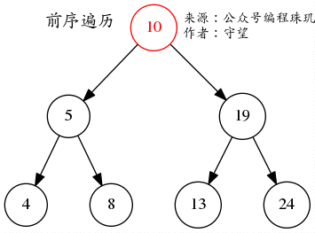
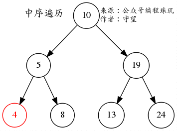
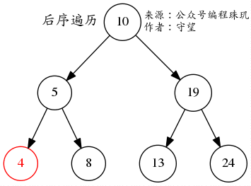
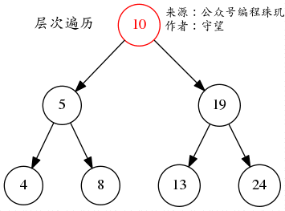

### 一、理论基础

#### 1、二叉树的几种特殊种类

1. **满二叉树**
    - 除底层外，其余每层上的节点都有两个子节点；
        
2. **完全二叉树**
    - 底层从左至右顺序填充（不留空）；
    - 其余层与满二叉树相同；
        

3. **二叉搜索树——有数值作为排序基准**
    - 左子树（若存在）上所有节点均小于根节点；
    - 右子树（若存在）上所有节点均大于根节点；
    - 每一棵子树也都满足上述两点；
        

4. **平衡二叉搜索树**
    - 在二叉搜索树的的基础上，保证左子树与右子树高度差不超过1；
    - 每棵左子树和右子树都要符合上述规则；
    - C++中的map、set、multimap、multiset的内部实现都是平衡二叉搜索树，因此都是有序的，增删操作的时间复杂度是O(logN)；
    - unordered_map、unordered_set底层实现是哈希表，因此是无序的，增删查改时间复杂度都是O(1)；


#### 2、二叉树的存储方式

1. **链式存储**

    - 看成链表即可，不同之处在于有左右两个指针；

        ```c++
        struct TreeNode
        {
            int val;
            TreeNode* left;
            TreeNode* right;
        }
        ```

        

2. **线性存储**

    - 用数组存储；

    - 对于第i个节点，其左孩子在数组中的index是2i+1，右孩子是2i+2；

      ​    

        

#### 3、二叉树的遍历

1. **深度优先遍历——通常用递归实现**

    1. **前序（中节点-左子树-右子树）**
        - 先遍历**中间节点**，再遍历**左子树**，最后遍历**右子树**；
        - 对于每颗子树，都按照上述规则继续遍历；
        - 下图二叉树遍历结果为：[10,5,4,8,19,13,24]；
            
    2. **中序（左子树-中节点-右子树）**
        - 先遍历**左子树**，再遍历**中间节点**，最后遍历**右子树**；
        - 对于每颗子树，都按照上述规则继续遍历；
        - 下图二叉树遍历结果为：[4,5,8,10,13,19,24]；
            
    3. **后序（左子树-右子树-中节点）**
        - 先遍历**左子树**，再遍历**右子树**，最后遍历**中间节点**；
        - 对于每颗子树，都按照上述规则继续遍历；
        - 下图二叉树遍历结果为：[4,8,5,13,24,19,10]；
            

2. **广度优先遍历——通常用队列实现**

    - **层序遍历——一层层遍历；**

        - **实现方法**

            - 采用队列，将根节点入队并出队，在出队时将其左右孩子节点放入队列中；
            - 对队列中的每个节点都采取上述操作；

        - **遍历结果**

            - 如图：[10,5,19,4,8,13,24]

            

### 二、二叉树递归遍历

#### 1、递归三部曲

1. 考虑每次递归需要执行的小任务，确定**返回值**和**入口参数**，参数在写函数逻辑的时候可以补充；
2.  确定递归的终止条件：即确定最基本的已知情况；
3. 在函数体中进行递归调用，执行更简一层的操作，直至最基本的已知情况；

#### 2、144.二叉树的前序遍历

```c++
/**
 * Definition for a binary tree node.
 * struct TreeNode {
 *     int val;
 *     TreeNode *left;
 *     TreeNode *right;
 *     TreeNode() : val(0), left(nullptr), right(nullptr) {}
 *     TreeNode(int x) : val(x), left(nullptr), right(nullptr) {}
 *     TreeNode(int x, TreeNode *left, TreeNode *right) : val(x), left(left), right(right) {}
 * };
 */
#include <iostream>
#include <vector>
using namespace std;
class Solution
{
public:
    void myPreTraversal(TreeNode *root, vector<int> &nums)
    {
        // 递归终止条件
        if (root == nullptr)
        {
            return;
        }

        // 递归调用:中-左-右
        nums.push_back(root->val);        // 中间节点
        myPreTraversal(root->left, nums); // 前序遍历左子树
        myPreTraversal(root->right, nums);// 前序遍历右子树
    }
    
    vector<int> preorderTraversal(TreeNode *root)
    {
        vector<int> result;
        myPreTraversal(root, result);

        return result;
    }
};
```

#### 2、145.二叉树的中序遍历

```c++
// 中序遍历：左-中-右
myInorderTraversal(root->left, nums);  // 前序遍历左子树
nums.push_back(root->val);             // 中间节点
myInorderTraversal(root->right, nums); // 前序遍历右子树
```

#### 3、94.二叉树的后序遍历

```c++
// 后序遍历：左-右-中
myPostorderTraversal(root->left, nums);  // 遍历左子树
myPostorderTraversal(root->right, nums); // 遍历右子树
nums.push_back(root->val);               // 中间节点
```

### 三、二叉树统一迭代法

#### 1、思想

1. 从递归思想出发，迭代事实上就是模仿递归的栈处理过程，依次排序各个节点；**关键在于：后排序的先入栈；**
2. 在二叉树中，遍历某节点和处理该节点（将val放入数组中）是不同步的操作；例如对中序遍历（左-中-右）来说，在遍历到某节点时，需要先处理其左节点（也可能是左子树）；
3. 因此我们在压栈的过程中，需要确定当前遍历节点的处理时机（也就是出栈时机），或者是**当前节点出栈时机**与**左右孩子节点出栈时机**的相对位置；
4. 对于**中序遍历（左-中-右）**来说，左节点出栈时机<当前节点的出栈时机<右节点出栈时机；因此我们需要标记每个节点的出栈时机，通过排列每个节点出栈时机之间的相对位置，完成遍历；
5. 具体实现为，以**相应遍历的逆序**将当前节点及其左右孩子节点压栈，并在当前节点之后压入nullptr，标记当前节点；在出栈时遇到nullptr即将下一个元素出栈，放入数组中，否则继续上述过程；

#### 2、前序

```c++
/*
 * @lc app=leetcode.cn id=144 lang=cpp
 *
 * [144] 二叉树的前序遍历
 */

// @lc code=start
/**
 * Definition for a binary tree node.
 * struct TreeNode {
 *     int val;
 *     TreeNode *left;
 *     TreeNode *right;
 *     TreeNode() : val(0), left(nullptr), right(nullptr) {}
 *     TreeNode(int x) : val(x), left(nullptr), right(nullptr) {}
 *     TreeNode(int x, TreeNode *left, TreeNode *right) : val(x), left(left), right(right) {}
 * };
 */
#include <iostream>
#include <vector>
#include <stack>
using namespace std;

class Solution
{
public:
    vector<int> preorderTraversal(TreeNode *root)
    {
        stack<TreeNode *> st;
        vector<int> result;

        if (root != nullptr)
        {
            st.push(root);
        }

        while (!st.empty())
        {
            TreeNode *cur_node = st.top();
            if (cur_node != nullptr)
            {
                st.pop(); // 先把当前节点pop，后续还要再放,防止重复

                // 前序遍历：中-左-右，因此按反向入栈：右-左-中
                if (cur_node->right != nullptr)
                {
                    st.push(cur_node->right); // 右
                }
                if (cur_node->left != nullptr)
                {
                    st.push(cur_node->left); // 左
                }
                st.push(cur_node); // 中，将当前遍历到的节点（中间节点）压栈
                st.push(nullptr);  // 在当前遍历到的节点后压入空节点（当栈弹出至此时作为标记）
            }
            else
            {
                st.pop();
                result.push_back(st.top()->val);
                st.pop();
            }
        }
        return result;
    }
};
// @lc code=end

```

#### 3、中序

```c++
// 中序遍历：左-中-右，因此按反向入栈：右-中-左
if (cur_node->right != nullptr)
{
    st.push(cur_node->right); // 右
}

st.push(cur_node); // 中，将当前遍历到的节点（中间节点）压栈
st.push(nullptr);  // 在当前遍历到的节点后压入空节点（当栈弹出至此时作为标记）

if (cur_node->left != nullptr)
{
    st.push(cur_node->left); // 左
}
```

#### 4、后序

```c++
// 后序遍历：左-右-中，因此按反向入栈：中-右-左

st.push(cur_node); // 中，将当前遍历到的节点（中间节点）压栈
st.push(nullptr);  // 在当前遍历到的节点后压入空节点（当栈弹出至此时作为标记）
                
if (cur_node->right != nullptr)
{
    st.push(cur_node->right); // 右
}
                
if (cur_node->left != nullptr)
{
    st.push(cur_node->left); // 左
}
```

### 四、二叉树层序遍历

#### 1、思想

1. 借助队列，将根节点加入队列中，再依次将队首元素出队；
2. 一个元素出队时，将其左右节点加入队列中；
3. 循环上述过程直至队列为空；
    

#### 2、注意点

1. queue要定义为TreeNode* 类型；
2. 获取队首元素要用queue.front()，和栈中使用的stack.top()区分开；
3. 子数组必须定义在while(!que.empty())内，因为每层的遍历都需要一层新数组；
4. 左右节点必须非空时才能加入队列中，如果允许空值加入会导致最后数组多出一层空值（对应树的最后一层空节点）；

#### 3、10道题目

##### （1）102.二叉树的层序遍历

[102. 二叉树的层序遍历](https://leetcode.cn/problems/binary-tree-level-order-traversal/)

```c++
/**
 * Definition for a binary tree node.
 * struct TreeNode {
 *     int val;
 *     TreeNode *left;
 *     TreeNode *right;
 *     TreeNode() : val(0), left(nullptr), right(nullptr) {}
 *     TreeNode(int x) : val(x), left(nullptr), right(nullptr) {}
 *     TreeNode(int x, TreeNode *left, TreeNode *right) : val(x), left(left),
 * right(right) {}
 * };
 */
class Solution {
public:
    vector<vector<int>> levelOrder(TreeNode* root) {

        queue<TreeNode*> que;
        vector<vector<int>> result_vec;

        if (root) {
            que.push(root);
        }

        while (!que.empty()) {

            int size = que.size(); // 保存每一层元素的数量

            // 必须将子数组定义在这里
            // 因为每次遍历完一层后需要一个空的子数组来存储下一行
            vector<int> sub_vec;
            while (size--) {

                TreeNode* tmp_node = que.front();
                sub_vec.push_back(tmp_node->val);

                // 左右节点非空时才能加入队列中
                // 一定不能加入空值，否则会影响循环次数（多出最后一行空值）
                if (tmp_node->left) {
                    que.push(tmp_node->left);
                }
                if (tmp_node->right) {
                    que.push(tmp_node->right);
                }
                que.pop();
            }

            result_vec.push_back(sub_vec);
        }

        return result_vec;
    }
};
```

##### （2）107.二叉树的层次遍历 II

[107. 二叉树的层序遍历 II - 力扣（LeetCode）](https://leetcode.cn/problems/binary-tree-level-order-traversal-ii/description/)

```c++
/**
 * Definition for a binary tree node.
 * struct TreeNode {
 *     int val;
 *     TreeNode *left;
 *     TreeNode *right;
 *     TreeNode() : val(0), left(nullptr), right(nullptr) {}
 *     TreeNode(int x) : val(x), left(nullptr), right(nullptr) {}
 *     TreeNode(int x, TreeNode *left, TreeNode *right) : val(x), left(left), right(right) {}
 * };
 */
class Solution {
public:
    vector<vector<int>> levelOrderBottom(TreeNode* root) {
        queue<TreeNode*> que;
        vector<vector<int>> result;

        if(root)
        {
            que.push(root);
        }

        while(!que.empty())
        {
            int size=que.size();
            vector<int> sub_vec;
            while(size--)
            {
                TreeNode* tmp_node=que.front();
                que.pop();
                sub_vec.push_back(tmp_node->val);
                if(tmp_node->left)
                {
                    que.push(tmp_node->left);
                }
                if(tmp_node->right)
                {
                    que.push(tmp_node->right);
                }
            }
            result.push_back(sub_vec);
        }
        reverse(result.begin(),result.end());
        return result;
    }
};
```

##### （3）199. 二叉树的右视图

[199. 二叉树的右视图](https://leetcode.cn/problems/binary-tree-right-side-view/)

```c++
/**
 * Definition for a binary tree node.
 * struct TreeNode {
 *     int val;
 *     TreeNode *left;
 *     TreeNode *right;
 *     TreeNode() : val(0), left(nullptr), right(nullptr) {}
 *     TreeNode(int x) : val(x), left(nullptr), right(nullptr) {}
 *     TreeNode(int x, TreeNode *left, TreeNode *right) : val(x), left(left),
 * right(right) {}
 * };
 */
class Solution {
public:
    vector<int> rightSideView(TreeNode* root) {

        queue<TreeNode*> que;
        vector<int> result;

        // 先层序遍历
        if (root) {
            que.push(root);
        }

        while (!que.empty()) {

            int size = que.size();
            vector<int> sub_vec;
            while (size--) {
                TreeNode* tmp_node = que.front();
                que.pop();
                if (tmp_node->left) {
                    que.push(tmp_node->left);
                }
                if (tmp_node->right) {
                    que.push(tmp_node->right);
                }
                // 如果遍历到该层的最后一个元素，直接push到result数组中
                // 注意while是判断size大小之后，先--再执行函数体中的逻辑，因此最后一个元素对应size=0
                if(size==0)
                {
                    result.push_back(tmp_node->val);
                }
            }
        }

        return result;
    }
};
```

##### （4）637.二叉树的层平均值

[637. 二叉树的层平均值 - 力扣（LeetCode）](https://leetcode.cn/problems/average-of-levels-in-binary-tree/)

```c++
/**
 * Definition for a binary tree node.
 * struct TreeNode {
 *     int val;
 *     TreeNode *left;
 *     TreeNode *right;
 *     TreeNode() : val(0), left(nullptr), right(nullptr) {}
 *     TreeNode(int x) : val(x), left(nullptr), right(nullptr) {}
 *     TreeNode(int x, TreeNode *left, TreeNode *right) : val(x), left(left),
 * right(right) {}
 * };
 */
class Solution {
public:
    vector<double> averageOfLevels(TreeNode* root) {
        queue<TreeNode*> que;
        vector<double> result;

        if (root) {
            que.push(root);
        }

        while (!que.empty()) {
            int size = que.size();
            double level_sum = 0;
            // 不能用while循环了，因为要保留size值
            for (int i = 0; i < size; i++) {
                TreeNode* tmp_node = que.front();
                que.pop();
                level_sum += tmp_node->val;
                if (tmp_node->left) {
                    que.push(tmp_node->left);
                }
                if (tmp_node->right) {
                    que.push(tmp_node->right);
                }
            }
            result.push_back(level_sum / size);
        }
        return result;
    }
};
```

##### （5）429.N叉树的层序遍历

[429. N 叉树的层序遍历 - 力扣（LeetCode）](https://leetcode.cn/problems/n-ary-tree-level-order-traversal/)

```c++
/*
// Definition for a Node.
class Node {
public:
    int val;
    vector<Node*> children;

    Node() {}

    Node(int _val) {
        val = _val;
    }

    Node(int _val, vector<Node*> _children) {
        val = _val;
        children = _children;
    }
};
*/

class Solution {
public:
    vector<vector<int>> levelOrder(Node* root) {
        queue<Node*> que;
        vector<vector<int>> result;

        if(root)
        {
            que.push(root);
        }

        while(!que.empty())
        {
            int size=que.size();
            vector<int> sub_vec;

            for(int i=0;i<size;i++)
            {
                Node* tmp_node=que.front();
                que.pop();
                sub_vec.push_back(tmp_node->val);
                for(auto i:tmp_node->children)
                {
                    que.push(i);
                }
            }
            result.push_back(sub_vec);
        }
        return result;
    }
};
```

##### （6）515.在每个树行中找最大值

[515. 在每个树行中找最大值 - 力扣（LeetCode）](https://leetcode.cn/problems/find-largest-value-in-each-tree-row/description/)

- 注意节点大小范围是`-2^31 <= Node.val <= 2^31 - 1`，即在INT32_MIN和INT32_MAX之间；
- 同时注意考虑负数的情况；

```C++
/**
 * Definition for a binary tree node.
 * struct TreeNode {
 *     int val;
 *     TreeNode *left;
 *     TreeNode *right;
 *     TreeNode() : val(0), left(nullptr), right(nullptr) {}
 *     TreeNode(int x) : val(x), left(nullptr), right(nullptr) {}
 *     TreeNode(int x, TreeNode *left, TreeNode *right) : val(x), left(left),
 * right(right) {}
 * };
 */
class Solution {
public:
    vector<int> largestValues(TreeNode* root) {
        queue<TreeNode*> que;
        vector<int> result;

        if (root) {
            que.push(root);
        }

        while (!que.empty()) {
            int size = que.size();
            // 注意考虑节点值为负数的情况
            // INT32_MIN=-2147483648=-2^31
            //  INT32_MAX=2147483647=2^31-1
            int max_val = INT32_MIN;
            // cout << INT32_MIN << endl;
            // cout << INT32_MAX << endl;
            for (int i = 0; i < size; i++) {
                TreeNode* tmp_node = que.front();
                que.pop();
                max_val = (tmp_node->val > max_val) ? tmp_node->val : max_val;
                if (tmp_node->left) {
                    que.push(tmp_node->left);
                }
                if (tmp_node->right) {
                    que.push(tmp_node->right);
                }
            }
            result.push_back(max_val);
        }
        return result;
    }
};
```

##### （7）116.填充每个节点的下一个右侧节点指针

[116. 填充每个节点的下一个右侧节点指针 - 力扣（LeetCode）](https://leetcode.cn/problems/populating-next-right-pointers-in-each-node/description/)

```c++
/*
// Definition for a Node.
class Node {
public:
    int val;
    Node* left;
    Node* right;
    Node* next;

    Node() : val(0), left(NULL), right(NULL), next(NULL) {}

    Node(int _val) : val(_val), left(NULL), right(NULL), next(NULL) {}

    Node(int _val, Node* _left, Node* _right, Node* _next)
        : val(_val), left(_left), right(_right), next(_next) {}
};
*/

class Solution {
public:
    Node* connect(Node* root) {
        queue<Node*> que;
        vector<int> result;

        if (root) {
            que.push(root);
        }

        while (!que.empty()) {
            int size = que.size();
            for (int i = 0; i < size; i++) {
                Node* tmp_node = que.front();
                que.pop();
                if (tmp_node->left) {
                    que.push(tmp_node->left);
                }
                if (tmp_node->right) {
                    que.push(tmp_node->right);
                }
                // 遍历到每层的最后一个元素
                if(i==size-1)
                {
                    tmp_node->next=NULL;
                }
                else
                {
                    tmp_node->next=que.front();
                }
            }
        }
        return root;
    }
};
```

##### （8）117.填充每个节点的下一个右侧节点指针II

[117. 填充每个节点的下一个右侧节点指针 II - 力扣（LeetCode）](https://leetcode.cn/problems/populating-next-right-pointers-in-each-node-ii/description/)

```
代码与上一题完全一样
```

##### （9）104.二叉树的最大深度

[104. 二叉树的最大深度 - 力扣（LeetCode）](https://leetcode.cn/problems/maximum-depth-of-binary-tree/description/)

```c++
/**
 * Definition for a binary tree node.
 * struct TreeNode {
 *     int val;
 *     TreeNode *left;
 *     TreeNode *right;
 *     TreeNode() : val(0), left(nullptr), right(nullptr) {}
 *     TreeNode(int x) : val(x), left(nullptr), right(nullptr) {}
 *     TreeNode(int x, TreeNode *left, TreeNode *right) : val(x), left(left), right(right) {}
 * };
 */
class Solution {
public:
    int maxDepth(TreeNode* root) {
        queue<TreeNode*> que;
        int depth=0;

        if(root)
        {
            que.push(root);
        }

        while(!que.empty())
        {
            int size=que.size();
            for(int i=0;i<size;i++)
            {
                TreeNode* tmp_node=que.front();
                que.pop();
                if(tmp_node->left)
                {
                    que.push(tmp_node->left);
                }
                if(tmp_node->right)
                {
                    que.push(tmp_node->right);
                }
            }
            depth++;
        }
        return depth;
    }
};
```

##### （10）111.二叉树的最小深度

[111. 二叉树的最小深度 - 力扣（LeetCode）](https://leetcode.cn/problems/minimum-depth-of-binary-tree/description/)

```c++
/**
 * Definition for a binary tree node.
 * struct TreeNode {
 *     int val;
 *     TreeNode *left;
 *     TreeNode *right;
 *     TreeNode() : val(0), left(nullptr), right(nullptr) {}
 *     TreeNode(int x) : val(x), left(nullptr), right(nullptr) {}
 *     TreeNode(int x, TreeNode *left, TreeNode *right) : val(x), left(left),
 * right(right) {}
 * };
 */
class Solution {
public:
    int minDepth(TreeNode* root) {
        queue<TreeNode*> que;
        int depth = 0;

        if (root) {
            que.push(root);
        }
        int level=0;
        while (!que.empty()) {
            depth++;//在进入每层的循环之前，depth++
            int size = que.size();
            //每层的循环
            for (int i = 0; i < size; i++) {
                TreeNode* tmp_node = que.front();
                que.pop();
                if (tmp_node->left) {
                    que.push(tmp_node->left);
                }
                if (tmp_node->right) {
                    que.push(tmp_node->right);
                }
                if (!tmp_node->left && !tmp_node->right) {
                    return depth;
                }
            }
        }
        return depth;
    }
};
```
