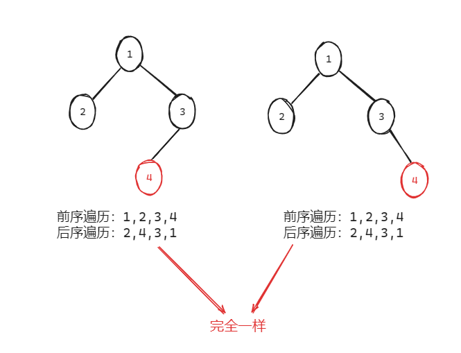
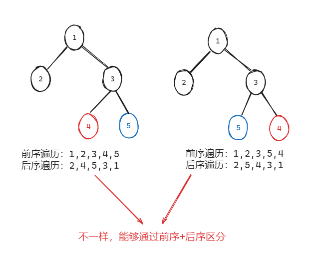

### 一、222.完全二叉树的节点个数

[222. 完全二叉树的节点个数 - 力扣（LeetCode）](https://leetcode.cn/problems/count-complete-tree-nodes/description/)

[代码随想录 (programmercarl.com)](https://programmercarl.com/0222.完全二叉树的节点个数.html#思路)

#### 1、普通二叉树思路

1. 左右子树找到自己的节点数量，报告给根节点，根节点再进行统计，考虑后序遍历；
2. **递归三部曲**
    1. **函数**：利用原函数，传入根节点，返回节点数量；
    2. **终止条件**：遍历到空节点返回0，遍历到叶子节点返回1；
    3. **递归调用**：
        - 左子树统计节点；
        - 右子树统计节点；
        - 中间节点处理：左+右+1；

#### 2、利用完全二叉树特点

1. 在子树中找满二叉树，找到后利用满二叉树的性质求节点数量：2^depth-1；

2. 找满二叉树思路：由于传入的是完全二叉树，因此只需要一直向左+一直向右遍历，如果左右深度一致，则代表是满二叉树；

    ```c++
    	// 判断传入的完全二叉树是不是满二叉树
        // 如果是，返回它的节点数量；如果不是，返回-1
        int isFullBinTree(TreeNode* root) {
            if (!root) {
                return -1;
            }
    
            // 深度初始化为1
            int left_depth = 1;
            int right_depth = 1;
    
            TreeNode* left_node = root->left;
            TreeNode* right_node = root->right;
    
            // 一直向左遍历
            while (left_node) {
                left_depth++;
                left_node = left_node->left;
            }
    
            // 一直向右遍历
            while (right_node) {
                right_depth++;
                right_node = right_node->right;
            }
    
            // 左右深度相同，代表该树是满二叉树（注意传入的是完全二叉树,且叶子节点也被视为满二叉树）
            if (left_depth == right_depth) {
                return (2 << (left_depth - 1)) - 1; // 根据深度返回节点数量:2^depth-1
            } else {
                return -1;
            }
        }
    ```

    3. **递归三部曲**
        1. **参数**：根节点；返回值：节点数量；
        2. **终止条件**：遇到空节点返回0；遇到满二叉树返回节点数量；
        3. **递归调用**：后序遍历；

#### 3、代码

1. **普通二叉树**

    ```c++
    /**
     * Definition for a binary tree node.
     * struct TreeNode {
     *     int val;
     *     TreeNode *left;
     *     TreeNode *right;
     *     TreeNode() : val(0), left(nullptr), right(nullptr) {}
     *     TreeNode(int x) : val(x), left(nullptr), right(nullptr) {}
     *     TreeNode(int x, TreeNode *left, TreeNode *right) : val(x), left(left),
     * right(right) {}
     * };
     */
    class Solution {
    public:
        int countNodes(TreeNode* root) {
    
            if (!root) {
                return 0;
            }
    
            // 遍历到叶子节点结束
            if (!root->left && !root->right) {
                return 1;
            }
    
            // 后序遍历：左-右-中
            int left_nums = countNodes(root->left);
            int right_nums = countNodes(root->right);
            int nums_sum = left_nums + right_nums + 1; // 记得加上自己
    
            return nums_sum;
        }
    };
    ```

2. **完全二叉树**

    ```c++
    /**
     * Definition for a binary tree node.
     * struct TreeNode {
     *     int val;
     *     TreeNode *left;
     *     TreeNode *right;
     *     TreeNode() : val(0), left(nullptr), right(nullptr) {}
     *     TreeNode(int x) : val(x), left(nullptr), right(nullptr) {}
     *     TreeNode(int x, TreeNode *left, TreeNode *right) : val(x), left(left),
     * right(right) {}
     * };
     */
    class Solution {
    private:
        // 判断传入的完全二叉树是不是满二叉树
        // 如果是，返回它的节点数量；如果不是，返回-1
        int isFullBinTree(TreeNode* root) {
            if (!root) {
                return -1;
            }
    
            // 深度初始化为1
            int left_depth = 1;
            int right_depth = 1;
    
            TreeNode* left_node = root->left;
            TreeNode* right_node = root->right;
    
            // 一直向左遍历
            while (left_node) {
                left_depth++;
                left_node = left_node->left;
            }
    
            // 一直向右遍历
            while (right_node) {
                right_depth++;
                right_node = right_node->right;
            }
    
            // 左右深度相同，代表该树是满二叉树（注意传入的是完全二叉树,且叶子节点也被视为满二叉树）
            if (left_depth == right_depth) {
                return (2 << (left_depth - 1)) - 1; // 根据深度返回节点数量:2^depth-1
            } else {
                return -1;
            }
        }
    
    public:
        int countNodes(TreeNode* root) {
    
            // 终止条件1：遍历到空节点返回0
            if (!root) {
                return 0;
            }
    
            // 终止条件2：找到满二叉树，返回满二叉树的节点数量
            int node_nums=isFullBinTree(root);
            if(node_nums!=-1)
            {
                return node_nums;
            }
    
            // 逐层向上报告，采用后序遍历
            int left_nums=countNodes(root->left);
            int right_nums=countNodes(root->right);
            int nums_sum=left_nums+right_nums+1;
    
            return nums_sum;
        }
    };
    ```


### 二、112. 路径总和

[112. 路径总和 - 力扣（LeetCode）](https://leetcode.cn/problems/path-sum/description/)

[代码随想录 (programmercarl.com)](https://programmercarl.com/0112.路径总和.html#算法公开课)

#### 1、思路

1. 遍历到叶子节点结束判断，考虑前序遍历；
2. **递归三部曲**
    1. **参数**：根节点，目标和；返回值：bool；
    2. **终止条件**：遍历到叶子节点，且刚好目标值减为0；
    3. **递归调用：**
        - 先处理中间节点，将传入的目标值减去root->val；
        - 处理左子树，传入新的目标值；
        - 处理右子树，传入新的目标值；

#### 2、注意点

1. 不要考虑在叶子节点之前就终止判断，因为目标值可能是负数，节点值也可能是负数；

2. 如下终止条件均错误；

    ```c++
    // 必须一直遍历到叶子节点，中间无法判断结果
            // 终止条件1：目标值减至小于0，返回false;
            // 不对！没考虑到targetSum小于零的情况
            if (my_sum < 0) {
                return false;
            }
    
            // 终止条件1：目标值减小后与传入的目标值异号
            // 也不对！节点值有正有负，可能在该节点异号，在后续节点仍能变回0
            if(my_sum*targetSum<0)
            {
                return false;
            }
    ```

#### 3、代码

```c++
/**
 * Definition for a binary tree node.
 * struct TreeNode {
 *     int val;
 *     TreeNode *left;
 *     TreeNode *right;
 *     TreeNode() : val(0), left(nullptr), right(nullptr) {}
 *     TreeNode(int x) : val(x), left(nullptr), right(nullptr) {}
 *     TreeNode(int x, TreeNode *left, TreeNode *right) : val(x), left(left),
 * right(right) {}
 * };
 */
class Solution {
public:
    bool hasPathSum(TreeNode* root, int targetSum) {
        // 空树的情况
        if (!root) {
            return false;
        }

        // 先处理中间节点，将目标值减去自身值
        int my_sum = targetSum - root->val;

        // 终止条件：找到叶子且目标值刚好为0，返回true
        if (!root->left && !root->right && my_sum == 0) {
            return true;
        }

        // 处理左子树
        if(root->left)
        {
            bool left_result=hasPathSum(root->left,my_sum);
            if(left_result)
            {
                return true;
            }
        }

        // 处理右子树
        if(root->right)
        {
            bool right_result=hasPathSum(root->right,my_sum);
            if(right_result)
            {
                return true;
            }
        }

        return false;
    }
};
```

### 三、106.从中序与后序遍历序列构造二叉树

[106. 从中序与后序遍历序列构造二叉树 - 力扣（LeetCode）](https://leetcode.cn/problems/construct-binary-tree-from-inorder-and-postorder-traversal/description/)

[105. 从前序与中序遍历序列构造二叉树 - 力扣（LeetCode）](https://leetcode.cn/problems/construct-binary-tree-from-preorder-and-inorder-traversal/)

[代码随想录 (programmercarl.com)](https://programmercarl.com/0106.从中序与后序遍历序列构造二叉树.html#算法公开课)

#### 1、思想

##### **（1）中序+后序**

1. 如果任一数组为空，代表是空节点，向上返回空节点；（相当于递归终止条件）
2. 唯一的已知条件：根节点必然是后序数组的最后一个元素；
3. 下一步是处理左右子树，但在此之前，我们需要先分清两个数组中，哪部分是左子树，哪部分是右子树；
    - 通过后序数组找到的根节点，在中序数组中可以分割左右子树；
    - 进而根据子树节点相同，在后序数组中也分割出左右子树；
    - 得到四个子数组：左子树中序、后序数组；右子树中序、后序数组；用于构造左右子树；
        
4. 处理左子树：递归调用，传入左子树的中序、后序数组；
5. 处理右子树：递归调用，传入右子树的中序、后序数组；
6. 将构造好的子树根节点报告给上层节点；

##### **（2）中序+前序**

##### （3）为什么”前序+后序“不能实现二叉树的复原？

1. 并不是所有情况都不能实现，当二叉树中存在某个节点，**仅有一片叶子或一棵子树时**，无法通过**前序+后序**还原唯一的二叉树；
    

2. 其原因在于前序遍历（中左右）和后序遍历（左右中）的**左右子树区间是连接在一起的**，如果仅有左子树或右子树，通过**遍历数组**无法判断其是左子树还是右子树；

3. 下面这种情况可以通过**前序+后序**区分开；
    


#### 2、注意点

1. 注意不能用(!postorder)或(postorder==NULL)作为判断条件判断vector对象是否为空，这两种方法通常用于指针，对于vector对象应该用postorder.empty()方法；

2. 通过已有vector（inorder）构造新vector（left_inorder）：

    ```c++
    // 区间左闭右开：[0,index)
    vector<int> left_inorder(inorder.begin(), inorder.begin() + index);
    ```

#### 3、代码

1. **中序+后序**

    ```c++
    /**
     * Definition for a binary tree node.
     * struct TreeNode {
     *     int val;
     *     TreeNode *left;
     *     TreeNode *right;
     *     TreeNode() : val(0), left(nullptr), right(nullptr) {}
     *     TreeNode(int x) : val(x), left(nullptr), right(nullptr) {}
     *     TreeNode(int x, TreeNode *left, TreeNode *right) : val(x), left(left),
     * right(right) {}
     * };
     */
    class Solution {
    public:
        TreeNode* buildTree(vector<int>& inorder, vector<int>& postorder) {
            
            // 数组为空，返回空节点
            // 注意不能用(!postorder)或(postorder==NULL)作为判断条件,这两种通常用于指针
            if (postorder.empty()) {
                return nullptr;
            }
    
            // 通过后序数组找根节点（后序数组的最后一个值）
            TreeNode* root = new TreeNode(postorder.back());
    
            // 基于后序数组找到的根节点，在中序数组中分割左右子树
            int index = 0;
            for (int i = 0; i < inorder.size(); i++) {
                if (inorder[i] == root->val) {
                    index = i;
                }
            }
    
            // 在中序数组中，index左边是左子树，右边是右子树（因为中序是：左-中-右）
            // 左子树中序数组,区间左闭右开：[0,index)
            vector<int> left_inorder(inorder.begin(), inorder.begin() + index);
            // 右子树中序数组，区间：[index+1,end())
            vector<int> right_inorder(inorder.begin() + index + 1, inorder.end());
    
            // 在后序数组中，按照区间长度，分割左右子树
            // 左子树后序数组，区间：[0,index)，长度和left_inorder一致
            vector<int> left_postorder(postorder.begin(),
                                       postorder.begin() + index);
            // 右子树后序数组，区间：[index,end()-1),注意舍弃最后一个根节点，长度和right_inorder一致
            vector<int> right_postorder(postorder.begin() + index,
                                        postorder.end() - 1);
    
            // 构造左子树
            root->left=buildTree(left_inorder,left_postorder);
    
            // 构造右子树
            root->right=buildTree(right_inorder,right_postorder);
            
            // 向父节点报告构造好的子树
            return root;
    
        }
    };
    ```

2. **中序+前序**

    ```c++
    /**
     * Definition for a binary tree node.
     * struct TreeNode {
     *     int val;
     *     TreeNode *left;
     *     TreeNode *right;
     *     TreeNode() : val(0), left(nullptr), right(nullptr) {}
     *     TreeNode(int x) : val(x), left(nullptr), right(nullptr) {}
     *     TreeNode(int x, TreeNode *left, TreeNode *right) : val(x), left(left),
     * right(right) {}
     * };
     */
    class Solution {
    public:
        TreeNode* buildTree(vector<int>& preorder, vector<int>& inorder) {
            // 递归终止条件：遇到空数组返回空节点
            if (preorder.empty()) {
                return nullptr;
            }
    
            // 获取根节点：前序遍历的首个元素
            TreeNode* root = new TreeNode(preorder.front());
    
                // 获取左右子树的分割点
                int index = 0;
            for (int i = 0; i < inorder.size(); i++) {
                if (inorder[i] == root->val) {
                    index = i;
                }
            }
    
            // 获取左右子树的前序数组
            // 左子树前序数组，区间：[1,1+index)，index=0时，构造空数组
            vector<int> left_preorder(preorder.begin() + 1 , preorder.begin() + 1 + index); 
            // 右子树前序数组，区间：[1+index，end())
            vector<int> right_preorder(preorder.begin() + 1 + index , preorder.end()); 
    
            // 获取左右子树的中序数组
            // 左子树后序数组，区间：[0,index)
            vector<int> left_inorder(inorder.begin() , inorder.begin() + index); 
            // 右子树后序数组，区间：[index+1，end())
            vector<int> right_inorder(inorder.begin() + index + 1 , inorder.end()); 
    
            // 构造左子树
            root->left=buildTree(left_preorder,left_inorder);
    
            // 构造右子树
            root->right=buildTree(right_preorder,right_inorder);
    
            // 向父节点报告构造好的子树
            return root;
        }
    };
    ```
