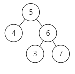

### 一、654.最大二叉树

[654. 最大二叉树 - 力扣（LeetCode）](https://leetcode.cn/problems/maximum-binary-tree/description/)

[代码随想录 (programmercarl.com)](https://programmercarl.com/0654.最大二叉树.html)

#### 1、思想

1. 对于二叉树构造的题目，优先考虑前序遍历构造，即自顶向下构造；
2. **递归三部曲**
    1. **入口参数**：数组；返回值：子树的根节点
    2. **终止条件**：数组为空返回空，数组长度为1证明找到叶子节点，返回该节点；
    3. **递归遍历**：前序
        1. 找到数组中的最大值，构造中间节点（中）；
        2. 分割左子树数组，构造左子树（左）；
        3. 分割右子树数组，构造右子树（右）；

#### 2、注意点

1. 获取到数组最大值后记得给max_val赋值；
2. 构造左右子树时记得赋给root->left和root->right；

#### 3、代码

```c++
/**
 * Definition for a binary tree node.
 * struct TreeNode {
 *     int val;
 *     TreeNode *left;
 *     TreeNode *right;
 *     TreeNode() : val(0), left(nullptr), right(nullptr) {}
 *     TreeNode(int x) : val(x), left(nullptr), right(nullptr) {}
 *     TreeNode(int x, TreeNode *left, TreeNode *right) : val(x), left(left), right(right) {}
 * };
 */
class Solution {
public:
    TreeNode* constructMaximumBinaryTree(vector<int>& nums) {
        
        // 终止条件1：遇到空数组，返回空指针
        if(nums.empty())
        {
            return nullptr;
        }

        // 终止条件2：数组大小为1，说明遍历到叶子节点，返回节点
        if(nums.size()==1)
        {
            return new TreeNode(nums[0]);
        }

        // 采用前序构造
        // 中间节点处理
        int max_val=0;
        int max_index=0;
        //找到最大元素
        for(int i=0;i<nums.size();i++)
        {
            if(nums[i]>max_val)
            {
                max_val=nums[i];
                max_index=i;
            }
        }
        // 构造当前节点
        TreeNode* root=new TreeNode(max_val);

        // 获取左子树数组,区间：[0,index)
        vector<int> left_nums(nums.begin(),nums.begin()+max_index);
        // 构造左子树
        root->left=constructMaximumBinaryTree(left_nums);
        
        // 获取右子树数组,区间：[index+1,end())
        vector<int> right_nums(nums.begin()+max_index+1,nums.end());
        // 构造右子树
        root->right=constructMaximumBinaryTree(right_nums);

        return root;

    }
};
```

#### 4、优化代码——采用下标代替新建数组

```c++
/**
 * Definition for a binary tree node.
 * struct TreeNode {
 *     int val;
 *     TreeNode *left;
 *     TreeNode *right;
 *     TreeNode() : val(0), left(nullptr), right(nullptr) {}
 *     TreeNode(int x) : val(x), left(nullptr), right(nullptr) {}
 *     TreeNode(int x, TreeNode *left, TreeNode *right) : val(x), left(left), right(right) {}
 * };
 */
class Solution {
private:
    // 用数组区间：[left_edge,right_edge)构造子树
    TreeNode* myConstruct(vector<int>& nums,int left_edge,int right_edge)
    {
        if(left_edge==right_edge)
        {
            return nullptr;
        }
        if(right_edge-left_edge==1)
        {
            return new TreeNode(nums[left_edge]);
        }

        // 采用前序构造
        // 中间节点处理
        int max_val=0;
        int max_index=0;
        //找到最大元素
        for(int i=left_edge;i<right_edge;i++)
        {
            if(nums[i]>max_val)
            {
                max_val=nums[i];
                max_index=i;
            }
        }
        cout<<"index:"<<max_index<<endl;
        // 构造当前节点
        TreeNode* root=new TreeNode(max_val);

        // 构造左子树
        root->left=myConstruct(nums,left_edge,max_index);

        // 构造右子树
        root->right=myConstruct(nums,max_index+1,right_edge);

        return root;

    }

public:
    TreeNode* constructMaximumBinaryTree(vector<int>& nums) {        
        return myConstruct(nums,0,nums.size());
    }
};
```

### 二、617.合并二叉树

[617. 合并二叉树 - 力扣（LeetCode）](https://leetcode.cn/problems/merge-two-binary-trees/description/)

[代码随想录 (programmercarl.com)](https://programmercarl.com/0617.合并二叉树.html)

#### 1、思路

1. 可以用构造新二叉树的思路进行，仍然考虑前序遍历；
2. **递归三部曲**
    1. **参数**：两树的根节点；返回值：新树的根节点；
    2. **终止条件**：tree1节点为空，返回新节点等于tree2节点；tree2节点为空，返回新节点等于tree1节点；
    3. **递归变量遍历：前序
        - 处理当前新节点：root->val=root1->val+root2->val;
        - 左子树：传入tree1和tree2的左子树；
        - 左=右子树：传入tree1和tree2的右子树；

#### 2、注意点

- 在终止条件中注意要return root，return了才是真正的终止；

#### 3、代码

```c++
/**
 * Definition for a binary tree node.
 * struct TreeNode {
 *     int val;
 *     TreeNode *left;
 *     TreeNode *right;
 *     TreeNode() : val(0), left(nullptr), right(nullptr) {}
 *     TreeNode(int x) : val(x), left(nullptr), right(nullptr) {}
 *     TreeNode(int x, TreeNode *left, TreeNode *right) : val(x), left(left), right(right) {}
 * };
 */
class Solution {
public:
    TreeNode* mergeTrees(TreeNode* root1, TreeNode* root2) {
        
        // 新树的根节点
        TreeNode* root=new TreeNode(0);

        //终止条件1：tree1节点为空，新节点等于tree2节点
        if(!root1)
        {
            root=root2;
            return root;
        }

        //终止条件2：tree2节点为空，新节点等于tree1节点
        if(!root2)
        {
            root=root1;
            return root;
        }

        // 否则根节点等于两树的节点之和
        root->val=root1->val+root2->val;
        // 处理左子树
        root->left=mergeTrees(root1->left,root2->left);
        // 处理右子树
        root->right=mergeTrees(root1->right,root2->right);

        return root;
    }
};
```

### 三、700.二叉搜索树中的搜索

[700. 二叉搜索树中的搜索 - 力扣（LeetCode）](https://leetcode.cn/problems/search-in-a-binary-search-tree/)

[代码随想录 (programmercarl.com)](https://programmercarl.com/0700.二叉搜索树中的搜索.html)

#### 1、思路

1. 迭代：根据二叉搜索树左小右大的特点，依次遍历即可；
2. 递归：与迭代同理；

#### 2、注意点

- 注意判断大小时必须用if...else if...else语句，不能if...if；
- 否则执行完上一种可能后还会判断下一种，有可能出现空指针访问（当上种情况返回空指针时）；

#### 3、代码

**（1）迭代**

```c++
/**
 * Definition for a binary tree node.
 * struct TreeNode {
 *     int val;
 *     TreeNode *left;
 *     TreeNode *right;
 *     TreeNode() : val(0), left(nullptr), right(nullptr) {}
 *     TreeNode(int x) : val(x), left(nullptr), right(nullptr) {}
 *     TreeNode(int x, TreeNode *left, TreeNode *right) : val(x), left(left), right(right) {}
 * };
 */
class Solution {
public:
    TreeNode* searchBST(TreeNode* root, int val) {     
        // 迭代
        TreeNode* cur=root;
        while(cur)
        {
            if(val<cur->val)
            {
                cur=cur->left;
            }
            else if(val>cur->val)
            {
                cur=cur->right;
            }
            else
            {
                return cur;
            }
        }
        return nullptr;
    }
};
```

**（2）递归**

```c++
/**
 * Definition for a binary tree node.
 * struct TreeNode {
 *     int val;
 *     TreeNode *left;
 *     TreeNode *right;
 *     TreeNode() : val(0), left(nullptr), right(nullptr) {}
 *     TreeNode(int x) : val(x), left(nullptr), right(nullptr) {}
 *     TreeNode(int x, TreeNode *left, TreeNode *right) : val(x), left(left), right(right) {}
 * };
 */
class Solution {
public:
    TreeNode* searchBST(TreeNode* root, int val) {
        // 递归
        TreeNode* cur=root;
        if(!cur)
        {
            return nullptr;
        }
        if(val==cur->val)
        {
            return cur;
        }

        if(val<cur->val)
        {
            cur = searchBST(cur->left,val);
        }
        else if(val>cur->val)
        {
            cur = searchBST(cur->right,val);
        }

        return cur;

    }
};
```

### 四、98.验证二叉搜索树

#### 1、思路

##### （1）直接思路（有误区）

1. 采用后序遍历，依次判断根节点的每棵子树是不是二叉搜索树，将结果报告给根节点；

2. **误区**：即使每棵子树都是二叉搜索树，整棵树也不一定是二叉搜索树；因为二叉搜索树在满足没棵子树都是二叉搜索树的同时，还要求左子树的**所有节点**都小于根节点，右子树的**所有节点**都小于根节点；

3. 如图二叉树中，左右子树都是二叉搜索树，但叶子节点3大于根节点5，因此不是二叉搜索树；
    

    ```c++
    // 解法错误，仅判断了当前节点和左右节点的关系
    // 没有考虑到二叉搜索树要求整棵左子树都要小于根节点，右子树同理
    bool isValidBST(TreeNode* root) {
        
        //找到叶子，返回true
        if (!root->left && !root->right) {
            return true;
        }
        // 存在左节点，且不满足二叉搜索树的条件，返回false
        if(root->left&&(root->left->val >= root->val))
        {
            return false;
        }
        // 存在右节点，且不满足二叉搜索树的条件，返回false
        if (root->right&&(root->right->val <= root->val)) 
        {
            return false;
        }
    
        bool left_result=true;
        bool right_result=true;
        // 让左子树去判断
        if(root->left)
        {
            left_result = isValidBST(root->left);
        }
        // 让右子树去判断
        if(root->right)
        {
            right_result = isValidBST(root->right);
        }
        // 返回结果
        return left_result && right_result;
    }
    ```

##### （2）正确思路

1. 二叉搜索树的特点：中序遍历一定是有序的（升序）；
2. 采用中序遍历二叉树，将当前节点值与上一节点值做比较，小于上一节点则不符合，返回false；
3. 一直判断到最后节点，返回true

#### 2、注意点

1. 注意处理中间节点之后为pre赋值；
2. 注意：pre->val**大于等于**root->val都是不符合条件的；

#### 3、代码

```c++
/**
 * Definition for a binary tree node.
 * struct TreeNode {
 *     int val;
 *     TreeNode *left;
 *     TreeNode *right;
 *     TreeNode() : val(0), left(nullptr), right(nullptr) {}
 *     TreeNode(int x) : val(x), left(nullptr), right(nullptr) {}
 *     TreeNode(int x, TreeNode *left, TreeNode *right) : val(x), left(left),
 * right(right) {}
 * };
 */
class Solution {
private:
    TreeNode* pre;

public:
    bool isValidBST(TreeNode* root) {
        if (!root) {
            return true;
        }

        // 中序遍历:左-中-右
        bool left_result = isValidBST(root->left);
        if(left_result==false)
        {
            return false;
        }

        if (pre && pre->val >= root->val) // 注意：大于等于都是不符合条件的
        {
            return false;
        }
        pre=root;

        bool right_result=isValidBST(root->right);
        if(right_result==false)
        {
            return false;
        }

        return true;

    }
};
```

