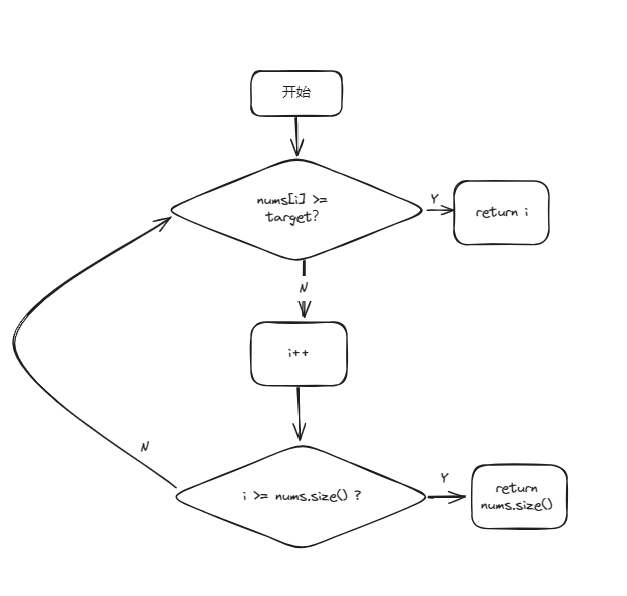

## 一、二分查找

[704. 二分查找](https://leetcode.cn/problems/binary-search/description/)

[代码随想录文章](https://programmercarl.com/0704.%E4%BA%8C%E5%88%86%E6%9F%A5%E6%89%BE.html)

[代码随想录视频讲解](https://www.bilibili.com/video/BV1fA4y1o715)

### 1、概述

​    背景：在有序数组中，寻找目标值；

​    思想：通过判断数组中间值是否和目标值相等，更新搜索区间，直到找到目标值或搜索结束；

​    时间复杂度：O(log n)；

​    空间复杂度：O(1)；

### 2、注意点

1. 右区间初始值是 **nums.size()** 还是 **nums.size()-1** ？
2. while循环的判断条件是**left<right** 还是 **left<=right** ？
3. 区间边界更新值left（right）=**middle** 还是**middle+1（middle-1）**？

### 3、决定因素——自定义的区间特性

#### （1）左闭右闭

​	① 右区间初始值为nums.size()-1；

​	② left<=right为合法区间，以此为循环判断条件；

​	③ 因为区间包含边界值，更新边界时left=middle+1，right=middle-1；

#### （2）左闭右开

​	① 右区间初始值为nums.size()；

​	② left<=right为不合法区间，应以left<right为循环判断条件；

​	③ 因为左区间包含边界值，更新边界时left=middle+1；

​	④ 但右区间不包含边界值，更新边界时right=middle；

### 4、代码

```c++
class Solution {
public:
    int search(vector<int>& nums, int target) {
        int left=0,right=nums.size()-1;//左闭右闭写法
        while(left<=right){
            int middle=(left+right)/2;
            if(target>nums[middle]){
                left=middle+1;
            }
            else if(target<nums[middle]){
                right=middle-1;
            }
            else{
                return middle;
            }
        }
       return -1;
    }
};
```

### 5、其他题目

#### （1）搜索插入位置

[35. 搜索插入位置 ](https://leetcode.cn/problems/search-insert-position/)

[代码随想录文章](https://programmercarl.com/0035.%E6%90%9C%E7%B4%A2%E6%8F%92%E5%85%A5%E4%BD%8D%E7%BD%AE.html#%E6%80%9D%E8%B7%AF)

1. **概述**：给定一个排序数组和一个目标值，在数组中找到目标值，并返回其索引。如果目标值不存在于数组中，返回它将会被按顺序插入的位置。

2. **自己的思路**：暴力解法
    

    ```c++
    class Solution
    {
    public:
        int searchInsert(vector<int> &nums, int target)
        {
            for (int i = 0; i < nums.size(); i++)
            {
                if (nums[i] >= target)
                {
                    return i;
                }
            }
            return nums.size();
        }
    };
    ```

3. **优化思想**：利用有序数组，采用二分法，分析后发现只有四种可能情况
    

    1. 在数组中找到目标值：直接在while循环中返回

    2. 在数组首位加入目标值

    3. 在数组中间加入目标值

    4. 在数组末尾加入目标值

    5. **经分析，后三种情况均应返回left值**

        ```c++
        class Solution
        {
        public:
            int searchInsert(vector<int> &nums, int target)
            {
                int left = 0;
                int right = nums.size() - 1;
        
                while (left <= right)
                {
                    int mid = (left + right) / 2;
                    if (nums[mid] == target)
                    {
                        return mid;
                    }
                    else if (nums[mid] <= target)
                    {
                        left = mid + 1;
                    }
                    else // mid指向的值大于target
                    {
                        right = mid - 1;
                    }
                }
                // 除非在数组中找到target，否则都应该返回left
                return left;
            }
        };
        ```

        

#### （2）在排序数组中查找元素的第一个和最后一个位置

[34.在排序数组中查找元素的第一个和最后一个位置](https://programmercarl.com/0034.在排序数组中查找元素的第一个和最后一个位置.html)

1. 暴力解法

    ```c++
    class Solution
    {
    public:
        vector<int> searchRange(vector<int> &nums, int target)
        {
            vector<int> result(2, -1);
    
            for (int i = 0; i < nums.size(); i++)
            {
                if (result[0] == -1 && nums[i] == target)//找到第一个相等元素
                {
                    result[0] = i;
                }
                if (result[0] != -1 && nums[i] == target)//找到后续相等元素
                {
                    result[1] = i;//for循环结束后，此处存储的是最后一个相等元素
                }
            }
            return result;
        }
    };
    ```

#### （3）x的平方根

[69.x 的平方根](https://leetcode.cn/problems/sqrtx/)

#### （4）有效的完全平方数

[367.有效的完全平方数](https://leetcode.cn/problems/valid-perfect-square/)

## 二、移除元素——快慢指针

[27. 移除元素](https://leetcode.cn/problems/remove-element/)

[代码随想录文章讲解](https://programmercarl.com/0027.%E7%A7%BB%E9%99%A4%E5%85%83%E7%B4%A0.html)

[代码随想录视频讲解](https://www.bilibili.com/video/BV12A4y1Z7LP)

### 1、概述

#### （1）题目

​		给定一个数组nums和目标值val，在nums其中找到并删除val，并返回最后剩下的数组的长度，要求只能在原数组中操作。

#### （2）思考

​		考虑一下，为什么题目不要求返回移除元素后的数组？事实上数组中的元素是不能被删除的，只能被覆盖，而且其在内存空间上连续分布，返回数组意义不大；

### 2、思想

#### （1）暴力解法

1. 外层for循环遍历数组，内层for循环覆盖数组中与val相等的元素；

2. 代码

    ```c++
    class Solution
    {
        public:
        int removeElement(vector<int> &nums, int val)
        {
            int size = nums.size();
        	for (int i = 0; i < size; i++)
        	{
            	if (nums[i] == val) // 找到等于val的数组元素
            	{
                	for (int j = i; j < size - 1; j++)
                	{
                    	nums[j] = nums[j + 1]; // 将其覆盖
                	}
                	i--;
                	size--;
            	}
        	}
        	return size;
        }
        
    }
    ```

    

#### （2）双指针法——快慢指针

1. **思想**

    1. 定义两个指针（fast、slow），fast指针依次指向数组的每个元素，slow指针指向的是更新之后数组的下标。

    2. 若快指针指向的元素 **不等于** val，则将该元素的值赋给慢指针所指向的下标（放入更新数组中）；

    3. 若快指针指向的元素 **等于** val，则快指针继续后移，跳过该元素（不放入更新数组中）。

        

2. **代码**

    1. **自敲**

        ```c++
        class Solution {
        public:
            int removeElement(vector<int>& nums, int val) {
            
            int fast = 0;
            int slow = 0;
        
            while (fast < nums.size())
            {
                while (nums[fast] == val)//数组中的元素等于val
                {
                    fast++;//fast动，slow不动
                    if (fast == nums.size())
                    {
                        return slow;
                    }
                }
                nums[slow] = nums[fast];//将slow的值和fast的值同步
                fast++;
                slow++;
            }
            return slow;
            }
        };
        ```

    2. **优化**

        ```c++
        class Solution {
        public:
            int removeElement(vector<int>& nums, int val) {
                
            int fast = 0;//快指针
            int slow = 0;//慢指针
            while (fast < nums.size())
            {
        
                if (nums[fast] != val)//此处判断考虑不等于的情况更简洁
                {
                    nums[slow] = nums[fast];
                    fast++;
                    slow++;
                    continue;
                }
                fast++;
            }
            return slow;
        }
        };
        ```

### 4、其他题目

#### （1）删除排序数组中的重复项

[26.删除排序数组中的重复项](https://leetcode.cn/problems/remove-duplicates-from-sorted-array/)

#### （2）移动0

[283.移动零](https://leetcode.cn/problems/move-zeroes/)