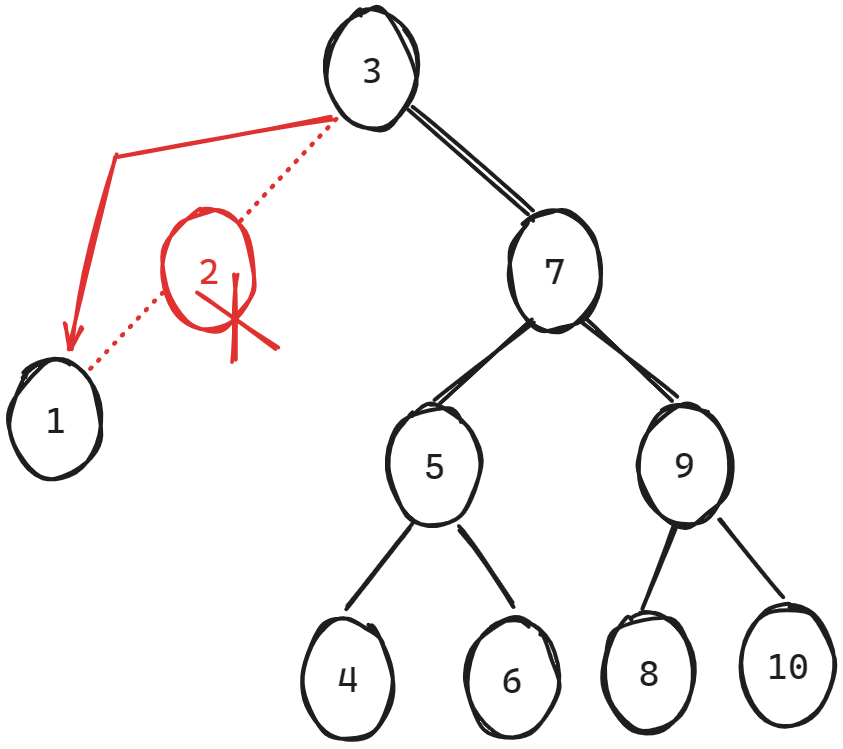
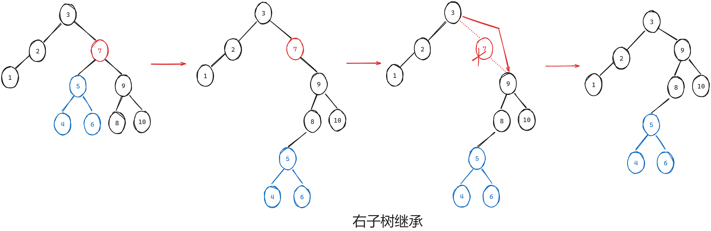
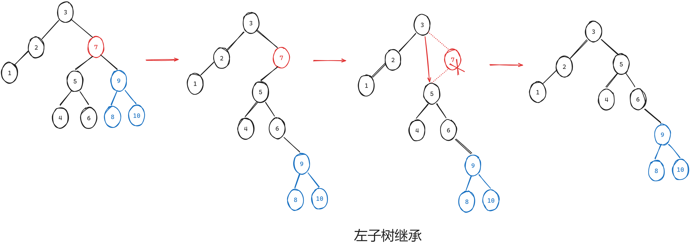

### 一、235. 二叉搜索树的最近公共祖先

[235. 二叉搜索树的最近公共祖先 - 力扣（LeetCode）](https://leetcode.cn/problems/lowest-common-ancestor-of-a-binary-search-tree/description/)

[代码随想录 (programmercarl.com)](https://programmercarl.com/0235.二叉搜索树的最近公共祖先.html#思路)

#### 1、递归思想

1. 根据二叉搜索树的性质，p，q节点的**公共祖先**必然在区间[p,q]之间，因此只要从上往下遍历，找到区间内的数值，则代表是pq的祖先；那么是**最近公共祖先**吗？
2. 如图，在我们**首次**找到5时，可以看到5是最进公共祖先，再向下遍历时，3和8均不是，为什么呢？
    
3. 这是因为当找到位于1和9之间的节点5时，说明1和9分别在5的左子树和右子树中（二叉搜索树的**整个左子树**比根节点小，而**整个右子树**比根节点大），再往下的节点，就是1或9所在子树的内部，再也不会遍历到1和9的公共祖先，因此**首次遍历到的就是最近公共祖先**；
4. 递归三部曲
    1. 返回值：最近公共祖先节点；输入参数：root，p，q
    2. 终止条件：找到空节点返回nullptr；找到在区间内的节点向上返回该节点；
    3. 递归调用：无顺序， 分别向下调用左右子树即可；

#### 2、迭代思想

1. 如果当前节点在[p,q]区间左边，则去找右子树；若在区间右边，则去找左子树；
2. 首次找到区间内的值则返回该节点，最后没找到则返回nullptr；

#### 3、代码

##### （1）递归

```c++
/**
 * Definition for a binary tree node.
 * struct TreeNode {
 *     int val;
 *     TreeNode *left;
 *     TreeNode *right;
 *     TreeNode(int x) : val(x), left(NULL), right(NULL) {}
 * };
 */

class Solution {
public:
    TreeNode* lowestCommonAncestor(TreeNode* root, TreeNode* p, TreeNode* q) {
        if(!root)
        {
            return nullptr;
        }
        if(root->val>=min(p->val,q->val)&&root->val<=max(p->val,q->val))
        {
            return root;
        }

        TreeNode* left_node= lowestCommonAncestor(root->left,p,q);
        TreeNode* right_node= lowestCommonAncestor(root->right,p,q);

        if(left_node) 
        {
            return left_node;
        }
        else if(right_node)
        {
            return right_node;
        }
        else
        {
            return nullptr;
        }
    }
};
```

##### （2）迭代

```c++
/**
 * Definition for a binary tree node.
 * struct TreeNode {
 *     int val;
 *     TreeNode *left;
 *     TreeNode *right;
 *     TreeNode(int x) : val(x), left(NULL), right(NULL) {}
 * };
 */

class Solution {
public:
    TreeNode* lowestCommonAncestor(TreeNode* root, TreeNode* p, TreeNode* q) {
        TreeNode* cur = root;
        while (cur) {
            if (cur->val < min(p->val, q->val)) {
                cur = cur->right;
            } else if (cur->val > max(p->val, q->val)) {
                cur = cur->left;
            } else if (cur->val >= min(p->val, q->val) &&
                       cur->val <= max(p->val, q->val)) {
                return cur;
            }
        }
        return nullptr;
    }
};
```

### 二、701.二叉搜索树中的插入操作

#### 1、思路

1. 递归和迭代一致，val大于当前节点则向右走，小于则向左走，遇到空节点说明要插入val；
2. 迭代时需要pre节点记录上一节点位置，以将val插入到二叉树中；
3. 递归时不需要pre节点，提供返回值，让上层接住更加方便；

#### 2、注意点

1. 需要通过记录pre节点，以此将val接入到二叉树中；`cur=node->left; cur=newNode;`这样的代码只会改变临时变量cur的值，而不会改变二叉树的结构；

#### 3、代码

##### （1）迭代

```c++
/**
 * Definition for a binary tree node.
 * struct TreeNode {
 *     int val;
 *     TreeNode *left;
 *     TreeNode *right;
 *     TreeNode() : val(0), left(nullptr), right(nullptr) {}
 *     TreeNode(int x) : val(x), left(nullptr), right(nullptr) {}
 *     TreeNode(int x, TreeNode *left, TreeNode *right) : val(x), left(left),
 * right(right) {}
 * };
 */
class Solution {
public:
    TreeNode* insertIntoBST(TreeNode* root, int val) {
        
        // 遇到空节点，说明该插入val了，将其返回给上层节点接住
        if(!root)
        {
            return new TreeNode(val);
        }
        
        if(val>root->val)
        {
            root->right = insertIntoBST(root->right,val); //接住返回的节点
        }
        else if(val<root->val)
        {
            root->left=insertIntoBST(root->left,val);     //接住返回的节点
        }
        return root;
    }
};

```

##### （2）递归

```c++
/**
 * Definition for a binary tree node.
 * struct TreeNode {
 *     int val;
 *     TreeNode *left;
 *     TreeNode *right;
 *     TreeNode() : val(0), left(nullptr), right(nullptr) {}
 *     TreeNode(int x) : val(x), left(nullptr), right(nullptr) {}
 *     TreeNode(int x, TreeNode *left, TreeNode *right) : val(x), left(left),
 * right(right) {}
 * };
 */
class Solution {
public:
    TreeNode* insertIntoBST(TreeNode* root, int val) {
        if(!root)
        {
            return new TreeNode(val);
        }
        
        if(val>root->val)
        {
            root->right = insertIntoBST(root->right,val);
        }
        else if(val<root->val)
        {
            root->left=insertIntoBST(root->left,val);
        }
        return root;
    }
};

```

### 三、450.删除二叉搜索树中的节点

#### 1、思路

**递归三部曲**

1. **返回值**：root；参数：root，key；

2. **终止条件**

    1. **遍历到空节点**：返回nullptr；

    2. **找到key节点**

        - 如果是**叶子节点**，直接删除；

        - 如果**一子树为空，另一子树非空**，则将用非空子树的根节点直接替代key节点；
            

        - 如果**key节点两子树均非空**，则有两种方案：1、左子树成为右子树**最小节点**的左子树，**右子树根节点继承key节点**；2、右子树成为左子树**最大节点**的右子树，**左子树根节点继承key节点**；
            

            

#### 2、注意点

1. 二叉搜索树中的最大/最小节点：无关深度的最右/最左节点；

2. 删除节点操作

    ```c++
    TreeNode* tmp_node=root->left;
    delete root;
    return tmp_node;
    ```

#### 3、代码

```c++
/**
 * Definition for a binary tree node.
 * struct TreeNode {
 *     int val;
 *     TreeNode *left;
 *     TreeNode *right;
 *     TreeNode() : val(0), left(nullptr), right(nullptr) {}
 *     TreeNode(int x) : val(x), left(nullptr), right(nullptr) {}
 *     TreeNode(int x, TreeNode *left, TreeNode *right) : val(x), left(left), right(right) {}
 * };
 */
class Solution {
public:
    TreeNode* deleteNode(TreeNode* root, int key) {
        
        if(!root) // 遍历到空节点，返回空给上层节点
        {
            return nullptr;
        }
        
        if(root->val==key) // 找到key
        {
            // 在叶子节点(左右子树均为空)，直接删除
            if(!root->left&&!root->right)
            {
                delete root;
                return nullptr;//返回给上层节点接住
            }

            // 左子树空，右子树不空，右子树直接继承
            else if(!root->left&&root->right)
            {
                TreeNode* tmp_node=root->right;
                delete root;
                return tmp_node;
            }

            // 左子树不空，右子树空，左子树直接继承
            else if(root->left&&!root->right)
            {
                TreeNode* tmp_node=root->left;
                delete root;
                return tmp_node;
            }

            // 左右子树均不为空：
            // 1、右子树继承，左子树成为右子树最小节点(无关深度的最左节点)的左子树
            // 2、左子树继承，右子树称为左子树最大节点(无关深度的最右节点)的右子树
            else
            {
                // 1、
                // 先将左子树移植
                TreeNode* insert_node=root->right;
                while(insert_node->left) // 找最左节点
                {
                    insert_node=insert_node->left;
                }
                insert_node->left=root->left; // 移植左子树

                // 删除当前节点
                TreeNode* tmp_node=root->right;
                delete root;
                return tmp_node;
            }
        }

        root->left=deleteNode(root->left,key);
        root->right=deleteNode(root->right,key);

        return root;
    }
};
```

