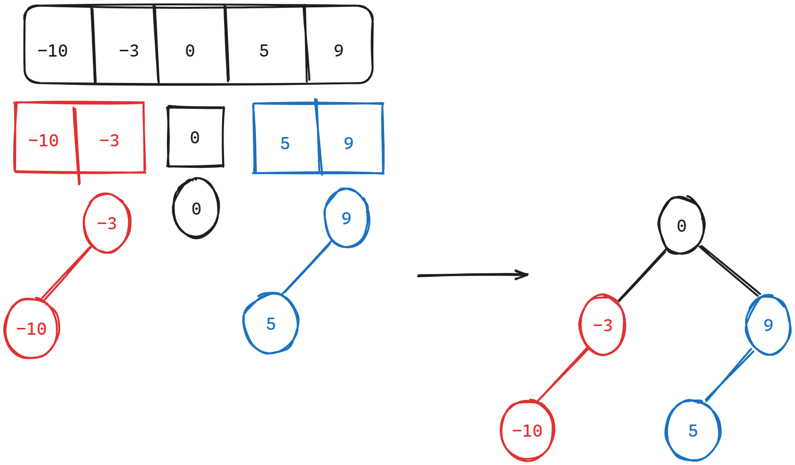

### 一、669. 修剪二叉搜索树

[669. 修剪二叉搜索树 - 力扣（LeetCode）](https://leetcode.cn/problems/trim-a-binary-search-tree/)

[代码随想录 (programmercarl.com)](https://programmercarl.com/0669.修剪二叉搜索树.html)

#### 1、思路

1. 找到区间外的节点时，考虑其左右子树是否仍然满足区间要求，继续遍历，结束后向上层返回；
2. **递归三部曲**
    1. **参数**：root，[low,high]；返回值：符合要求的节点；
    2. **终止条件**：
        - 遍历到空，向上返回空；
        - 找到区间范围外的叶子节点，直接删除；
        - 非叶子节点，小于区间，继续遍历**右子树**（右子树大于根节点，有可能在区间内）；
        - 非叶子节点，大于区间，继续遍历**左子树**（左子树小于根节点，有可能在区间内）；
    3. **递归调用**：向左、右遍历，并用左、右节点接住结果；

#### 2、注意点

- 逐层向上返回符合条件的根节点，上层需要用自己的左右节点接住下层返回的结果；

#### 3、代码

```c++
/**
 * Definition for a binary tree node.
 * struct TreeNode {
 *     int val;
 *     TreeNode *left;
 *     TreeNode *right;
 *     TreeNode() : val(0), left(nullptr), right(nullptr) {}
 *     TreeNode(int x) : val(x), left(nullptr), right(nullptr) {}
 *     TreeNode(int x, TreeNode *left, TreeNode *right) : val(x), left(left), right(right) {}
 * };
 */
class Solution {
public:
    TreeNode* trimBST(TreeNode* root, int low, int high) {
        
        
        if(!root)
        {
            return nullptr;
        }
        // cout<<"root:"<<root->val<<" ";

        // 找到范围外的叶子节点，直接删除，向上返回nullptr
        if((root->val>high||root->val<low) && (!root->left&&!root->right))
        {
            return nullptr;
        }
        // 非叶子节点，大于区间，向左继续遍历（左子树要小于根节点）
        else if(root->val>high)
        {
            TreeNode* left_node=trimBST(root->left,low,high);
            return left_node;
        }
        // 非叶子节点，小于区间，向右继续遍历（右子树要大于根节点）
        else if(root->val<low)
        {
            TreeNode* right_node=trimBST(root->right,low,high);
            return right_node;
        }

        root->left= trimBST(root->left,low,high);
        root->right= trimBST(root->right,low,high);
        
        return root;

        
    }
};
```

### 二、108.将有序数组转换为二叉搜索树

[108. 将有序数组转换为二叉搜索树 - 力扣（LeetCode）](https://leetcode.cn/problems/convert-sorted-array-to-binary-search-tree/)

[代码随想录 (programmercarl.com)](https://programmercarl.com/0108.将有序数组转换为二叉搜索树.html)

#### 1、思路

1. 将数组中间节点（left+right/2）作为根节点，左右区间分别作为左右子树的数组；
2. 递归调用，继续分配；
    

#### 2、注意点

1. 区间的定义要清晰，是左闭右闭还是左闭右开；

2. 初始化vector

    ```c++
    // 初始化数组，区间：[0,mid)
    vector<int> left_nums(nums.begin(),nums.begin()+mid);
    ```

#### 3、代码

##### （1）自己思路——重新定义左右子树数组

```c++
/**
 * Definition for a binary tree node.
 * struct TreeNode {
 *     int val;
 *     TreeNode *left;
 *     TreeNode *right;
 *     TreeNode() : val(0), left(nullptr), right(nullptr) {}
 *     TreeNode(int x) : val(x), left(nullptr), right(nullptr) {}
 *     TreeNode(int x, TreeNode *left, TreeNode *right) : val(x), left(left), right(right) {}
 * };
 */
class Solution {
public:
    TreeNode* sortedArrayToBST(vector<int>& nums) {
        if(nums.size()==0)
        {
            return nullptr;
        }
        
        int mid=nums.size()/2;
        TreeNode* root=new TreeNode(nums[mid]);
        
		// 初始化左右子树数组，区间：[left,right)
        vector<int> left_nums(nums.begin(),nums.begin()+mid);
        vector<int> right_nums(nums.begin()+mid+1,nums.end());

        root->left=sortedArrayToBST(left_nums);
        root->right=sortedArrayToBST(right_nums); 

        return root;
    }
};
```

##### （2）优化——采用区间分割左右子树数组

```c++
/**
 * Definition for a binary tree node.
 * struct TreeNode {
 *     int val;
 *     TreeNode *left;
 *     TreeNode *right;
 *     TreeNode() : val(0), left(nullptr), right(nullptr) {}
 *     TreeNode(int x) : val(x), left(nullptr), right(nullptr) {}
 *     TreeNode(int x, TreeNode *left, TreeNode *right) : val(x), left(left), right(right) {}
 * };
 */
class Solution {
private:
    //数组有效区间：[left,right]
    TreeNode* traversal(vector<int>& nums,int left,int right)
    {
        if(left>right)
        {
            return nullptr;
        }

        int mid=(left+right)/2;
        TreeNode* root=new TreeNode(nums[mid]);

        root->left=traversal(nums,left,mid-1);
        root->right=traversal(nums,mid+1,right);

        return root;
    }
public:
    TreeNode* sortedArrayToBST(vector<int>& nums) {
        return traversal(nums,0,nums.size()-1);
    }
};
```

### 三、538.把二叉搜索树转换为累加树

#### 1、思路

1. 反中序遍历二叉树：**右-中-左**；即可得到从大到小的遍历顺序；
2. 逐个累加即可；

#### 2、代码

```c++
/**
 * Definition for a binary tree node.
 * struct TreeNode {
 *     int val;
 *     TreeNode *left;
 *     TreeNode *right;
 *     TreeNode() : val(0), left(nullptr), right(nullptr) {}
 *     TreeNode(int x) : val(x), left(nullptr), right(nullptr) {}
 *     TreeNode(int x, TreeNode *left, TreeNode *right) : val(x), left(left), right(right) {}
 * };
 */
class Solution {
private:
    int sum=0;
public:
    TreeNode* convertBST(TreeNode* root) {
        if(!root)
        {
            return nullptr;
        }

        // 右
        convertBST(root->right);
        // 中
        sum+=root->val;
        root->val=sum;
        // 左
        convertBST(root->left);

        return root;
    }
};
```

### 四、二叉树总结

#### （1）对递归的感受

1. 递归完全可以看成一个等级制系统，根节点是t0级别，下面各层依次是t1、t2级别等；
2. 递归调用事实上就是高级别官员将任务分拆给下属完成（直至最底层），再逐层向上报告完成情况的过程；
3. 以二叉树的后序遍历为例：左-右-中的遍历顺序；事实上就是先让**左下属（左子树的根节点）**完成相应工作，再让**右下属（右子树的根节点）**完成工作，最后高级别官员统计完成情况，再向其**上级（父节点）**回报；

#### （2）对遍历顺序的感受

1. **后序遍历**：感觉是最好用的遍历方式，大部分题目的逻辑都是左右子树分别判断后再将结果上报给父节点判断，符合后序遍历“左-中-右”的逻辑
2. **前序遍历**：当终止条件是深入到最底层叶子节点时，适合使用前序遍历，例如求二叉树深度，求二叉树路径等；
3. **中序遍历**：见到二叉搜索树马上要想到中序遍历是有序的，这是很多题目的关键条件；
4. **层序遍历**：用的不多，知道用队列模拟即可；

#### （3）修改二叉树的感受

1. **删除节点**：两种解决方案
    1. **右子树继承**：将左子树移植到右子树**最小节点（就是最左边的节点）**下，作为该节点的左子树；**右子树根节点继承**被删除节点的位置；
    2. **左子树继承**：将右子树移植到左子树**最大节点（就是最右边的节点）**下，作为该节点的右子树；**左子树根节点继承**被删除节点的位置；
2. **插入节点**：找到符合条件的空位置插入即可；
3. **修剪**：在修剪完一个节点后，考虑其子树（如果存在）是否仍能满足区间要求；
4. **构造**：将有序数组分割即可，很简单；