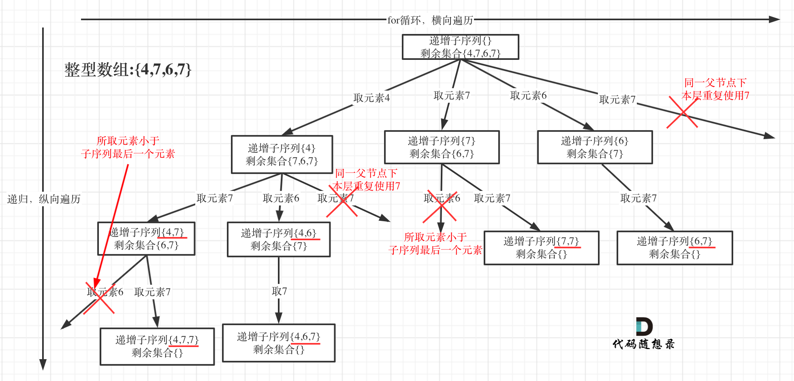

### 十一、491.递增子序列</span>

[491. 非递减子序列 - 力扣（LeetCode）](https://leetcode.cn/problems/non-decreasing-subsequences/description/)

[代码随想录 (programmercarl.com)](https://programmercarl.com/0491.递增子序列.html)	

#### 1、思路

1. 与[十、90.子集Ⅱ](#jump10)的不同点在于**本题不能排序**，因此不能使用used数组解决，只能使用unordered_set来记录当前树层使用过的元素；
    

#### 2、代码

```c++
class Solution {
private:
    vector<int> path;
    vector<vector<int>> result;
    void backtracking(const vector<int>& nums, int start_index) {
        if (start_index == nums.size()) {
            return;
        }

        unordered_set<int> used_set;
        for (int i = start_index; i < nums.size(); i++) {

            if ((!path.empty() && nums[i] < path.back()) ||
                used_set.find(nums[i]) != used_set.end()) {
                continue;
            } 
            else{
                path.push_back(nums[i]);
                // cout<<"push:";
                // printPath(path);
                used_set.insert(nums[i]);
                // cout<<"set:";
                // printSet(used_set);
                
                if(path.size()>=2)
                {
                    result.push_back(path);
                }
            }
            // cout<<endl;

            backtracking(nums,i+1);

            path.pop_back();
            // cout<<"pop:";
            // printPath(path);
            // cout<<endl;

        }
    }

    void printPath(const vector<int>& path) {
        for (auto i : path) {
            cout << i << " ";
        }
        cout << endl;
    }

    void printSet(const unordered_set<int>& used_set)
    {
        for (auto i : used_set) {
            cout << i << " ";
        }
        cout << endl;
    }

public:
    vector<vector<int>> findSubsequences(vector<int>& nums) {
        backtracking(nums, 0);
        return result;
    }
};
```

### 十二、46.全排列

[46. 全排列 - 力扣（LeetCode）](https://leetcode.cn/problems/permutations/description/)

[代码随想录 (programmercarl.com)](https://programmercarl.com/0046.全排列.html#算法公开课)

#### 1、思路

1. 事实上排列的本质就是**在众多的“剩余”元素中选取下一个元素**的过程；
2. 用used数组记录**哪个数字已经被选择过**，跳过它去选择下一个元素；
    

#### 2、注意点

- 与组合问题的最大区别在此，**i从0开始而不再是start_index**；
- **used必须定义在主函数体内**而不能定义为private成员，因为作为private成员时无法初始化其大小，可能会发生越界访问；

#### 3、代码

```c++
class Solution {
private:
    vector<int> path;
    vector<vector<int>> result;
    void backtracking(vector<int>& nums, vector<int>& used) {
        
        // path中的元素和nums.size()相同，说明每个元素都排列了，返回path
        if (path.size() == nums.size()) {
            result.push_back(path);
            return;
        }

        // 与组合问题的最大区别在此，i从0开始而不再是start_index
        for (int i = 0; i < nums.size(); i++) {
            if (used[i] == 1) {
                continue;
            }

            path.push_back(nums[i]);
            used[i] = 1;

            backtracking(nums, used);

            used[i] = 0;
            path.pop_back();
        }
    }

public:
    vector<vector<int>> permute(vector<int>& nums) {
        
        // used必须定义在此处而不能定义为private成员，否则可能会越界访问数组
        vector<int> used(nums.size(),0); 
        
        backtracking(nums, used);
        return result;
    }
};
```

### 十三、47.全排列 II

[47. 全排列 II - 力扣（LeetCode）](https://leetcode.cn/problems/permutations-ii/description/)

[代码随想录 (programmercarl.com)](https://programmercarl.com/0047.全排列II.html)

#### 1、思路


#### 2、代码

```c++
class Solution {
private:
    vector<int> path;
    vector<vector<int>> result;
    void backtracking(vector<int>& nums,vector<int>& used)
    {
        if(path.size()==nums.size())
        {
            result.push_back(path);
            return;
        }

        for(int i=0;i<nums.size();i++)
        {
            // 从前一相同数字中回溯后，跳过选择该元素（因为已经在该位置选过相同的元素）
            if(i>0 && nums[i]==nums[i-1] && used[i-1]==0)
            {
                continue; 
            }
            
            if(used[i]==1)
            {
                continue;
            }

            path.push_back(nums[i]);
            used[i]=1;

            backtracking(nums,used);

            used[i]=0;
            path.pop_back();
        }
    }
public:
    vector<vector<int>> permuteUnique(vector<int>& nums) {
        // 先排序
        sort(nums.begin(),nums.end());

        vector<int> used(nums.size(),0);
        backtracking(nums,used);
        
        return result;
    }
};
```