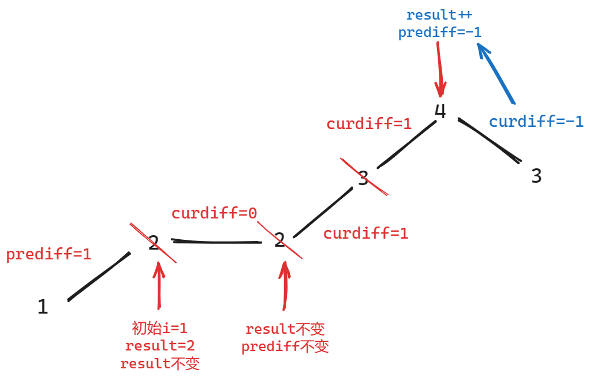

### 一、理论基础

[代码随想录 (programmercarl.com)](https://programmercarl.com/贪心算法理论基础.html#算法公开课)

- 总结来说：贪心算法是由**局部最优推导全局最优**的过程；
- 每题的思路都不同，没有固定套路；

### 二、455.分发饼干

[455. 分发饼干 - 力扣（LeetCode）](https://leetcode.cn/problems/assign-cookies/)

[代码随想录 (programmercarl.com)](https://programmercarl.com/0455.分发饼干.html)

#### 1、思路

1. 尽可能用大的饼干喂大胃口的孩子；
2. 局部最优：大饼干喂大胃口；全局最优：能喂饱最多孩子

#### 2、注意点

#### 3、代码

```c++
class Solution {
public:
    int findContentChildren(vector<int>& g, vector<int>& s) {
        // 两数组分别排序
        sort(g.begin(),g.end()); // 胃口
        sort(s.begin(),s.end()); // 饼干

        // 尽量用大饼干去满足胃口大的孩子
        int result=0;
        int s_index=s.size()-1;
        for(int g_index=g.size()-1;g_index>=0;g_index--){
            if(s_index>=0 && g[g_index]<=s[s_index])
            {
                result++;
                s_index--;
            }
        }

        return result;

    }
};
```

### 三、 376. 摆动序列

[376. 摆动序列 - 力扣（LeetCode）](https://leetcode.cn/problems/wiggle-subsequence/description/)

[代码随想录 (programmercarl.com)](https://programmercarl.com/0376.摆动序列.html#算法公开课)

#### 1、思路

1. 局部最优：遇到趋势相同的节点则跳过；全局最优：仅留下波峰和波谷；
    

#### 2、注意点

1. 情况1：上下坡中有平坡
    
2. 情况2：单调坡中有平坡
    
3. 首尾元素
    1. 将如果前两个元素不同，摆动元素至少为2，将result初始化为2；
    2. 前两个元素相同，则result初始化为1，保留一个；
    3. 从第2个元素开始遍历直至倒数第二个元素，最后一个元素的处理是由倒数第二个元素实现的；

#### 3、代码

```c++
class Solution {
public:
    int wiggleMaxLength(vector<int>& nums) {
        // 处理边界情况:1个元素&2个元素
        if (nums.size() <= 1) {
            return nums.size();
        }
        if (nums.size() == 2) {
            if (nums[0] != nums[1]) {
                return 2;
            } else {
                return 1;
            }
        }

        int prediff = nums[1] - nums[0]; // 初始化为第二个元素和第一个元素的差
        int curdiff = 0;                 // curdiff=nums[i+1]-nums[i]
        int result = 0;
        if (prediff == 0) {
            result = 1; // 如果前面两个元素相等，则初始化结果为1
        } else {
            result = 2; // 如果前面两个元素不相等，则初始化结果为2
        }

        // 从第二个元素开始遍历，直至倒数第二个元素
        for (int i = 1; i < nums.size() - 1; i++) {
            curdiff = nums[i + 1] - nums[i];

            // 当左为平坡(prediff=0)，右为斜坡时(curdiff!=0)，认为有一个摆动
            if ((prediff <= 0 && curdiff > 0) ||
                (prediff >= 0 && curdiff < 0)) {

                result++;
                // 当且仅当发生摆动时，才更新prediff，处理单调坡中有平坡的情况
                prediff = curdiff;
            }
        }

        return result;
    }
};
```

### 四、 53.最大子数组和

[53. 最大子数组和 - 力扣（LeetCode）](https://leetcode.cn/problems/maximum-subarray/description/)

[代码随想录 (programmercarl.com)](https://programmercarl.com/0053.最大子序和.html)

#### 1、思路

1. **局部最优**：当前和已经退化到负数时，只会拖累后面的数，此时舍弃当前和，从下一个元素开始重新计算和；
2. **全局最优**：得到最大的子数组和；

#### 2、代码

```c++
class Solution {
public:
    int maxSubArray(vector<int>& nums) {
        int result = INT_MIN;
        int sum = 0;

        for (int i = 0; i < nums.size(); i++) {

            // sum小于0时只会拖累下一个数，不妨直接从下一个数开始
            if (sum <= 0) {
                sum = nums[i];
            } else {
                sum += nums[i];
            }

            result = (sum > result) ? sum : result;
            // cout << "sum:" << sum << endl;
            // cout << "result:" << result << endl;
        }
        return result;
    }
};
```

