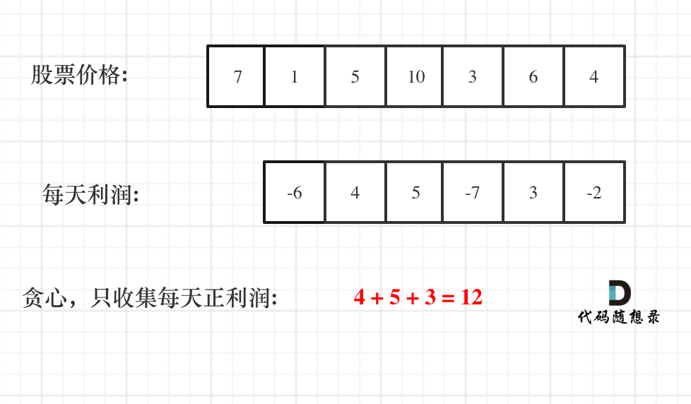
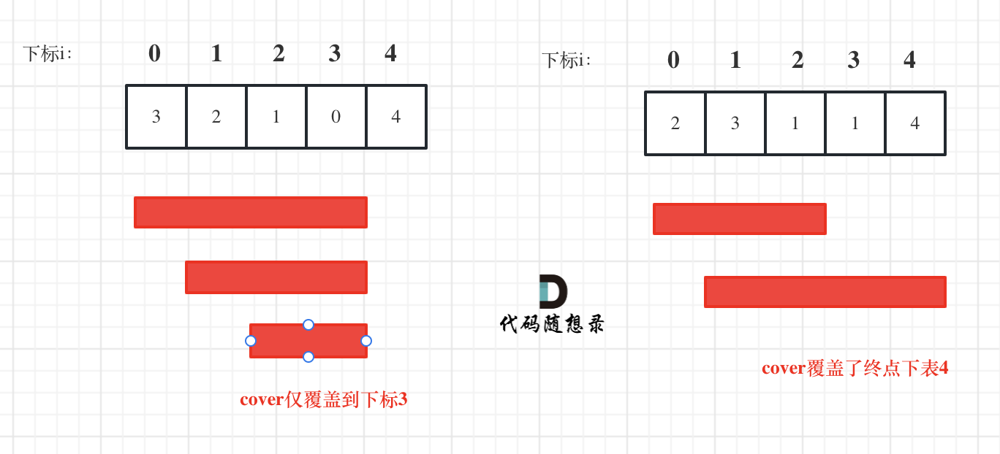

### 五、 122.买卖股票的最佳时机 II

[122. 买卖股票的最佳时机 II - 力扣（LeetCode）](https://leetcode.cn/problems/best-time-to-buy-and-sell-stock-ii/description/)

[代码随想录 (programmercarl.com)](https://programmercarl.com/0122.买卖股票的最佳时机II.html#算法公开课)

#### 1、思路

1. 注意可以随时买卖股票，且必须以两天为一个交易单位，所以利润可以被分解为每两天的利润；
2. 因此只需要计算所有**相邻两天**之间的价格差，只要价格差为正，即可为最终结果做出贡献；
3. 局部最优：找出所有赚钱的相邻两天；
4. 全局最优：赚最多的钱！！
    

#### 2、代码

```c++
class Solution {
public:
    int maxProfit(vector<int>& prices) {
        int result=0;
        for(int i=1;i<prices.size();i++)
        {
            // 计算相邻两天的利润
            int profit_today=prices[i]-prices[i-1];

            // 如果相邻两天的利润为正,代表能对结果有贡献
            if(profit_today>0)
            {
                result+=profit_today;
            }
        }
        
        return result;
    }
};
```

### 六、55. 跳跃游戏

[55. 跳跃游戏 - 力扣（LeetCode）](https://leetcode.cn/problems/jump-game/description/)

[代码随想录 (programmercarl.com)](https://programmercarl.com/0055.跳跃游戏.html)

#### 1、思路

1. 遍历节点，延展当前能遍历到的最大覆盖范围；
2. 如果覆盖范围达到了nums.size()-1，说明必然可以跳到最后一位；
    

#### 2、注意点

1. for循环不需要遍历到nums.size()，遍历到当前的覆盖范围coverage即可；

#### 3、代码

```c++
class Solution {
public:
    bool canJump(vector<int>& nums) {

        int coverage = 0; // 覆盖范围

        // 不需要遍历到nums.size(),到coverage即可
        for (int i = 0; i <= coverage; i++) {

            // if (i > coverage) {
            //     break;
            // }
            
            // 修改覆盖范围
            coverage = (coverage>(i+nums[i]))?coverage:i+nums[i]; 
            if(coverage>=nums.size()-1)
            {
                return true;
            }
        }

        return false;
    }
};
```

### 七、45.跳跃游戏Ⅱ

[45. 跳跃游戏 II - 力扣（LeetCode）](https://leetcode.cn/problems/jump-game-ii/)

[代码随想录 (programmercarl.com)](https://programmercarl.com/0045.跳跃游戏II.html#思路)

#### 1、思路

1. 仍然考虑覆盖范围，但需要考虑跳几次能达到末尾；
2. 因此当每次**走到当前覆盖范围的末尾，需要拓展覆盖范围**，都将**跳跃次数++**；
    

#### 2、注意点

1. 覆盖范围取遍历到的覆盖范围的最大值；
2. 注意处理边界情况：**只有一个元素**，跳0次；

#### 3、代码

```c++
class Solution {
public:
    int jump(vector<int>& nums) {
        // 处理边界条件:仅有一个元素，跳0次
        if(nums.size()==1)
        {
            return 0;
        }

        int result=1;// 处理完跳0次的情况后，至少需要跳1次；
        int max_coverage=0;
        int cur_coverage=0;

        for(int i=0;i<=cur_coverage;i++)
        {
            max_coverage=max(max_coverage,i+nums[i]);
            // 如果发现当前的最大范围已经覆盖最后一个元素，则结束循环
            if(max_coverage>=nums.size()-1)
            {
                break;
            }

            // 走到当前覆盖范围的尽头，需要拓展范围，则result++（多走一步）
            if(i==cur_coverage)
            {
                cur_coverage=max_coverage;
                result++;
            }
        }
        
        return result;

    }
};
```

### 八、1005.K次取反后最大化的数组和

[1005. K 次取反后最大化的数组和 - 力扣（LeetCode）](https://leetcode.cn/problems/maximize-sum-of-array-after-k-negations/description/)

[代码随想录 (programmercarl.com)](https://programmercarl.com/1005.K次取反后最大化的数组和.html#算法公开课)

#### 1、思路

1. 容易想到，可以优先将绝对值大的负值全部取反，得到较大的正值；
2. 之后用**最小的正值**消耗k（如果k为奇数，会使其变负）；
3. 步骤
    1. 先按绝对值降序排序；
    2. 把负数都变正；
    3. 如果此时剩下的k为奇数，将最小的正数变负；
    4. 输出数组的和；

#### 2、注意点

1. 将nums**按绝对值降序**排列，便于将负数全部变正后**处理最小的正数**（即nums.size()-1，当然这里也可能是0）；

2. 自定义比较函数cmp

    1. 返回true代表第一个数放在第二个数前，返回false反之

        ```c++
        static bool cmp(int a, int b)
        { 
        	return abs(a) > abs(b); // 较大的数排在前边
        }
        ```

    2. 注意要将cmp定义成**static静态成员函数**；因为sort()希望其参数是和类的实例无关的成员函数，**非静态成员函数需要绑定在类的实例上才能使用**；

#### 3、代码

```c++
class Solution {
public:
    static bool cmp(int a, int b) { return abs(a) > abs(b); }
    int largestSumAfterKNegations(vector<int>& nums, int k) {

        int result = 0;

        // 1、先按绝对值降序排序
        sort(nums.begin(), nums.end(), cmp);

        // 2、把负数都变正
        for (int i = 0; i < nums.size(); i++) {
            if(k==0)
            {
                break;
            }
            if (k != 0 && nums[i] < 0) {
                nums[i] *= (-1);
                k--;
            }
        }

        // 3、如果此时剩下的k为奇数，将最小的正数变负
        if (k % 2 == 1) {
            nums[nums.size() - 1] *= (-1);
        }

        // 4、输出数组的和
        for (auto i : nums) {
            result += i;
        }

        return result;
    }
};
```

### 九、134. 加油站

[134. 加油站 - 力扣（LeetCode）](https://leetcode.cn/problems/gas-station/description/)

[代码随想录 (programmercarl.com)](https://programmercarl.com/0134.加油站.html)

#### 1、思路

1. 先判断当前行程是否无解，若耗油量总和要大于加油量，则无解；
2. 若有解，题目说**必有唯一解**，因此有以下步骤
    1. 遍历站点，求出在站点i加油，并行驶到站点i+1之后剩下的油量（即**相邻两两站点之间的油量盈余gas[i] - cost[i]**，注意**可能为负**）；
    2. 将每站的油量盈余逐个叠加，当盈余和在站点i出现负值时，说明从当前起点出发无法走到站点i，此时重置起点start_station为i+1，重置油量盈余为0；
    3. 遍历结束后记录到的起点即为可行的起点；

#### 2、代码

```c++
class Solution {
public:
    int canCompleteCircuit(vector<int>& gas, vector<int>& cost) {
        int start_station = 0;// 起点
        int rest = 0; // 每一程的剩余油量
        int cur_gas = 0; // 当前油量和

        int gas_sum = 0; // 所有站点加油量总和
        int cost_sum = 0; // 所有站点耗油量总和

        for (int i = 0; i < gas.size(); i++)
        {
            gas_sum += gas[i];
            cost_sum += cost[i];
        }
        // 排除无解的情况：即耗油量总和要大于加油量
        if (cost_sum > gas_sum)
            return -1;

        for (int i = 0; i < gas.size(); i++) 
        {
            rest = gas[i] - cost[i]; // 仅从i站到i+1站，剩余的油量（可能为负）
            cur_gas += rest; // 从出发站点到i站点时，油箱当前的油量盈余

            // 油箱当前的油为负时，更新出发站点为下一个站点，并重置油箱
            if (cur_gas < 0) 
            {
                start_station = i + 1;
                cur_gas = 0;
            }
        }
        // 由于已经排除无解的情况，因此遍历结束后直接返回start_station就是唯一解
        return start_station;
    }
};
```

