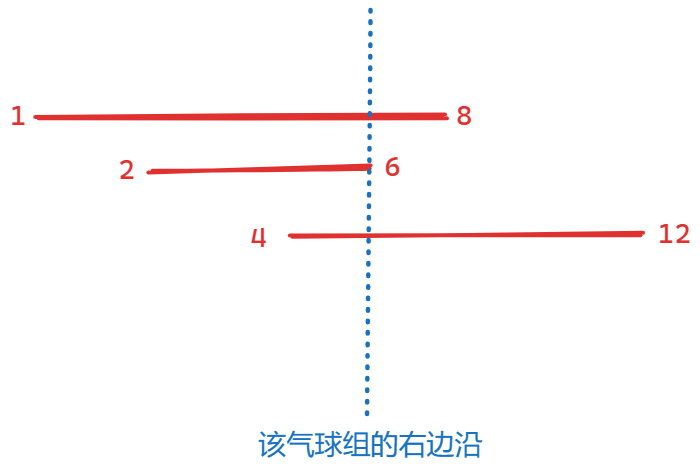
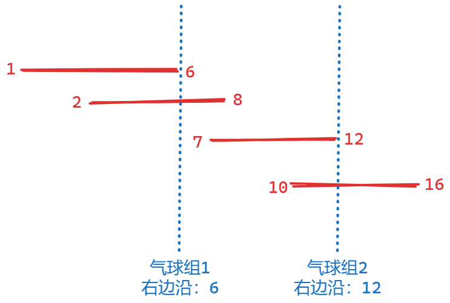
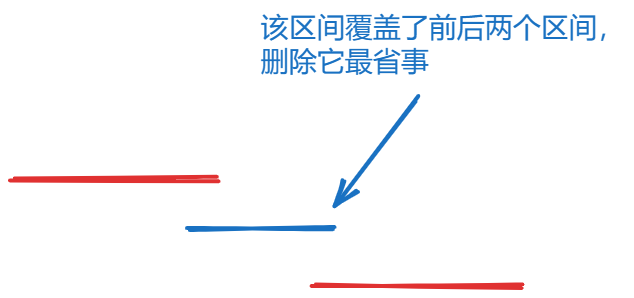
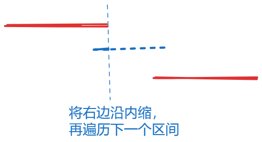
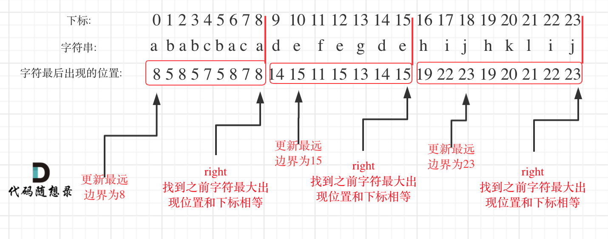

### 十三、452. 用最少数量的箭引爆气球

[452. 用最少数量的箭引爆气球 - 力扣（LeetCode）](https://leetcode.cn/problems/minimum-number-of-arrows-to-burst-balloons/description/)

[代码随想录 (programmercarl.com)](https://programmercarl.com/0452.用最少数量的箭引爆气球.html#算法公开课)

#### 1、思路

1. 典型的重叠区间问题，后续三道题都是重叠区间问题，这类问题的关键在于**当前区间边界的选取和缩放；**
2. 对本题来说，可以**将有重叠区间的气球看作一个气球组**，该组的右边沿是组内**每个气球右边缘的最小值**
    
3. 在实际处理中，先将气球按左边沿升序排列，再依次遍历气球；
4. 若气球i+1和i重合，则**将其加入i所在的气球组，并更新气球组的右边沿**（如果需要的话）——贪心之处；
5. 若i+1和i不重合，说明**要创建新的气球组，此时箭的数量++，并更新气球组边沿为i+1的右边沿**；
    

#### 2、代码

```c++
class Solution {
public:
    static bool cmp(vector<int> a, vector<int> b) { return a[0] < b[0]; }

    void printPoints(vector<vector<int>>& points) {
        cout << "[";
        for (auto i : points) {
            cout << "[" << i[0] << "," << i[1] << "]"
                 << " ";
        }
        cout << "]";
        cout << endl;
    }

    int findMinArrowShots(vector<vector<int>>& points) {
        // 先按左边界升序排列
        sort(points.begin(), points.end(), cmp);
        // printPoints(points);

        // 寻找能一箭引爆的重叠气球
        int result = 1; // 至少需要一箭，初始化为1
        for (int i = 0; i < points.size()-1; i++) {
            // 气球i+1和i所在组的气球不重叠，则增加箭数量
            if (points[i][1] < points[i+1][0]) { 
                result++;
            }
            // 气球i+1和i重叠，则将i+1加入该组，并修改该组的右边界
            else{ 
                points[i+1][1]=min(points[i][1],points[i+1][1]);
            }
        }

        return result;
    }
};
```

### 十四、435. 无重叠区间

[435. 无重叠区间 - 力扣（LeetCode）](https://leetcode.cn/problems/non-overlapping-intervals/description/)

[代码随想录 (programmercarl.com)](https://programmercarl.com/0435.无重叠区间.html#算法公开课)

#### 1、思路

1. 先将区间按左边界升序排列，再依次遍历各区间；
2. 若区间i+1和区间i重叠，则说明要删除一个，删除哪个呢？考虑一下，发现**删除右边界较大的区间比较好**，因为右边界较大的区间可能覆盖到后续区间；
    
3. 因此遍历区间时，若i+1区间和第i区间重叠，则将删除区间的数量++，并将区间内缩，遍历下一区间；
    

#### 2、代码

```c++
class Solution {
public:
    static bool cmp(vector<int> a, vector<int> b)
    {
        return a[0]<b[0];
    }

    void printIntervals(vector<vector<int>>& intervals)
    {
        for(auto i:intervals)
        {
            cout<<"["<<i[0]<<","<<i[1]<<"]"<<" ";
        }
        cout<<endl;
    }

    int eraseOverlapIntervals(vector<vector<int>>& intervals) {

        // 排序
        sort(intervals.begin(),intervals.end(),cmp);
        // printIntervals(intervals);

        int result = 0;

        for (int i = 0; i < intervals.size()-1; i++) {
            // 找到重叠的区间
            if(intervals[i][1]>intervals[i+1][0]){
                result++;
                // 更新右边界
                intervals[i+1][1]=min(intervals[i][1],intervals[i+1][1]);
            }
        }
        
        return result;
    }
};
```

### 十五、763.划分字母区间

#### 1、思路

1. 先遍历一次字符串，找到每个字符出现的最后位置；
2. 再次遍历字符串，每段子串的边缘至少应该延长到当前字符最后出现的位置；
3. 当且仅当遍历到**子串边缘（子串内所有字母最后出现位置的最大值）**时，停止遍历，保留子串长度；
4. **更新下一个子串边缘为i+1字符的最后出现位置；**
    

#### 2、代码

```c++
class Solution {
public:
    void printVec(const vector<int> &vec)
    {
        for(auto i:vec)
        {
            cout<<i<<" ";
        }
        cout<<endl;
    }

    vector<int> partitionLabels(string s) {
        vector<int> last_position(26,0); // 每个字母最后出现的位置
        vector<int> result;
        int str_length=0;
        int cur_str_edge=0;

        // 统计每个字母最后出现的位置
        for(int i=0;i<s.size();i++)
        {
            int index=s[i]-'a';
            last_position[index] = max(last_position[index],i);
        }
        printVec(last_position);

        // 找到每个分割字符串的长度
        for(int i=0;i<s.size();i++)
        {
            int index = s[i] - 'a';

            cur_str_edge=max(cur_str_edge,last_position[index]);
            str_length++;

            if(i == cur_str_edge)
            {
                result.push_back(str_length);
                str_length=0;
                if(i!=s.size()-1)
                    cur_str_edge=last_position[(int)(s[i+1]-'a')];
            }

        }

        return result;
    }
};
```

### 
