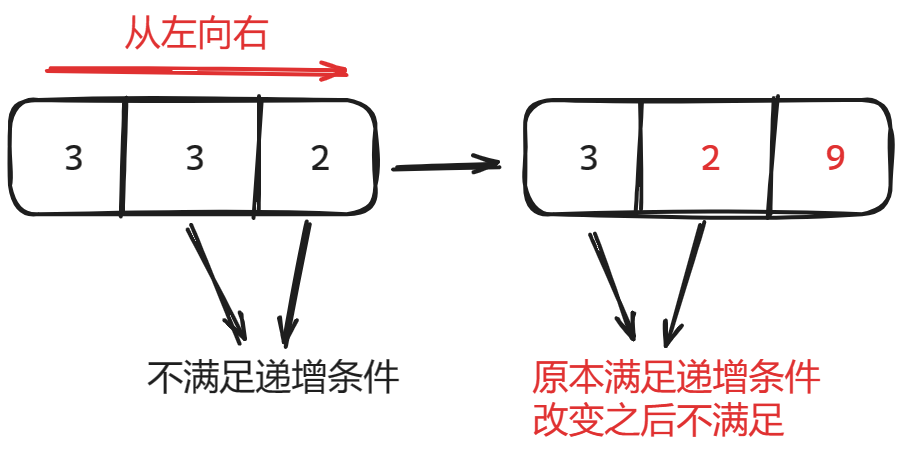
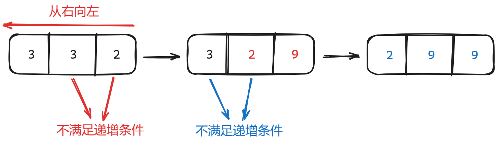
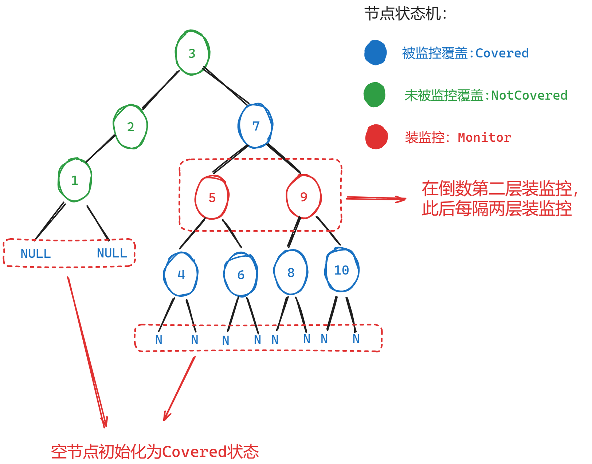

### 十六、56. 合并区间

[56. 合并区间 - 力扣（LeetCode）](https://leetcode.cn/problems/merge-intervals/description/)

[代码随想录 (programmercarl.com)](https://programmercarl.com/0056.合并区间.html#算法公开课)

#### 1、思路

- 本题和**十五、763.划分字母区间**很相似，区别在于本题遇到重叠区间时要拓宽区间边沿；
    

#### 2、注意点

- 注意处理边界条件：遍历到**最后一个区间**时，当前重叠区间overlapping_interval已经被前一个区间处理，直接将overlapping_interval加入结果集即可；

#### 3、代码

```c++
class Solution {
public:
    static bool cmp(vector<int> a, vector<int> b) { return a[0] < b[0]; }

    void printIntervals(vector<vector<int>>& intervals)
    {
        for(auto i:intervals)
        {
            cout<<"["<<i[0]<<","<<i[1]<<"]"<<" ";
        }
        cout<<endl;
    }

    vector<vector<int>> merge(vector<vector<int>>& intervals) {
        
        // 按左边界排序
        sort(intervals.begin(), intervals.end(), cmp);
        // printIntervals(intervals);

        vector<int> overlapping_interval = intervals[0]; // 存放当前重叠区间
        // cout<<"overlapping_interval[0]:"<<"["<<overlapping_interval[0]<<","<<overlapping_interval[1]<<"]";
        vector<vector<int>> result;
        for (int i = 0; i < intervals.size(); i++) {
            // 处理边界情况：遍历到最后一个区间
            if(i==intervals.size()-1){
                //此时重叠区间已经被i-1更新，直接加入结果集即可
                result.push_back(overlapping_interval);
                break;
            }

            // 第i+1个区间和前一个重叠区间重叠
            // cout<<"overlapping_interval[1]:"<<overlapping_interval[1]<<endl;
            if (overlapping_interval[1] >= intervals[i + 1][0]) {
                // 拓展重叠区间的右边界
                overlapping_interval[1] = max(overlapping_interval[1], intervals[i + 1][1]);
            }
            // 不重叠
            else {
                // 将当前重叠区间加入结果集
                result.push_back(overlapping_interval);

                // 更新重叠区间
                overlapping_interval = intervals[i + 1];
            }
        }

        return result;
    }
};
```

### 十七、738.单调递增的数字

[738. 单调递增的数字 - 力扣（LeetCode）](https://leetcode.cn/problems/monotone-increasing-digits/description/)

[代码随想录 (programmercarl.com)](https://programmercarl.com/0738.单调递增的数字.html#算法公开课)

#### 1、思路

1. 因为题目要找小于等于N的**最大**整数，因此我们采用如下策略；

    1. 将数字转换为字符串**str_num**；
    2. 遇到第i位数不符合递增序列，就将其-1；
    3. 将i+1之后的数位全部变成9；

2. 考虑**从左向右遍历**，遇到**str_num[i] > str_num[i+1]（即非递增）**的情况时，将**str_num[i]--，并将i~size()-1的数全部变为9**；发现会遇到问题——**会改变已满足的条件**；

3. 

4. **从右向左遍历**则可以保证改变数字不会影响之前满足的条件，因为已经将已经遍历过的数字全部变为9；

    

#### 2、注意点

1. 将int转换为string：`string str_num = to_string(n);`
2. 将string转换为int：`result = stoi(str_num);`
3. 将char转换为int：`result = atoi(str_num);`

#### 3、代码

```c++
class Solution {
public:
    void printStr(string& s) {
        for (auto i : s) {
            cout << i;
        }
        cout << endl;
    }

    int monotoneIncreasingDigits(int n) {

        string str_num = to_string(n); // 将int转换成string便于处理
        int result = 0;
        // printStr(str_num);

        // 从右向左遍历
        for (int i = str_num.size() - 1; i > 0; i--) {
            // 如果第i-1位大于第i位
            if (str_num[i - 1] > str_num[i]) {
                // 将i-1位减1
                str_num[i - 1] -= 1;

                // 将第i位到size-1位全部变为9
                int replace_length = str_num.size() - i;
                str_num.replace(i, replace_length, replace_length, '9');
                cout<<"i:"<<i<<" nums:";
                printStr(str_num);
            }
        }
        
        result = stoi(str_num);

        return result;
    }
};
```

### 十八、968.监控二叉树

[968. 监控二叉树 - 力扣（LeetCode）](https://leetcode.cn/problems/binary-tree-cameras/description/)

[代码随想录 (programmercarl.com)](https://programmercarl.com/0968.监控二叉树.html)

#### 1、思路

1. 要将每个监控的作用最大程度发挥，必须在**倒数第二层节点（叶子节点的父节点）装监控，此后每隔两层装一次监控；**考虑采用**后序遍历**，逐层向上反馈；

    

2. 每个节点的**状态机**如下：

    1. **被监控覆盖：Covered；**
    2. **未被监控覆盖：NotCovered；**
    3. **安装监控：Monitor；**

3. 状态转移

    1. 空节点向上反馈**Covered**，以保证**叶子节点不装监控**，同时**叶子节点的父节点安装监控**；

    2. 如果**任何一侧叶子节点报告了NotCovered**，则在本节点**安装监控**，向上反馈**Monitor**；

        ```c++
        if (left == NotCovered || right == NotCovered) {
        	result++;
        	return Monitor;
        }
        ```

    3. 如果**两个叶子节点都没有监控Monitor**，则本节点向上报告状态**NotCovered**；

        ```c++
        else if (left != Monitor && right != Monitor) {
        	return NotCovered;
        }
        ```

    4. 如果**任何一侧叶子节点报告了Monitor**，则本节点向上报告状态**Covered**；

        ```c++
        else if (left == Monitor || right == Monitor) {
        	return Covered;
        }
        ```

#### 2、注意点

1. 处理边界条件1：二叉树仅有一个节点；

    ```c++
    if(!root->left && !root->right){
    	return 1;
    }
    ```

2. 处理边界条件2：二叉树的根节点未被覆盖NotCovered，则为其加装监控

    ```c++
    if(root_state==NotCovered){
        result++;
    }
    ```

3. 在遍历二叉树的代码traversal中，尽管逻辑不会走到最后，但编译规则要求必须给函数一个返回值；

#### 3、代码

```c++
/**
 * Definition for a binary tree node.
 * struct TreeNode {
 *     int val;
 *     TreeNode *left;
 *     TreeNode *right;
 *     TreeNode() : val(0), left(nullptr), right(nullptr) {}
 *     TreeNode(int x) : val(x), left(nullptr), right(nullptr) {}
 *     TreeNode(int x, TreeNode *left, TreeNode *right) : val(x), left(left),
 * right(right) {}
 * };
 */

// 被监控覆盖
#define Covered 0
// 未被监控覆盖
#define NotCovered 1
// 安装监控
#define Monitor 2

class Solution {
private:
    int result = 0;

    int traversal(TreeNode* root) {
        // 终止条件：遍历到空节点，则返回被覆盖Covered状态，便于处理
        if (!root) {
            return Covered;
        }

        // 后序遍历
        int left = traversal(root->left);
        // cout << "left:" << left << " ";
        int right = traversal(root->right);
        // cout << "right:" << right << " " << endl;

        // 中间节点处理逻辑
        // 1、只要有一侧是未覆盖NotCovered，则在本节点安装监控，向上返回Monitor
        if (left == NotCovered || right == NotCovered) {
            result++;
            // cout << "result:" << result << endl;
            return Monitor;
        }
        // 2、两侧都没有监控!=Monitor，则向上返回未被覆盖NotCovered
        else if (left != Monitor && right != Monitor) {
            return NotCovered;
        }
        // 3、只要有一侧装了监控Monitor，则向上返回已被监控覆盖状态Covered
        else if (left == Monitor || right == Monitor) {
            return Covered;
        }

        // 逻辑不会走到最后，但函数要求必须有返回值
        return -1;
    }

public:
    int minCameraCover(TreeNode* root) {
        // 处理边界条件1：二叉树仅有一个节点
        if(!root->left && !root->right){
            return 1;
        }
        
        // 调用遍历，并接收根节点的状态
        int root_state=traversal(root); 

        // 处理边界条件2：二叉树的根节点未被覆盖NotCovered，则为其加装监控
        if(root_state==NotCovered){
            result++;
        }
        
        return result;
    }
};
```
