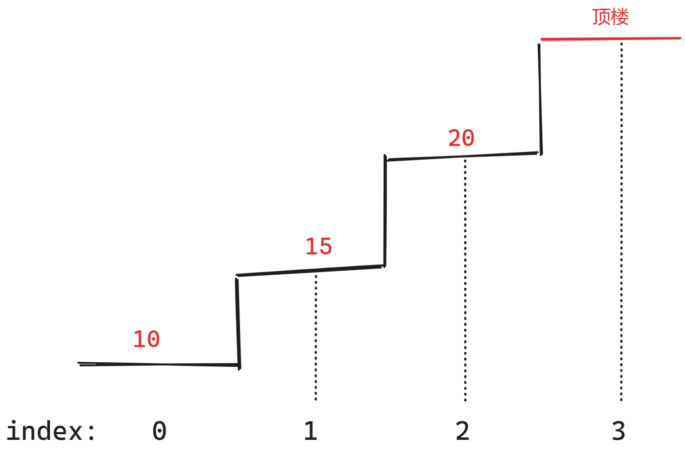

### 一、动态规划理论基础

#### 1、参考

[代码随想录 (programmercarl.com)](https://programmercarl.com/动态规划理论基础.html)

#### 2、动态规划五部曲

1. 考虑清楚dp数组的含义，包括**索引**和**数组值**的含义；
2. 确定**递推公式**；
3. 基于递推公式确定如何**初始化dp数组；**
4. 确定**遍历顺序**：从前向后/从后向前，两层for循环谁内谁外？
5. 打印dp数组，观察是否符合预期结果；

### 二、509. 斐波那契数

[509. 斐波那契数 - 力扣（LeetCode）](https://leetcode.cn/problems/fibonacci-number/description/)

[代码随想录 (programmercarl.com)](https://programmercarl.com/0509.斐波那契数.html)

#### 1、思路

1. dp[i]含义：第i个斐波那契数的值；
2. 递推公式：`dp[i]=dp[i-1]+dp[i-2];`
3. dp初始化：`dp[0] = 0;dp[1] = 1;`
4. 遍历方式：因为每项都要利用前两项的值，因此从前向后遍历；

#### 2、代码

```c++
class Solution {
public:
    void printDP(vector<int> &dp){
        for(auto i:dp)
        {
            cout<<i<<" ";
        }
    }

    int fib(int n) {
        // 处理边界条件
        if(n<=1){
            return n;
        }

        // dp[i]含义：第i个斐波那契数的值
        vector<int> dp(n+1);

        // dp[i]初始化
        dp[0] = 0;
        dp[1] = 1;

        // 遍历
        for(int i=2;i<=n;i++){
            // 递推公式
            dp[i]=dp[i-1]+dp[i-2];
        }

        // 打印dp数组
        // printDP(dp);

        return dp[n];
    }
};
```

### 三、70.爬楼梯

[70. 爬楼梯 - 力扣（LeetCode）](https://leetcode.cn/problems/climbing-stairs/description/)

[代码随想录 (programmercarl.com)](https://programmercarl.com/0746.使用最小花费爬楼梯.html#算法公开课)

#### 1、思路

1. dp[i]含义：走到第i节台阶共有几种方法；

2. 递推公式

    1. 到达第i阶的方法有两种，**一是从i-1阶上，二是从i-2阶上**；
    2. 因此**到达i-1阶和i-2阶的方法之和**就是到达第i阶的方法数；
    3. 递推公式为：`dp[i] = dp[i - 2] + dp[i - 1];`

3. dp初始化：到达第0级台阶有0种方法，第1级有1种，第2级有2种；

    ```c++
    dp[0] = 0;
    dp[1] = 1;
    dp[2] = 2;
    ```

4. 遍历顺序：每级台阶的方法数都依赖于前两级的上台阶方法之和，因此**从前向后遍历**；

#### 2、注意点

- 设置**第0阶**，方便表示dp；
- 要从**第3阶**开始遍历，因为0~2阶都已经被初始化；

#### 3、代码

```c++
class Solution {
public:
    void printDP(vector<int>& dp) {
        for (auto i : dp) {
            cout << i << " ";
        }
    }
    int climbStairs(int n) {
        // 处理边界条件
        if (n <= 2) {
            return n;
        }

        // dp[i]含义：走到第i节台阶有几种方法？
        // 事实上楼顶就相当于第n+1级台阶，因此dp要有n+项
        vector<int> dp(n + 1);

        // 初始化dp
        dp[0] = 0;
        dp[1] = 1;
        dp[2] = 2;

        // 遍历
        for (int i = 3; i <= n; i++) {
            // 递推公式：到达第i阶的方法有两类，一类是从i-1阶上，一类是从i-2阶上
            // 因此这两类方法的总数就是到达第i阶的方法数
            dp[i] = dp[i - 2] + dp[i - 1];
        }
        
        printDP(dp);
        return dp[n];
    }
};
```

### 四、746.使用最小花费爬楼梯

[746. 使用最小花费爬楼梯 - 力扣（LeetCode）](https://leetcode.cn/problems/min-cost-climbing-stairs/description/)

[代码随想录 (programmercarl.com)](https://programmercarl.com/0746.使用最小花费爬楼梯.html#算法公开课)

#### 1、思路

1. 每个台阶的消费可以看成离开本台阶需要付出的费用，不付费用则被本台阶禁锢，付费用后可以上1级或者2级；
    
2. dp[i]含义：到达下标为i台阶的**最低**花费；
3. 递推公式：可以分别从i-1和i-2到达台阶i，花费分别是cost[i-1]和cost[i-1]，取较小值即可；得到：`dp[i] = min(dp[i - 2] + cost[i - 2], dp[i - 1] + cost[i - 1]);`
4. dp初始化：题目说**可以直接从第0级或第1级开始**，因此`dp[0] = 0;dp[1] = 0;`
5. 遍历顺序：每级台阶的消费都依赖于前2级台阶，因此**从前向后遍历**；
    

#### 2、注意点

- 顶楼也可以看成一级台阶，因此**dp有cost.size()+1**项

#### 3、代码

```c++
class Solution {
public:
    void printDP(vector<int>& dp) {
        for (auto i : dp) {
            cout << i << " ";
        }
    }
    int minCostClimbingStairs(vector<int>& cost) {
        // dp[i]：到达下标为i的台阶的最低花费
        // 事实上顶楼也可以看成一级台阶，因此dp有cost.size()+1项
        vector<int> dp(cost.size()+1);

        // 初始化dp
        dp[0] = 0;
        dp[1] = 0;

        // 要爬到顶楼，因此遍历到dp的最后一个元素
        for (int i = 2; i < dp.size(); i++) {
            // 递推公式：当前台阶可以从i-1或者i-2台阶付费到达，取两者较小值即可
            dp[i] = min(dp[i - 2] + cost[i - 2], dp[i - 1] + cost[i - 1]);
        }

        // printDP(dp);
        return dp.back();
    }
};
```

