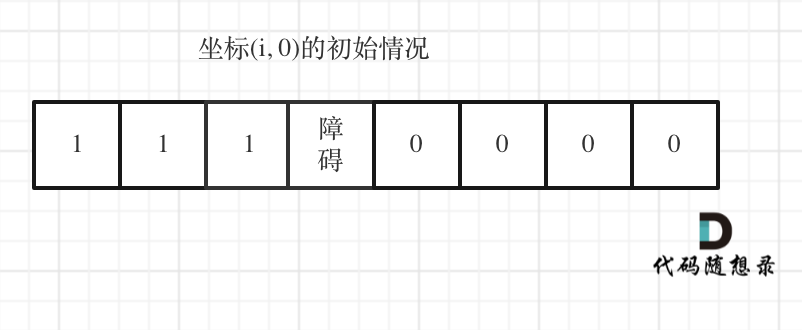

### 五、62.不同路径

[62. 不同路径 - 力扣（LeetCode）](https://leetcode.cn/problems/unique-paths/description/)

[代码随想录 (programmercarl.com)](https://programmercarl.com/0062.不同路径.html)

#### 1、思路

1. 显然每个网格都只能从其左网格或上网格到达，考虑动态规划；
2. dp[i] [j]含义：到达网格(i，j)有dp[i] [j]种路径方法；
3. 递推：当前方法总和是**左网格方法+右网格方法**
    `  dp[i][j]=dp[i][j-1]+dp[i-1][j];` 
4. 初始化：**第0行和第0列上的网格都只有一种方法到达**，全部初始化为1

#### 2、注意点

- 注意从(1,1)网格开始遍历，而不是(0,0)；
- 打印数字长度不同的dp数组注意用制表位对齐，方便观察；
    `cout<<dp[i][j]<<"\t";`

#### 3、代码

##### （1）二维dp数组实现

```c++
class Solution {
public:
    void printdp(vector<vector<int>> &dp){
        for(int i=0;i<dp.size();i++){
            for(int j=0;j<dp[0].size();j++){
                cout<<dp[i][j]<<"\t";
            }
            cout<<endl;
        }
    }
    int uniquePaths(int m, int n) {

        // dp[i][j]含义：到达网格(i，j)有dp[i][j]种方法
        vector<vector<int>> dp(m,vector<int>(n));
        
        // 初始化：第0行和第0列上的网格都只有一种方法到达，全部初始化为1
        for(int i=0;i<dp.size();i++){
            dp[i][0]=1; // 初始化第0列
        }
        for(int j=0;j<dp[0].size();j++){
            dp[0][j]=1; // 初始化第0行
        }

        // 遍历顺序：从左往右，从上往下遍历，谁内谁外无需考虑
        // 注意从(1,1)网格开始遍历，而不是(0,0)
        for(int i=1;i<dp.size();i++){
            for(int j=1;j<dp[0].size();j++){
                // 递推公式：当前方法总和是左格子方法+右格子方法
                dp[i][j]=dp[i][j-1]+dp[i-1][j];
            }
        }
        // printdp(dp);
        return dp[m-1][n-1];

    }
};
```

##### （1）一维dp数组实现

1. 注意递推公式` dp[i] =dp[i] + dp[i - 1];`
2. 等式右边的dp[i]是上次遍历得到的dp[i]，相当于从上格子的方法数；
3. 而dp[i - 1]相当于从左格子往右走的路径数；

```c++
class Solution {
public:
    int uniquePaths(int m, int n) {
        vector<int> dp(n);
        for (int i = 0; i < n; i++) dp[i] = 1;
        for (int j = 1; j < m; j++) {
            for (int i = 1; i < n; i++) {
                // 原本的dp[i]相当于从上格子往下走的路径数
                // dp[i - 1]相当于从左格子往右走的路径数
                // 新的dp[i]等于上述两者相加
                dp[i] =dp[i] + dp[i - 1];
            }
        }
        return dp[n - 1];
    }
};
```

### 六、63. 不同路径 II

[63. 不同路径 II - 力扣（LeetCode）](https://leetcode.cn/problems/unique-paths-ii/)

[代码随想录 (programmercarl.com)](https://programmercarl.com/0063.不同路径II.html#其他语言版本)

#### 1、思路

- 和**五、62.不同路径**基本类似，不同点在于**有障碍的网格相当于无法到达，方法数为0（dp[i]=0）**；
- 同时如果障碍在**第0行或第0列**，会导致**后面的网格都无法到达**；
    
- 遇到障碍物，将障碍物网格的到达路径数设置为0；
    

#### 2、注意点

- 初始化时，一旦遇到障碍物，跳出初始化循环（break），障碍物及其后网格都无法到达（到达路径数都为0）；
- 遍历时，一旦遇到障碍物，将障碍物网格的到达路径数设置为0，遍历下一个网格(continue)；

#### 3、代码

```c++
class Solution {
public:
    void printdp(vector<vector<int>>& dp) {
        for (int i = 0; i < dp.size(); i++) {
            for (int j = 0; j < dp[0].size(); j++) {
                cout << dp[i][j] << "\t";
            }
            cout << endl;
        }
    }

    int uniquePathsWithObstacles(vector<vector<int>>& obstacleGrid) {
        // dp[i][j]含义：到达网格(i，j)有dp[i][j]种路径数
        vector<vector<int>> dp(obstacleGrid.size(),
                               vector<int>(obstacleGrid[0].size(), 0));

        // 1、初始化：第0行和第0列上的网格都只有一种路径到达，全部初始化为1
        // 2、如果遇到障碍物，则其后的网格都无法到达，路径数为0
        for (int i = 0; i < dp.size(); i++) { // 初始化第0列

            // 一旦遇到障碍物，跳出初始化循环（break），障碍物及其后网格都无法到达（到达路径数都为0）
            if (obstacleGrid[i][0] == 1) {
                dp[i][0] = 0;
                break;
            }
            dp[i][0] = 1;
        }
        for (int j = 0; j < dp[0].size(); j++) { // 初始化第0行

            // 一旦遇到障碍物，跳出初始化循环，障碍物及其后网格都无法到达（到达路径数都为0）
            if (obstacleGrid[0][j] == 1) {
                dp[0][j] = 0;
                break;
            }
            dp[0][j] = 1;
        }

        // 1、遍历顺序：从左往右，从上往下遍历，谁内谁外无需考虑
        // 2、注意从(1,1)网格开始遍历，而不是(0,0)
        // 3、遇到障碍物，将障碍物网格的到达路径数设置为0
        for (int i = 1; i < dp.size(); i++) {
            for (int j = 1; j < dp[0].size(); j++) {

                // 一旦遇到障碍物，将障碍物网格的到达路径数设置为0，直接遍历下一个网格(continue)
                if (obstacleGrid[i][j] == 1) {
                    dp[i][j] = 0;
                    continue;
                }

                // 递推公式：当前路径数总和是左格子路径数+右格子路径数
                dp[i][j] = dp[i][j - 1] + dp[i - 1][j];
            }
        }
        // printdp(dp);
        return dp[dp.size() - 1][dp[0].size() - 1];
    }
};
```

### 七、343.拆分整数

[343. 整数拆分 - 力扣（LeetCode）](https://leetcode.cn/problems/integer-break/description/)

[代码随想录 (programmercarl.com)](https://programmercarl.com/0343.整数拆分.html#算法公开课)

#### 1、思路

1. dp[i]含义：数字i拆分后能获得的大乘积；

2. 递推公式：`dp[i] = max({j * (i - j), j * dp[i - j], dp[i]});`

    - j * (i - j)：代表仅将i拆为2个数，j和(i-j)，观察乘积；
    - j * dp[i - j]：代表将（i-j）继续拆分，dp[i-j]表示了将（i-j）拆分后得到的最大乘积；
    - dp[i]：上一次循环得到的最大乘积；
    - **取三者之中的最大值；**

3. 初始化：

    ```c++
    dp[0] = 0; // 0只能被拆为0+0
    dp[1] = 0; // 1只能被拆为1+0
    dp[2] = 1; // 2 被拆开为 1*1 时得到最大乘积
    ```

4. 遍历：遍历每种拆分可能，**将i拆分为j+(i-j)**；例如5：1+4、2+3；

#### 2、注意点

- 对每个数字i，**最多只需要遍历到 (i/2 + i/2)** 的情况即可；如上述的5，3+2就是2+3的重复；
- 注意一个事实，对于每个数，**拆成相近的数会得到较大的乘积；**

#### 3、代码

```c++
class Solution {
public:
    void printdp(const vector<int> &dp){
        for(auto i:dp){
            cout<<i<<" ";
        }
        cout<<endl;
    }
    int integerBreak(int n) {

        // dp[i]：数字i被拆分后的最大乘积
        vector<int> dp(n+1,0);

        // 初始化
        dp[0] = 0;
        dp[1] = 0;
        dp[2] = 1; // 2 被拆开为 1*1 时得到最大乘积

        // 遍历:i从3开始遍历
        // 对每个数字i，最多只需要遍历到 (i/2 + i/2) 的情况即可
        for (int i = 3; i <= n; i++) {
            for (int j = 1; j <= i /2; j++) {
                // j * (i - j)：仅拆为2个数，j和(i-j)
                // j * dp[i - j]：将i-j继续拆，dp[i-j]表示了将i-j拆分后得到的最大乘积
                // dp[i]：上一层循环得到的最大乘积
                dp[i] = max({j * (i - j), j * dp[i - j], dp[i]});

            }
        }
        // printdp(dp);

        return dp[n];
    }
};
```

### 八、96.不同的二叉搜索树

[96. 不同的二叉搜索树 - 力扣（LeetCode）](https://leetcode.cn/problems/unique-binary-search-trees/description/)

[代码随想录 (programmercarl.com)](https://programmercarl.com/0096.不同的二叉搜索树.html#算法公开课)

#### 1、思路

1. 注意一个事实，对于一棵有`i`个节点，且节点值为`1~i`的二叉搜索树，如果以`j`作为根节点，则：
    - 左子树有**（j-1）**个节点；
    - 右子树有**（i-j）**个节点；
2. 若为1个节点，有1种二叉树形态；2个节点，有2种二叉树形态；3个节点，有5种二叉树形态；
    
    
3. 观察后容易发现，在n=3的情况下，1作为根节点时，**左子树节点数为0，右子树节点数为2**；且右子树是连续的数字排布（2和3），因此**右子树的形态数就是n=2时可能存在的形态数**；2、3作为根节点时同理；
4. 动态规划思路
    1. dp[i]含义：i个节点可以组成dp[i]种不同的二叉搜索树形态；
    2. 递推公式：`dp[i] += dp[j-1] * dp[i-j]`；**以j作为根节点时：**
        - 左子树：有`(j-1)`个节点，有`dp[j-1]`种不同的二叉搜索树形态；
        - 右子树：有`(i-j)`个节点，有`dp[i-j]`种不同的二叉搜索树形态；
        - 左子树的形态数量**乘上**右子树的形态数量，得到当前树的总形态数量，并在j的遍历过程中叠加；
    3. 初始化：0个节点只有一种，即空二叉树，1个节点只有一种；
    4. 遍历：
        - 外层：遍历存在`2~n`个节点的情况；
        - 内层：遍历用`1~i`作为根节点的情况；

#### 2、代码

```c++
class Solution {
public:
    int numTrees(int n) {
        
        // dp[i]含义：i个节点可以组成dp[i]种不同的二叉搜索树
        vector<int> dp(n + 1);

        // 初始化
        dp[0] = 1; // 0个节点只有一种，即空二叉树
        dp[1] = 1; // 1个节点只有一种

        // 遍历2~n个节点的情况
        for (int i = 2; i <= n; i++) {
            // 遍历用1~i作为根节点的情况
            for (int j = 1; j <= i; j++){
                // 当j作为根节点时，对于二叉搜索树来说：
                // 左子树：有(j-1)个节点，有dp[j-1]种不同的二叉搜索树形态
                // 右子树：有(i-j)个节点，有dp[i-j]种不同的二叉搜索树形态
                // 左子树的形态数量乘上右子树的形态数量，得到该树的形态数量，并在j的遍历过程中叠加
                dp[i] += dp[j-1] * dp[i-j];
            }
        }
 
        return dp[n];
    }
};
```

