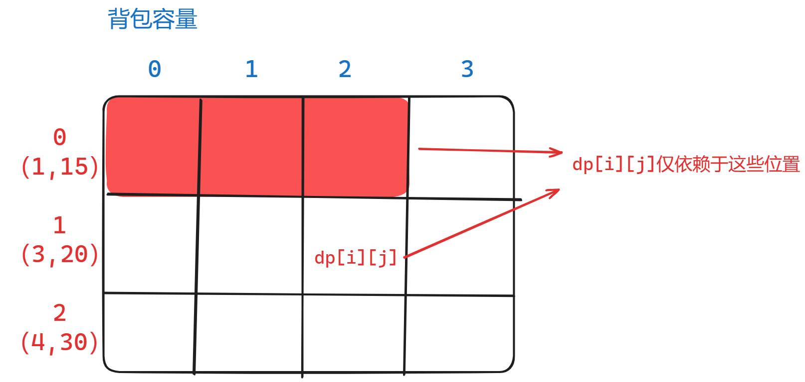
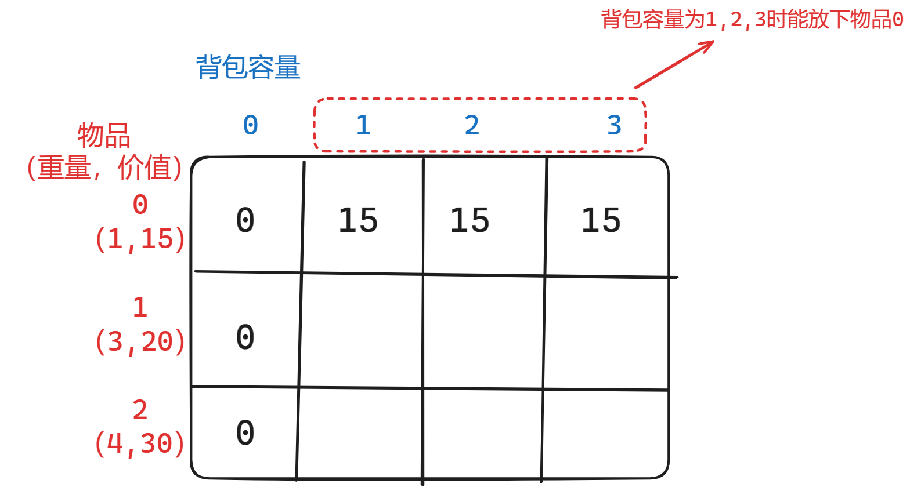

### 九、01背包问题（二维数组）

​	有n件物品和一个最多能背重量为w 的背包。第i件物品的重量是weight[i]，得到的价值是value[i] 。**每件物品只能用一次**，求解将哪些物品装入背包里物品价值总和最大。

[46. 携带研究材料（第六期模拟笔试） (kamacoder.com)](https://kamacoder.com/problempage.php?pid=1046)

#### 1、思路

##### （1）暴力解法

1. 用回溯算法搜索出所有可能的情况，记录最大的价值总和；
2. 每个物品有**选/不选**2种状态，因此共有2^n种可能，回溯搜索的时间复杂度是O(2^n)；

##### （2）动态规划

|       | 重量 | 价值 |
| :---: | :--: | :--: |
| 物品0 |  1   |  15  |
| 物品1 |  3   |  20  |
| 物品2 |  4   |  30  |

1. **`dp[i][j]`的含义**：对于容量为`j`的背包，在物品`[0,i]`中任意选择，能够得到的**最大价值总和**为`dp[i][j]`;
    
2. **递推公式**：对dp的每个项来说，可以选择**不放入物品i（doNotPut）**，也可以选择**放入（doPut）**；
    - 若**不放入**物品`i`，则当前背包的价值为遍历物品`i-1`得到的价值；
        `doNotPut= dp[i - 1][j]`
    - 若**放入**物品`i`（当然需要判断一下**是不是放得下**），则**当前背包的价值** = 背包容量为`“j-物品i的重量”`时的最大价值 + 物品i的价值；
        `doPut = dp[i - 1][j - materialSpace[i]] + materialValue[i]`
    - 最终取**两者较大值**（即决定物品i是否放入背包）`dp[i][j] = max(doNotPut, doPut);`
3. **初始化dp数组**
    - 观察递推公式可以发现，`dp[i][j]`取决于`i-1`行中**j，以及j之前的项（即表格的左上方）**
        
    - 背包容量为0时放不下物品，最大价值总和为0，因此**第0列初始化为全0**；
    - 第0行代表**仅在物品0中选取时**，不同背包容量的最大价值，因此考虑物品0能否放下即可；
        
4. **遍历dp数组**
    - 两层for循环，一层遍历**物品i**，一层遍历**背包容量j**，内外顺序可以调换（从图中也可以看出，无论是行遍历还是列遍历都能满足）；
    - **从（1,1）开始遍历**，否则会发生数组访问溢出；

#### 2、注意点

- **递推公式中，若将i放入背包，记得加上`materialValue[i]`！！！**
- 注意**dp的列数为backpackSpace + 1**，要留出空间为0的背包；
- 最后打印dp数组**最后一行的最后一个元素**即可；

#### 3、代码

```c++
#include <iostream>
#include <vector>
#include <algorithm>
using namespace std;

int materialNumber;
int backpackSpace;

void printDP(const vector<vector<int>> &dp)
{
    for (int i = 0; i < dp.size(); i++)
    {
        for (int j = 0; j < dp[0].size(); j++)
        {
            cout << dp[i][j] << " ";
        }
        cout << endl;
    }
}

void printVec(const vector<int> &vec)
{
    for (auto i : vec)
    {
        cout << i << " ";
    }
    cout << endl;
}

void solve(void)
{
    // line 1：物品数量，背包空间
    cin >> materialNumber >> backpackSpace;

    vector<int> materialSpace(materialNumber, 0);
    vector<int> materialValue(materialNumber, 0);

    // line 2：物品所占空间
    for (int i = 0; i < materialNumber; i++)
    {
        cin >> materialSpace[i];
    }
    // cout << "materialSpace:";
    // printVec(materialSpace);

    // line 3：物品价值
    for (int i = 0; i < materialNumber; i++)
    {
        cin >> materialValue[i];
    }
    // cout << "materialValue:";
    // printVec(materialValue);

    // dp[i][j]含义：空间为j的背包，在[0:i]中任选物品，所能携带的最大价值为dp[i][j]
    // 注意dp的列数为backpackSpace + 1，要留出空间为0的背包
    vector<vector<int>> dp(materialNumber, vector<int>(backpackSpace + 1, -1));

    /*  dp初始化（基于递推公式）:
        第0列是空间为0的背包，价值均为0;
        第0行取决于第0个物品能否放进空间为j的背包;
    */
    for (int i = 0; i < dp.size(); i++)
    {
        dp[i][0] = 0;
    }
    for (int j = 0; j < dp[0].size(); j++)
    {
        // 物品0能放进背包
        if (j >= materialSpace[0])
        {
            dp[0][j] = materialValue[0];
        }
        // 物品0放不进背包
        else
        {
            dp[0][j] = 0;
        }
    }
    // cout << "init dp:" << endl;
    // printDP(dp);

    // 遍历：内外层可互换，先遍历背包或先遍历物品都可以
    // 注意从（1,1）开始遍历
    for (int i = 1; i < dp.size(); i++) // 遍历物品i
    {
        for (int j = 1; j < dp[0].size(); j++) // 遍历背包重量j
        {
            // 不放物品i
            int doNotPut = dp[i - 1][j];
            // cout << "doNotPut:" << doNotPut << endl;

            // 考虑放物品i
            int doPut;
            bool backpackSpaceNotEnough = (j < materialSpace[i]);
            // 整个背包都放不下物品i
            if (backpackSpaceNotEnough)
            {
                // cout << "notEnough" << endl;
                doPut = doNotPut;
            }
            // 背包可以放得下物品i
            else
            {
                // cout << "Enough" << endl;
                // 放入物品后背包的价值 = 背包空间为j-materialSpace[i]时的最大价值，加上物品i的价值
                doPut = dp[i - 1][j - materialSpace[i]] + materialValue[i];
            }
            // cout << "doPut:" << doPut << endl;

            dp[i][j] = max(doNotPut, doPut);
            // cout << "dp" << "[" << i << "]" << "[" << j << "]:" << dp[i][j] << endl;
        }
    }
    // printDP(dp);
    cin.get();
    cout << dp[materialNumber - 1][backpackSpace] << endl;
}

int main()
{
    solve();
    cin.get();
    return 0;
}
```

### 十、01背包问题（一维数组）

#### 1、思路

> 参考**五、62.不同路径**中的一维数组实现；

1. 事实上就是**二维数组的压缩**，由于dp每项仅对**上一行左边**的元素有依赖关系，因此事实上只需要**维护二维数组中的一行即可**；
    
2. **递推公式**：`dp[j] = max(dp[j], dp[j - materialSpace[i]] + materialValue[i]);`
3. 不同点在于**遍历顺序**
    1. 首先必须在**外层遍历物品i，内层遍历背包容量j**，因为我们维护的是二维数组的行，因此必须采用逐行（逐物品）遍历；
    2. 其次，为了利用二维数组视图中上一行左方的元素，一维数组必须**倒序遍历**，从右向左更新dp；
    3. 最后，如果像二维数组那样**初始化了第一行（在一维数组中体现为初始了整个dp数组）**，**遍历时必须从物品1开始遍历**，不再遍历物品0，否则在倒序遍历过程中会将物品0重复放入背包；

#### 2、注意点

- 重点注意**遍历顺序**中提到的3点！

#### 3、代码

```c++
#include <iostream>
#include <vector>
#include <algorithm>
using namespace std;

int materialNumber;
int backpackSpace;

void printVec(const vector<int> &vec)
{
    for (auto i : vec)
    {
        cout << i << '\t';
    }
    cout << endl;
}

void solve(void)
{
    // line 1：物品数量，背包空间
    cin >> materialNumber >> backpackSpace;

    vector<int> materialSpace(materialNumber, 0);
    vector<int> materialValue(materialNumber, 0);

    // line 2：物品所占空间
    for (int i = 0; i < materialNumber; i++)
    {
        cin >> materialSpace[i];
    }
    // cout << "materialSpace:";
    // printVec(materialSpace);

    // line 3：物品价值
    for (int i = 0; i < materialNumber; i++)
    {
        cin >> materialValue[i];
    }
    // cout << "materialValue:";
    // printVec(materialValue);

    // dp[j]含义：空间为j的背包能装的最大价值
    vector<int> dp(backpackSpace + 1, 0);

    // 初始化:物品0放进空间为i的背包中
    for (int j = 0; j < dp.size(); j++)
    {
        // 放得下
        if (j >= materialSpace[0])
        {
            dp[j] = materialValue[0];
        }
        // 放不下
        else
        {
            dp[j] = 0;
        }
    }

    // 遍历：
    // 1、必须外层遍历物品，内层遍历背包（事实上是将一维数组映射到二维数组的行）；
    // 2、内层遍历背包时必须倒序遍历，以利用上一层遍历物品的循环得到的dp值；
    // 3、如果初始化了第0个物品下的整个dp数组，则需要从第1个物品开始遍历，否则倒序遍历时会将物品0重复放入背包
    for (int i = 1; i < materialNumber; i++)
    {
        for (int j = dp.size() - 1; j >= materialSpace[i]; j--)
        {
            dp[j] = max(dp[j], dp[j - materialSpace[i]] + materialValue[i]);
        }
        }

    // printVec(dp);
    cin.get();
    cout << dp.back() << endl;
}

int main()
{
    solve();

    cin.get();
    return 0;
}
```

### 十一、416. 分割等和子集

[416. 分割等和子集 - 力扣（LeetCode）](https://leetcode.cn/problems/partition-equal-subset-sum/description/)

[代码随想录 (programmercarl.com)](https://programmercarl.com/0416.分割等和子集.html#算法公开课)

#### 1、思路

1. **数组总和的一半**就是两个子集的目标和`target`；
2. 将其抽象为**背包问题**，即：**能否使用集合中的元素（重量和价值均为nums[i]）填充容量为`target`的背包，使其价值总和恰好为`target`；**
3. **dp[i]含义**：容量为`i`的背包能放下的**最大元素和**;
4. **递推公式**：` dp[j] = max(dp[j], dp[j - nums[i]] + nums[i]);`
5. **初始化**：**初始化为0**不影响递推公式求max即可

#### 2、注意点

- 剪枝：排除**数组总和为奇数**的情况；

#### 3、代码

```c++
class Solution {
public:
    void printVec(const vector<int>& vec) {
        for (auto i : vec) {
            cout << i << '\t';
        }
        cout << endl;
    }

    bool canPartition(vector<int>& nums) {

        int sum = accumulate(nums.begin(), nums.end(), 0);
        // 奇数不可能分为两个相等子集
        if (sum % 2 == 1) {
            return false;
        }

        // 每个子集的目标
        int target = sum / 2;

        // 抽象成背包问题，在容量为target的背包中放元素；
        // 如果恰好能放下和为target的元素，代表可以分成两个相等子集
        // 其中nums[i]即使重量也是价值

        // dp[j]含义：容量为i的背包能放下的最大元素和;
        vector<int> dp(target + 1, 0);

        // 初始化：初始化为0，不能影响后续取较大值

        // 遍历
        for (int i = 0; i < nums.size(); i++) {
            for (int j = dp.size() - 1; j >= nums[i]; j--) {
                dp[j] = max(dp[j], dp[j - nums[i]] + nums[i]);
            }
            printVec(dp);
        }

        if (dp.back() == target)
            return true;
            
        return false;
    }
};
```