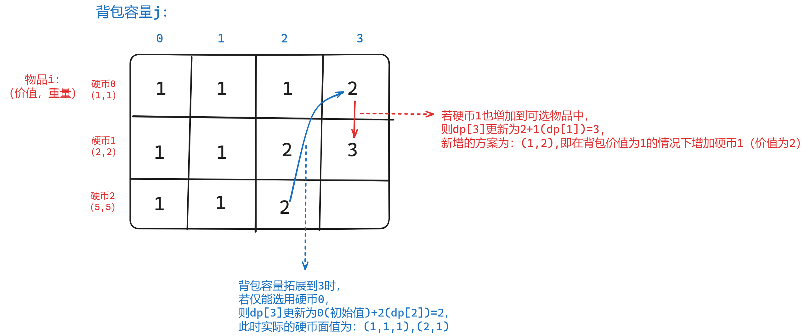

### 十五、卡码网52.携带研究材料（完全背包理论）

> 小明是一位科学家，他需要参加一场重要的国际科学大会，以展示自己的最新研究成果。他需要带一些研究材料，但是他的行李箱空间有限。这些研究材料包括实验设备、文献资料和实验样本等等，它们各自占据不同的重量，并且具有不同的价值。
>
> 小明的行李箱所能承担的总重量为 N，问小明应该如何抉择，才能携带最大价值的研究材料，每种研究材料可以选择无数次，并且可以重复选择

[52. 携带研究材料（第七期模拟笔试） (kamacoder.com)](https://kamacoder.com/problempage.php?pid=1052)

[完全背包理论基础](https://programmercarl.com/背包问题理论基础完全背包.html)

#### 1、思路

1. 完全背包问题：和零一背包的不同在于，**零一背包每种物品仅能取一次**，**完全背包中每种物品都有无限数量，可以选取任意个数**；

2. 体现在代码上的区别在于：内层遍历背包容量时，采用**正序遍历而非倒序遍历，**如此方能实现同一物品取用多次；

    ```c++
    for (int i = 0; i < materialNum; i++) // 遍历物品
    {
        // 遍历背包容量，采用正序遍历
        for (int capacity = materialWeight[i]; capacity <= backpackCapacity; capacity++) 
        {
            dp[capacity] = max(dp[capacity], dp[capacity - materialWeight[i]] + materialValue[i]);
        }
    }
    ```

    

#### 2、注意点

- 在完全背包求最大价值的问题中，由于采用正向遍历（物品可以重复取用），列遍历和行遍历都可以推导出正确的dp[j]，也就是说**物品-背包的内外层循环可以互换**；

#### 3、代码

```c++
#include <iostream>
#include <vector>
using namespace std;

void printVec(vector<int> &vec)
{
    for (auto i : vec)
    {
        cout << i << " ";
    }
    cout << endl;
}

void solve(void)
{
    int materialNum = 0;
    int backpackCapacity = 0;
    // input line 1：物品种类和背包空间
    cin >> materialNum >> backpackCapacity;

    vector<int> materialWeight(materialNum);
    vector<int> materialValue(materialNum);
    // input line N：每种物品的重量和价值
    for (int i = 0; i < materialNum; i++)
    {
        cin >> materialWeight[i] >> materialValue[i];
    }

    // printVec(materialWeight);
    // printVec(materialValue);

    // dp[capacity]含义：容量为capacity的背包的最高价值为dp[capacity]
    // 初始化：全0即可，不影响后续取max即可
    vector<int> dp(backpackCapacity + 1, 0);

    for (int i = 0; i < materialNum; i++) // 遍历物品
    {
        for (int capacity = materialWeight[i]; capacity <= backpackCapacity; capacity++) // 遍历背包
        {
            dp[capacity] = max(dp[capacity], dp[capacity - materialWeight[i]] + materialValue[i]);
        }
        // printVec(dp);
    }

    cout << dp.back();

    // cin.get();
}

int main()
{
    solve();

    // cin.get();
    return 0;
}
```

### 十六、518.零钱兑换Ⅱ

> 给定不同面额的硬币和一个总金额。写出函数来计算可以凑成总金额的硬币组合数。假设每一种面额的硬币有无限个。
>
> 示例 1:
>
> - 输入: amount = 5, coins = [1, 2, 5]
> - 输出: 4
>
> 解释: 有四种方式可以凑成总金额:
>
> - 5=5
> - 5=2+2+1
> - 5=2+1+1+1
> - 5=1+1+1+1+1

[518. 零钱兑换 II - 力扣（LeetCode）](https://leetcode.cn/problems/coin-change-ii/description/)

[代码随想录 (programmercarl.com)](https://programmercarl.com/0518.零钱兑换II.html#思路)

#### 1、思路

1. dp[capacity]含义：容量为capacity的背包有dp[capacity]种组合方式；
2. 递推公式：类比于求方法数、路径数的**递推公式 —— 已有的方法+将物品i加入选择范围后的新增的方法**
    `dp[capacity] += dp[capacity - coins[i]];`
3. 初始化：dp[0]==1，作为递推的起点；
4. 遍历顺序：必须外层遍历物品，内层遍历背包（行遍历）；

#### 2、注意点

1. 本题是完全背包求**组合数**（类比方法数、路径数）的问题，必须采用行遍历：**外层遍历物品，内层遍历背包容量**；
2. **列遍历**会出现的问题：**求得排列数而非组合数**，例如总和为3的硬币**排列**有2种：(1，2)和(2，1)，而组合仅有1种；下图用二维数组表现**采用列遍历**时一维数组的变化过程；
    

#### 3、代码

```c++
class Solution {
public:
    void printVec(const vector<int>& vec) {
        for (auto i : vec) {
            cout << i << '\t';
        }
        cout << endl;
    }

    int change(int amount, vector<int>& coins) {
        // 转换为完全背包问题：背包容量为amount，硬币的价值和重量都是coins[i];
        // dp[capacity]含义：容量为capacity的背包有dp[capacity]种组合方式
        vector<int> dp(amount + 1, 0);

        // 初始化
        dp[0] = 1;

        // cout << "背包-物品：" << endl;
        // for (int capacity = 0; capacity <= amount; capacity++) { // 背包
        //     cout << "capacity=" << capacity << endl;
        //     for (int i = 0; i < coins.size(); i++) { // 物品
        //         if (capacity >= coins[i]) {
        //             dp[capacity] += dp[capacity - coins[i]];
        //             printVec(dp);
        //         } else {
        //             cout << "capacity < coins[i]" << endl;
        //         }
        //     }
        // }
        // cout << endl;

        // dp.assign(dp.size(), 0);
        // // 初始化
        // dp[0] = 1;

        // cout << "物品-背包：" << endl;
        for (int i = 0; i < coins.size(); i++) { // 物品
            for (int capacity = coins[i]; capacity <= amount;
                 capacity++) { // 背包
                dp[capacity] += dp[capacity - coins[i]];
            }
            // printVec(dp);
        }

        return dp.back();
    }
};
```

### 十七、377.组合总和Ⅳ

> 给定一个由正整数组成且不存在重复数字的数组，找出和为给定目标正整数的组合的个数。
>
> 示例:
>
> - nums = [1, 2, 3]
> - target = 4
>
> 所有可能的组合为： (1, 1, 1, 1) (1, 1, 2) (1, 2, 1) (1, 3) (2, 1, 1) (2, 2) (3, 1)
>
> 请注意，顺序不同的序列被视作不同的组合。
>
> 因此输出为 7。

[377. 组合总和 Ⅳ - 力扣（LeetCode）](https://leetcode.cn/problems/combination-sum-iv/description/)

[代码随想录 (programmercarl.com)](https://programmercarl.com/0377.组合总和Ⅳ.html)

#### 1、思路

1. 此时与上一题的不同之处就是**从求组合变为求排列**；
2. 因此将两层循环遍历顺序互换即可：**采用列遍历，外层遍历背包容量，内层遍历物品；**

#### 2、注意点

- 测试用例中保证装满容量为target的背包不会超过int种方法，但容量小于target的背包可能会超过！
- 因此需要增加判断：
    `dp[capacity] < INT_MAX - dp[capacity - nums[i]]`

#### 3、代码

```c++
class Solution {
public:
    void printVec(const vector<int>& vec) {
        for (auto i : vec) {
            cout << i << '\t';
        }
        cout << endl;
    }

    int combinationSum4(vector<int>& nums, int target) {
        // 转换成背包问题：容量为target的背包中放置价值和重量均为nums[i]的物品，有几种放满背包的方法？
        // 注意本题求的是排列数量，而不是组合

        // dp[capacity]含义：装满容量为capacity的背包有dp[capacity]种方法
        vector<int> dp(target + 1, 0);

        // 初始化
        dp[0] = 1;

        // 外层遍历背包重量，内层遍历物品，从而获得不同的排列
        for (int capacity = 0; capacity <= target; capacity++) { // 背包
            // cout << "capacity=" << capacity << endl;
            for (int i = 0; i < nums.size(); i++) { // 物品
                // cout<<"nums[i]="<<nums[i]<<' ';
                // 测试用例中保证装满容量为target的背包不会超过int种方法，但容量小于target的背包可能会超过！
                // 因此需要增加判断，dp[capacity] < INT_MAX - dp[capacity - nums[i]]
                if (capacity >= nums[i] &&
                    dp[capacity] < INT_MAX - dp[capacity - nums[i]]) {

                    dp[capacity] += dp[capacity - nums[i]];
                }
            }
        }
        // printVec(dp);

        return dp.back();
    }
};
```

### 十八、卡码网57.爬楼梯（完全背包）

> 假设你正在爬楼梯。需要 n 阶你才能到达楼顶。
>
> 每次你可以爬至多m (1 <= m < n)个台阶。你有多少种不同的方法可以爬到楼顶呢？
>
> 注意：给定 n 是一个正整数。
>
> 当 m = 2，n = 3 时，n = 3 这表示一共有三个台阶，m = 2 代表你每次可以爬一个台阶或者两个台阶。
>
> 此时你有三种方法可以爬到楼顶。
>
> - 1 阶 + 1 阶 + 1 阶
> - 1 阶 + 2 阶
> - 2 阶 + 1 阶

[57. 爬楼梯（第八期模拟笔试） (kamacoder.com)](https://kamacoder.com/problempage.php?pid=1067)

[代码随想录 (programmercarl.com)](https://programmercarl.com/0070.爬楼梯完全背包版本.html#思路)

#### 1、思路

- 抽象成**完全背包问题**，背包容量为n，每种物品的重量和价值均为[1,m]（无限选取）；

#### 2、代码

```c++
#include <iostream>
#include <vector>
using namespace std;

void printVec(const vector<int> &vec)
{
    for (auto i : vec)
    {
        cout << i << '\t';
    }
    cout << endl;
}
void solve(void)
{

    int target = 0; // 目标台阶数
    int stairs = 0; // 每次最多可以爬的台阶数
    cin >> target >> stairs;

    // 抽象成完全背包问题，背包容量为target，每种物品的重量为stairs（无限选取）；
    // 装满背包共有多少种方法（求排列，而非组合）

    // dp[capacity]含义：装满容量为capacity的背包，有dp[capacity]种方法
    vector<int> dp(target + 1, 0);

    // 初始化
    dp[0] = 1;

    for (int capacity = 0; capacity <= target; capacity++) // 背包
    {
        // cout << "capacity:" << capacity << endl;
        for (int goods = 1; goods <= stairs; goods++) // 物品
        {
            if (capacity >= goods)
            {
                dp[capacity] += dp[capacity - goods];
                // cout << "goods:" << goods << " ";
                // printVec(dp);
            }
        }
    }

    // cin.get();
    cout << dp.back();
}

int main(void)
{
    solve();
    // cin.get();
    return 0;
}
```

