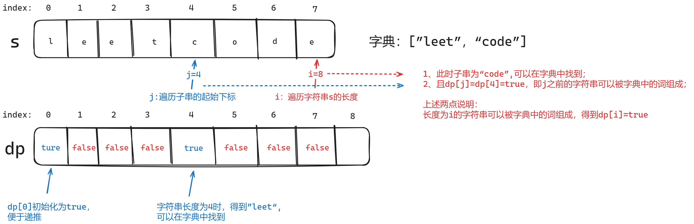
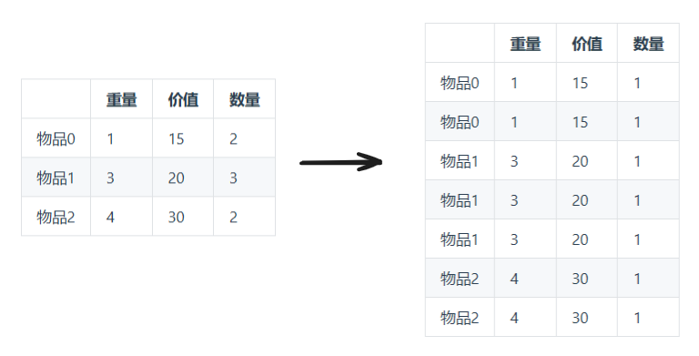
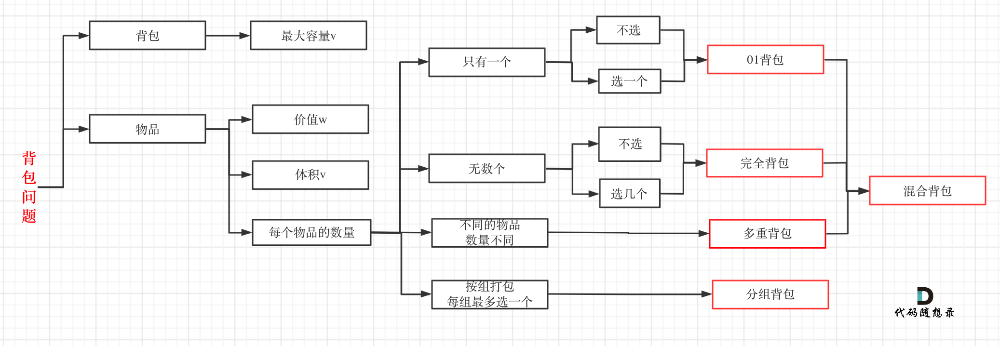

### 十九、322.零钱兑换

> 给定不同面额的硬币 coins 和一个总金额 amount。编写一个函数来计算可以凑成总金额所需的**最少的硬币个数**。如果没有任何一种硬币组合能组成总金额，返回 -1。
>
> 你可以认为每种硬币的数量是无限的。
>
> 示例 1：
>
> - 输入：coins = [1, 2, 5], amount = 11
> - 输出：3
> - 解释：11 = 5 + 5 + 1

[322. 零钱兑换 - 力扣（LeetCode）](https://leetcode.cn/problems/coin-change/description/)

[代码随想录 (programmercarl.com)](https://programmercarl.com/0322.零钱兑换.html)

#### 1、思路

**完全背包问题**，背包容量为amount，物品重量为coins[i]；

1. dp[j]含义：装满容量为j的背包所需的最少物品数量为dp[j]；
2. 递推公式：`dp[j] = min(dp[j], dp[j - coins[i]] + 1);`；
3. dp初始化：dp[0]初始化为0，**其余初始化为INT_MAX**，不影响后续取min

#### 2、注意点

- 由于除dp[0]外其余dp[j]都初始化为INT_MAX，遇到INT_MAX说明当前背包容量无法被装满，跳过即可；

    ```c++
    if (dp[j - coins[i]] != INT_MAX) {
        dp[j] = min(dp[j], dp[j - coins[i]] + 1);
    }
    ```

#### 3、代码

```c++
class Solution {
public:
    void printVec(const vector<int>& vec) {
        for (auto i : vec) {
            cout << i << " ";
        }
        cout << endl;
    }

    int coinChange(vector<int>& coins, int amount) {
        // dp[j]含义：装满容量为j的背包所需的最少物品数量为dp[j]
        vector<int> dp(amount + 1);

        // dp[0]初始化为0，其余初始化为INT_MAX，不影响后续取min
        dp[0] = 0;
        for (int i=1;i<dp.size();i++) {
            dp[i] = INT_MAX;
        }

        for (int i = 0; i < coins.size(); i++) {
            for (int j = coins[i]; j <= amount; j++) {
                if (dp[j - coins[i]] != INT_MAX) {
                    dp[j] = min(dp[j], dp[j - coins[i]] + 1);
                }
            }
        }

        // printVec(dp);

        return (dp.back() != INT_MAX) ? dp.back() : -1;
    }
};
```

### 二十、279.完全平方数

> 给定正整数 n，找到若干个完全平方数（比如 1, 4, 9, 16, ...）使得它们的和等于 n。你需要让组成和的完全平方数的个数最少。
>
> 给你一个整数 n ，返回和为 n 的完全平方数的 最少数量 。
>
> 完全平方数 是一个整数，其值等于另一个整数的平方；换句话说，其值等于一个整数自乘的积。例如，1、4、9 和 16 都是完全平方数，而 3 和 11 不是。
>
> 示例 1：
>
> - 输入：n = 12
> - 输出：3
> - 解释：12 = 4 + 4 + 4

[279. 完全平方数 - 力扣（LeetCode）](https://leetcode.cn/problems/perfect-squares/description/)

[代码随想录 (programmercarl.com)](https://programmercarl.com/0279.完全平方数.html#算法公开课)

#### 1、思路

**完全背包问题**

1. 背包容量为n，物品为若干个完全平方数；

2. 如何确定**完全平方数的个数**呢，观察题目可以发现最大的完全平方数应该为n，因此有下述公式；例如n=15，则其仅可能由1、2、3的平方组成；
    $$
    完全平方数的个数=\sqrt{n}
    $$

3. dp[j]：装满容量为j的背包最少需要dp[j]个物品；

4. 递推公式：`dp[j] = min(dp[j], dp[j - square(i)] + 1);`

#### 2、注意点

1. 本题和上题基本一样，为什么**上题在递推公式中会出现int变量越界的情况，本题就没有呢？**
2. 我们发现尽管后面的dp初始化为INT_MAX，但由于**完全平方数中有1的存在**，因此每种背包容量j事实上都有办法装满（全用1即可），即dp[j]不会出现INT_MAX的情况，因此变量也不会溢出；

#### 3、代码

```c++
class Solution {
public:
    void printVec(const vector<int>& vec) {
        for (auto i : vec) {
            if (i == INT_MAX) {
                cout << "-1 ";
            } else {
                cout << i << " ";
            }
        }
        cout << endl;
    }

    int square(int num) { return num * num; }

    int numSquares(int n) {
        // 转换为背包问题，讨论装满容量为n的背包最少需要几个物品

        // 完全平方数(物品重量)的最大值为:(根号n取整)^2
        int maxGoods = sqrt(n);
        // cout << "maxGoods:" << maxGoods << endl;

        // dp[j]:装满容量为j的背包最少需要dp[j]个物品
        // 初始化:dp[0]为0，其余为最大值，不能影响后续取min
        vector<int> dp(n + 1, INT_MAX);
        dp[0] = 0;

        for (int i = 1; i <= maxGoods; i++) {
            for (int j = square(i); j <= n; j++) {
				// 尽管后面的dp初始化为INT_MAX，但考虑到完全平方数中有1
                // 因此每种背包容量事实上都能有办法装满（全用1即可）
                // dp[j]不会出现INT_MAX，变量也不会溢出，无需像上题那样另外判断
                dp[j] = min(dp[j], dp[j - square(i)] + 1);
            }
        }
        // printVec(dp);
        return dp.back();
    }
};
```

### 二十一、139.单词拆分

> 给定一个非空字符串 s 和一个包含非空单词的列表 wordDict，判定 s 是否可以被空格拆分为一个或多个在字典中出现的单词。
>
> 说明：
>
> 拆分时可以重复使用字典中的单词。
>
> 你可以假设字典中没有重复的单词。
>
> 示例 1：
>
> - 输入: s = "leetcode", wordDict = ["leet", "code"]
> - 输出: true
> - 解释: 返回 true 因为 "leetcode" 可以被拆分成 "leet code"。

[139. 单词拆分 - 力扣（LeetCode）](https://leetcode.cn/problems/word-break/)

[代码随想录 (programmercarl.com)](https://programmercarl.com/0139.单词拆分.html)

#### 1、思路

1. 字符串s为背包，字典中的字符串为物品；本题和纯完全背包问题的**不同之处在于背包的空间是有规则的，仅有符合规则（字符串匹配）的物品才能装进背包**；

2. **dp[i]（bool类型）**：`长度为i`的字符串s能否被字典中的词构成；

3. **递推公式思路**

    1. 获取子串subString[j,i-1]，起始index为j，长度为i-j;

    2. 如果能在**字典中找到子串subString[j,i-1]**，且**子串起始索引`j`之前的字符串s（恰好是长度为j的字符串）能被字典中的词构成（即dp[j] = true）**，代表字典中的词可以组成字符串[0,i]，即dp[i]=true;
        

    3. 得到递推公式

        ```c++
        if (wordDictSet.find(subString) != wordDictSet.end() &&
            dp[j] == true) {
            dp[i] = true;
        }
        ```

4. **初始化：**dp[0]=true以便后续能推导出true，其余默认为false即可；

5. **遍历顺序**

    1. 外层：i遍历字符串s长度；
    2. 内层：j遍历子串起始位置；

#### 2、注意点

1. 用set来实现字典，方便查找：`unordered_set<string> wordDictSet(wordDict.begin(), wordDict.end());`

2. 获取子串：

    ```c++
    // 获取子串subString，起始index为j，长度为i-j
    string subString = s.substr(j, i - j);
    ```

#### 3、代码

```c++
class Solution {
public:
    void printVec(const vector<bool>& vec) {
        for (auto i : vec) {
            cout << i << " ";
        }
        cout << endl;
    }

    bool wordBreak(string s, vector<string>& wordDict) {
        // 用set来实现字典，方便查找
        unordered_set<string> wordDictSet(wordDict.begin(), wordDict.end());

        // dp[i]:长度为i的字符串s能否被字典中的词组成(背包问题，长度就是容量)
        vector<bool> dp(s.size() + 1, false);

        // dp[0]初始化为true，便于递推公式推导
        dp[0] = true;

        for (int i = 1; i <= s.size(); i++) { // 遍历字符串长度i（背包容量）
            for (int j = 0; j < i; j++) { // 遍历子串起始位置j（能不能装入物品）
                // 获取子串subString，起始index为j，长度为i-j
                string subString = s.substr(j, i - j);

                // 如果能在字典中找到子串[j,i-1]，且子串起始索引j之前的字符串s（恰好是长度为j的字符串）能被字典中的词构成(dp[j] = true)
                // 代表可以组成字符串[0,i]，即dp[i]=true;
                if (wordDictSet.find(subString) != wordDictSet.end() &&
                    dp[j] == true) {

                    dp[i] = true;
                }
            }
        }

        return dp.back();
    }
};
```

### 二十二、多重背包（物品的数量为有限值）

> 你是一名宇航员，即将前往一个遥远的行星。在这个行星上，有许多不同类型的矿石资源，每种矿石都有不同的重要性和价值。你需要选择哪些矿石带回地球，但你的宇航舱有一定的容量限制。 
>
> 给定一个宇航舱，最大容量为 C。现在有 N 种不同类型的矿石，每种矿石有一个重量 w[i]，一个价值 v[i]，以及最多 k[i] 个可用。不同类型的矿石在地球上的市场价值不同。你需要计算如何在不超过宇航舱容量的情况下，最大化你所能获取的总价值。

[56. 携带矿石资源（第八期模拟笔试） (kamacoder.com)](https://kamacoder.com/problempage.php?pid=1066)

[代码随想录 (programmercarl.com)](https://programmercarl.com/背包问题理论基础多重背包.html#多重背包)

#### 1、思路

**本质上就是零一背包问题，将各种物品摊开即可；**


#### 2、代码

```c++
#include <iostream>
#include <vector>
#include <numeric>
using namespace std;

void printVec(vector<int> &vec)
{
    for (int i : vec)
    {
        cout << i << " ";
    }
    cout << endl;
}

// 计算展开后的每种矿石重量
vector<int> getStonesTotalWeight(int stonesTotalNumber,
                                 const vector<int> &diffStonesNumber,
                                 const vector<int> &stonesWeight)
{
    vector<int> stonesTotalWeight;
    stonesTotalWeight.reserve(stonesTotalNumber);
    // 外层遍历矿石种类
    for (int i = 0; i < diffStonesNumber.size(); i++)
    {
        // 内层遍历不同种类矿石的数量
        for (int j = diffStonesNumber[i]; j > 0; j--)
        {
            stonesTotalWeight.push_back(stonesWeight[i]);
        }
    }
    return stonesTotalWeight;
}

// 计算展开后的每种矿石价值
vector<int> getStonesTotalValue(int stonesTotalNumber,
                                const vector<int> &diffStonesNumber,
                                const vector<int> &stonesValue)
{
    vector<int> stonesTotalValue;
    stonesTotalValue.reserve(stonesTotalNumber);
    // 外层遍历矿石种类
    for (int i = 0; i < diffStonesNumber.size(); i++)
    {
        // 内层遍历不同种类矿石的数量
        for (int j = diffStonesNumber[i]; j > 0; j--)
        {
            stonesTotalValue.push_back(stonesValue[i]);
        }
    }
    return stonesTotalValue;
}

void solve(void)
{
    // 多重背包问题,其实将重复的物品展开后就是零一背包问题

    int backPackSpace = 0;
    int stonesTypeNumber = 0;
    cin >> backPackSpace >> stonesTypeNumber;

    vector<int> stonesWeight(stonesTypeNumber);
    vector<int> stonesValue(stonesTypeNumber);
    vector<int> diffStonesNumber(stonesTypeNumber);
    for (int i = 0; i < stonesTypeNumber; i++)
    {
        cin >> stonesWeight[i];
    }
    for (int i = 0; i < stonesTypeNumber; i++)
    {
        cin >> stonesValue[i];
    }
    for (int i = 0; i < stonesTypeNumber; i++)
    {
        cin >> diffStonesNumber[i];
    }

    // 计算展开后的矿石总数
    int stonesTotalNumber = accumulate(diffStonesNumber.begin(), diffStonesNumber.end(), 0);
    // 计算展开后的每种矿石重量
    vector<int> stonesTotalWeight;
    stonesTotalWeight.reserve(stonesTotalNumber); // 预先分配空间，防止动态分配耗时过大
    stonesTotalWeight = getStonesTotalWeight(stonesTotalNumber, diffStonesNumber, stonesWeight);
    // printVec(stonesTotalWeight);

    // 计算展开后的每种矿石的价值
    vector<int> stonesTotalValue;
    stonesTotalValue.reserve(stonesTotalNumber); // 预先分配空间，防止动态分配耗时过大
    stonesTotalValue = getStonesTotalValue(stonesTotalNumber, diffStonesNumber, stonesValue);
    // printVec(stonesTotalValue);

    // 已转换成零一背包问题
    // dp[j]:容量为j的背包能装下的最大价值为dp[j]
    vector<int> dp(backPackSpace + 1, 0);

    for (int i = 0; i < stonesTotalNumber; i++) // 外层遍历物品
    {
        for (int j = backPackSpace; j >= stonesTotalWeight[i]; j--) // 内层遍历背包容量
        {
            dp[j] = max(dp[j], dp[j - stonesTotalWeight[i]] + stonesTotalValue[i]);
        }
    }
    cout << dp.back();
    // cin.get();
}

int main()
{
    solve();
    // cin.get();
    return 0;
}
```

### 二十三、背包问题总结

#### 1、各种背包区别

1. 零一背包：顾名思义，每种物品**只有一个**， 要么取要么不取；
2. 完全背包：每种物品有**无限个**，可以任意选取；
3. 多重背包：每种物品有**若干个**，选取有限制，将物品展开后就是零一背包；



#### 2、递推公式

1. **背包装满的最大价值：**`dp[j] = max(dp[j], dp[j - weight[i]] + value[i]);`
    - [动态规划：474.一和零](https://programmercarl.com/0474.一和零.html)
2. **能否装满背包，或者最多能装多少（重量和价值相同）：**`dp[j] = max(dp[j], dp[j - nums[i]] + nums[i]); `
    - [动态规划：416.分割等和子集(opens new window)](https://programmercarl.com/0416.分割等和子集.html)
    - [动态规划：1049.最后一块石头的重量 II](https://programmercarl.com/1049.最后一块石头的重量II.html)
3. **装满背包有几种方法（只与重量有关）：**`dp[j] += dp[j - nums[i]];`
    - [动态规划：494.目标和(opens new window)](https://programmercarl.com/0494.目标和.html)
    - [动态规划：518. 零钱兑换 II(opens new window)](https://programmercarl.com/0518.零钱兑换II.html)
    - [动态规划：377.组合总和Ⅳ(opens new window)](https://programmercarl.com/0377.组合总和Ⅳ.html)
    - [动态规划：70. 爬楼梯进阶版（完全背包）](https://programmercarl.com/0070.爬楼梯完全背包版本.html)
4. **装满背包的最少物品个数（只与重量有关）：**`dp[j] = min(dp[j - coins[i]] + 1, dp[j])`
    - [动态规划：322.零钱兑换(opens new window)](https://programmercarl.com/0322.零钱兑换.html)
    - [动态规划：279.完全平方数(opens new window)](https://programmercarl.com/0279.完全平方数.html)

### 3、遍历顺序

1. **零一背包：**
    - 二维数组：背包容量和物品的遍历顺序可以互换（行遍历和遍历均可）；
    - 一维数组：**行遍历**，外层遍历物品，内层遍历背包容量，且**背包容量需要从大到小倒序遍历（防止物品被重复取用）**；
2. **完全背包：**
    - 求组合数：行遍历，外层物品，内层背包容量；
        [动态规划：518.零钱兑换II](https://programmercarl.com/0518.零钱兑换II.html)
    - 求排列数：列遍历，外层背包容量，内层物品；
        [动态规划：377. 组合总和 Ⅳ (opens new window)](https://mp.weixin.qq.com/s/Iixw0nahJWQgbqVNk8k6gA)
        [动态规划：70. 爬楼梯进阶版（完全背包）](https://programmercarl.com/0070.爬楼梯完全背包版本.html)
    - 求最小的物品数量：行列遍历均可；
        [动态规划：322. 零钱兑换 (opens new window)](https://programmercarl.com/0322.零钱兑换.html)
        [动态规划：279.完全平方数](https://programmercarl.com/0279.完全平方数.html)

