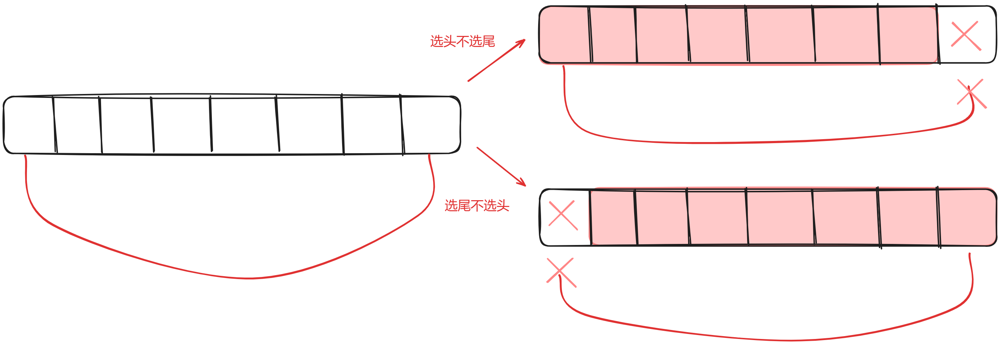

### 二十四、198.打家劫舍

> 你是一个专业的小偷，计划偷窃沿街的房屋。每间房内都藏有一定的现金，影响你偷窃的唯一制约因素就是相邻的房屋装有相互连通的防盗系统，如果两间相邻的房屋在同一晚上被小偷闯入，系统会自动报警。
>
> 给定一个代表每个房屋存放金额的非负整数数组，计算你 不触动警报装置的情况下 ，一夜之内能够偷窃到的最高金额。
>
> - 示例 1：
> - 输入：[1,2,3,1]
> - 输出：4
>
> 解释：偷窃 1 号房屋 (金额 = 1) ，然后偷窃 3 号房屋 (金额 = 3)。  偷窃到的最高金额 = 1 + 3 = 4 。

[198. 打家劫舍 - 力扣（LeetCode）](https://leetcode.cn/problems/house-robber/description/)

[代码随想录 (programmercarl.com)](https://programmercarl.com/0198.打家劫舍.html#算法公开课)

#### 1、思路

1. 注意偷窃时不一定要隔一间偷一次，也可能隔两间（或多间）偷一次更赚！比如：[100，1，1，100]；因此采用动态规划，确定在[0,i]房间内最多能偷多少钱
2. dp[i]含义：在[0,i]房间实施偷窃，能够偷窃到的最高金额；
3. 递推公式：**dp[i] = max(不偷房间i，偷房间i)**；不偷房间i即为`dp[i-1]`，偷房间i代表不能偷房间i-1，即为`dp[i - 2] + nums[i]`；
    `dp[i] = max(dp[i - 1], dp[i - 2] + nums[i]);`

#### 2、注意点

- 注意：**考虑偷i房间不等于偷i房间**，偷不偷是由递推公式决定的；
- 注意处理边界情况：仅有1个房间，否则初始化dp[1]会访问溢出；

#### 3、代码

```c++
class Solution {
public:
    int rob(vector<int>& nums) {
        // 注意处理边界情况：仅有一个房间，否则初始化dp[1]会访问溢出
        if(nums.size()==1){
            return nums[0];
        }

        // dp[i]含义：在[0,i]房间实施偷窃，能够偷窃到的最高金额
        vector<int> dp(nums.size());

        // 初始化
        dp[0]=nums[0];
        dp[1]=max(nums[0],nums[1]);

        // 递归公式，max(不偷i房间/偷i房间)
        for (int i = 2; i < nums.size(); i++) {
            dp[i] = max(dp[i - 1], dp[i - 2] + nums[i]);
        }

        return dp.back();
    }
};
```

###  二十五、213.打家劫舍II

> 你是一个专业的小偷，计划偷窃沿街的房屋，每间房内都藏有一定的现金。这个地方所有的房屋都 围成一圈 ，这意味着第一个房屋和最后一个房屋是紧挨着的。同时，相邻的房屋装有相互连通的防盗系统，如果两间相邻的房屋在同一晚上被小偷闯入，系统会自动报警 。
>
> 给定一个代表每个房屋存放金额的非负整数数组，计算你 在不触动警报装置的情况下 ，能够偷窃到的最高金额。
>
> 示例 1：
>
> - 输入：nums = [2,3,2]
> - 输出：3
> - 解释：你不能先偷窃 1 号房屋（金额 = 2），然后偷窃 3 号房屋（金额 = 2）, 因为他们是相邻的。

[代码随想录 (programmercarl.com)](https://programmercarl.com/0213.打家劫舍II.html#算法公开课)

[213. 打家劫舍 II - 力扣（LeetCode）](https://leetcode.cn/problems/house-robber-ii/description/)

#### 1、思路

1. 将环形问题转换为线性问题解决；
2. 以下两种情况可以**将环形问题展开成线性问题**：
    - 考虑偷第一个房间而不考虑最后一个房间；
    - 考虑偷最后一个房间而不考虑第一个房间；
        
3. 将数组掐头去尾传入线性打家劫舍的处理函数中，最后求两者的最大值即可；

#### 2、注意点

- 注意处理边界情况：环形中仅有一个房间；

#### 3、代码

```c++
class Solution {
public:
    // 处理线性打家劫舍
    int robLinear(vector<int>& nums) {
        if (nums.size() == 1) {
            return nums[0];
        }

        // dp[i]含义：在[0,i]房间实施偷窃，能够偷窃到的最高金额
        vector<int> dp(nums.size());

        // 初始化
        dp[0] = nums[0];
        dp[1] = max(nums[0], nums[1]);

        // 递归公式，max(不偷i房间/偷i房间)
        for (int i = 2; i < nums.size(); i++) {
            dp[i] = max(dp[i - 1], dp[i - 2] + nums[i]);
        }

        return dp.back();
    }

    // 处理环形打家劫舍
    int rob(vector<int>& nums) {
        // 将环形打家劫舍问题拆分成线性问题：两种情况，分别仅选首尾房间

        // 先处理边界情况，环形中仅有一个房间
        if(nums.size() == 1){
            return nums[0];
        }

        // 选第一个房间，不选最后一个房间
        vector<int> numsPickHead(nums.begin(), nums.end() - 1);
        // 选最后一个房间，不选第一个房间
        vector<int> numsPickTail(nums.begin() + 1, nums.end());

        int pickHeadResult = robLinear(numsPickHead);
        int pickTailResult = robLinear(numsPickTail);

        return max(pickHeadResult, pickTailResult);
    }
};
```

### 二十六、337.打家劫舍III

> 小偷又发现了一个新的可行窃的地区。这个地区只有一个入口，我们称之为 `root` 。
>
> 除了 `root` 之外，每栋房子有且只有一个“父“房子与之相连。一番侦察之后，聪明的小偷意识到“这个地方的所有房屋的排列类似于一棵二叉树”。 如果 **两个直接相连的房子在同一天晚上被打劫** ，房屋将自动报警。
>
> 给定二叉树的 `root` 。返回 ***在不触动警报的情况下** ，小偷能够盗取的最高金额* 。
>
> 
>
> **示例 1:**
>
> 
>
> ```
> 输入: root = [3,2,3,null,3,null,1]
> 输出: 7 
> 解释: 小偷一晚能够盗取的最高金额 3 + 3 + 1 = 7
> ```

[337. 打家劫舍 III - 力扣（LeetCode）](https://leetcode.cn/problems/house-robber-iii/)

[代码随想录 (programmercarl.com)](https://programmercarl.com/0337.打家劫舍III.html#算法公开课)

#### 1、思路

1. dp[i]含义：

    - dp[0]表示**不考虑当前节点时，得到的最高金额**；

    - dp[1]表示**考虑偷当前节点时，得到的最高金额**；
    - 注意在递归遍历树节点的过程中，**每层递归都有自己的dp数组**，因此只需要定义大小为2的dp即可；

2. 采用**后序遍历**，逐层上报告得到的最大价值；

3. 递推逻辑：

    - 若偷当前节点，则左右子节点不能偷：本节点价值+左右子节点在不偷自己时获得的最大价值（即dp[0]）;
        `int pickCurrentNode = root->val + leftdp[0] + rightdp[0];`
    - 若不偷当前节点，则左右子节点可以偷（可以偷但不一定偷）：左右子节点所获得的最大价值相加即可；
        `int dontPickCurrentNode = max(leftdp[0],leftdp[1])+max(rightdp[0],rightdp[1]);`

#### 2、代码

```c++
/**
 * Definition for a binary tree node.
 * struct TreeNode {
 *     int val;
 *     TreeNode *left;
 *     TreeNode *right;
 *     TreeNode() : val(0), left(nullptr), right(nullptr) {}
 *     TreeNode(int x) : val(x), left(nullptr), right(nullptr) {}
 *     TreeNode(int x, TreeNode *left, TreeNode *right) : val(x), left(left),
 * right(right) {}
 * };
 */
class Solution {
public:
    vector<int> treeRob(TreeNode* root) {
        if (!root) {
            return {0, 0};
        }

        // dp[i]含义：
        // dp[0]表示不偷该节点得到的最高金额
        // dp[1]表示偷该节点得到的最高金额
        vector<int> dp(2);

        // 后序遍历，逐层上报到根节点，获取结果
        vector<int> leftdp = treeRob(root->left);   // 左
        vector<int> rightdp = treeRob(root->right); // 右

        // 处理当前节点
        // 若偷当前节点，则左右子节点不能偷
        int pickCurrentNode = root->val + leftdp[0] + rightdp[0];
        // 若不偷当前节点，则左右子节点可以偷（可以偷但不一定偷）
        int dontPickCurrentNode = max(leftdp[0],leftdp[1])+max(rightdp[0],rightdp[1]);

        return {dontPickCurrentNode,pickCurrentNode};
    }

    int rob(TreeNode* root) {
        vector<int> result=treeRob(root);
        return max(result[0],result[1]);
    }
};
```
