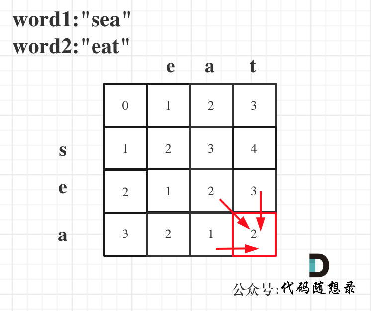

### 三十九、115.不同的子序列

> 给你两个字符串 `s` 和 `t` ，统计并返回在 `s` 的 **子序列** 中 `t` 出现的个数，结果需要对 109 + 7 取模。
>
> **示例 1：**
>
> ```
> 输入：s = "rabbbit", t = "rabbit"
> 输出：3
> 解释：
> 如下所示, 有 3 种可以从 s 中得到 "rabbit" 的方案。
> rabbbit
> rabbbit
> rabbbit
> ```

[115. 不同的子序列 - 力扣（LeetCode）](https://leetcode.cn/problems/distinct-subsequences/description/)

[代码随想录 (programmercarl.com)](https://programmercarl.com/0115.不同的子序列.html#算法公开课)

#### 1、思路

1. **`dp[i][j]`含义**：在s[0:i-1]中，可以构成`dp[i][j]`个t[0:j-1]；

2. **递推公式**

    ```c++
    if (s[i - 1] == t[j - 1]) {
        // 当s[i-1]和t[i-1]字母相等时，考虑两种情况：
        // (1)不考虑新的s[i-1]，在s[0:i-2]中多少种t[0:i-1]（上一轮循环已经计算过）：dp[i- 1][j]
        // (2)将相等的s[i-1]和t[i-1]剔除（因为就算加上它们俩，字符串也相等），在s[0:i-2]有多少种t[0:i-2]：dp[i-1][j-1]
        dp[i][j] = dp[i - 1][j] + dp[i - 1][j - 1];
    } 
    else {
        // 当两字母不相等时，相当于不需要利用s[i-1]，继承dp[i - 1][j]即可
        dp[i][j] = dp[i - 1][j];
    }
    ```

3. **初始化**

    - t为空字符串时，在s中能找到一种t，因此将dp第0列初始化为全1；
    - s为空字符串时，仅当t也为空字符串时有一种可能，因此将dp第0行（除第一个元素）初始化为全0；


#### 2、注意点

- 题目数据要求dp中的数据类型至少为：无符号64位`unsigned long long`

#### 3、代码

```c++
class Solution {
public:
    int numDistinct(string s, string t) {

        // dp[i][j]:在s[0:i-1]中，有dp[i][j]个t[0:j-1];
        // 题目数据要求dp中的数据类型至少为：无符号64位
        vector<vector<unsigned long long>> dp(s.size() + 1, vector<unsigned long long>(t.size() + 1, 0));

        // 初始化
        // （1）t为空字符串时，在s中能找到一种t，因此将dp第0列初始化为全1
        // （2）s为空字符串时，仅当t也为空字符串时有一种可能，因此将dp第0行（除第一个元素）初始化为全0
        for (int i = 0; i < dp.size(); i++) {
            dp[i][0] = 1;
        }

        for (int i = 1; i < dp.size(); i++) {
            for (int j = 1; j < dp[0].size(); j++) {
                if (s[i - 1] == t[j - 1]) {
                    // 当s[i-1]和t[i-1]字母相等时，考虑两种情况：
                    // (1)不考虑新的s[i-1]，在s[0:i-2]中多少种t[0:i-1]（上一轮循环已经计算过）：dp[i- 1][j]
                    // (2)将相等的s[i-1]和t[i-1]剔除（因为就算加上它们俩，字符串也相等），在s[0:i-2]有多少种t[0:i-2]：dp[i-1][j-1]
                    dp[i][j] = dp[i - 1][j] + dp[i - 1][j - 1];
                } else {
                    // 当两字母不相等时，相当于不需要利用s[i-1]，继承dp[i - 1][j]即可
                    dp[i][j] = dp[i - 1][j];
                }
            }
        }

        return dp.back().back();
    }
};
```

#### 三十九、583. 两个字符串的删除操作

> 给定两个单词 word1 和 word2，找到使得 word1 和 word2 相同所需的最小步数，每步可以删除任意一个字符串中的一个字符。
>
> 示例：
>
> - 输入: "sea", "eat"
> - 输出: 2
> - 解释: 第一步将"sea"变为"ea"，第二步将"eat"变为"ea"

[583. 两个字符串的删除操作 - 力扣（LeetCode）](https://leetcode.cn/problems/delete-operation-for-two-strings/description/)

[代码随想录 (programmercarl.com)](https://programmercarl.com/0583.两个字符串的删除操作.html)

#### 1、思路



#### 2、注意点

#### 3、代码

```c++
class Solution {
public:
    void printDP(vector<vector<int>> &dp){
        for (int i = 0; i < dp.size(); i++) {
            for (int j = 0; j < dp[0].size(); j++) {
                cout<<dp[i][j]<<'\t';
            }
            cout<<endl;
        }
    }
    int minDistance(string word1, string word2) {
        // dp[i][j]:对于word1[0:i-1]和word2[0:j-1]，需要操作dp[i][j]步
        vector<vector<int>> dp(word1.size() + 1,
                               vector<int>(word2.size() + 1, 0));

        // 初始化
        // (1)第0行：word1为空字符串时，需要将word2删除j次，因此第0行初始化为j
        for (int j = 0; j < dp[0].size(); j++) {
            dp[0][j] = j;
        }
        // (2)第0列：word2为空字符串时，需要将word1删除i次，因此第0列初始化为i
        for (int i = 0; i < dp.size(); i++) {
            dp[i][0] = i;
        }
        // printDP(dp);

        // 遍历:注意要从(1,1)开始，否则会越界
        for (int i = 1; i < dp.size(); i++) {
            for (int j = 1; j < dp[0].size(); j++) {
                if (word1[i - 1] == word2[j - 1]) {
                    dp[i][j] = dp[i - 1][j - 1];
                } else {
                    // 删除word1[i-1]或删除word2[j-1]
                    dp[i][j] = min(dp[i - 1][j] + 1, dp[i][j - 1] + 1);
                }
            }
        }

        return dp.back().back();
    }
};
```

### 四十、72. 编辑距离

> 给你两个单词 word1 和 word2，请你计算出将 word1 转换成 word2 所使用的最少操作数 。
>
> 你可以对一个单词进行如下三种操作：
>
> - 插入一个字符
> - 删除一个字符
> - 替换一个字符
> - 示例 1：
> - 输入：word1 = "horse", word2 = "ros"
> - 输出：3
> - 解释： horse -> rorse (将 'h' 替换为 'r') rorse -> rose (删除 'r') rose -> ros (删除 'e')
> - 示例 2：
> - 输入：word1 = "intention", word2 = "execution"
> - 输出：5
> - 解释： intention -> inention (删除 't') inention -> enention (将 'i' 替换为 'e') enention -> exention (将 'n' 替换为 'x') exention -> exection (将 'n' 替换为 'c') exection -> execution (插入 'u')

[72. 编辑距离 - 力扣（LeetCode）](https://leetcode.cn/problems/edit-distance/description/)

[代码随想录 (programmercarl.com)](https://programmercarl.com/0072.编辑距离.html#算法公开课)

#### 1、思路

1. **`dp[i][j]`含义**：对于word1[0:i-1]和word2[0:j-1]，需要操作`dp[i][j]`步；

2. **递推公式**：

    ```c++
    // 两字母相等的情况下，相当于不用考虑当前两个字母，从dp[i - 1][j - 1]继承即可
    if (word1[i - 1] == word2[j - 1]) {
        dp[i][j] = dp[i - 1][j - 1];
    } 
    else {
        // dp[i - 1][j] + 1：word1删除，即不考虑word1[i-1]的情况下，操作次数+1
        // dp[i][j - 1] + 1：word1增加（等价于word2删除）
        // dp[i - 1][j - 1] + 1：替换，word1和word2替换都可以，不考虑word1[i-1]和word2[j-1]的情况下
        dp[i][j] = min(dp[i - 1][j] + 1,
                   min(dp[i][j - 1] + 1, dp[i - 1][j - 1] + 1));
    }
    ```

3. **初始化**：

    - 第0行：word1为空字符串时，需要将word2删除j次，因此第0行初始化为j；
    - 第0列：word2为空字符串时，需要将word1删除i次，因此第0列初始化为i；


#### 2、注意点

- 遍历:注意要从(1,1)开始，否则会越界；

#### 3、代码

```c++
class Solution {
public:
    int minDistance(string word1, string word2) {
        // dp[i][j]:对于word1[0:i-1]和word2[0:j-1]，需要操作dp[i][j]步
        vector<vector<int>> dp(word1.size() + 1,
                               vector<int>(word2.size() + 1, 0));

        // 初始化
        // (1)第0行：word1为空字符串时，需要将word2删除j次，因此第0行初始化为j
        for (int j = 0; j < dp[0].size(); j++) {
            dp[0][j] = j;
        }
        // (2)第0列：word2为空字符串时，需要将word1删除i次，因此第0列初始化为i
        for (int i = 0; i < dp.size(); i++) {
            dp[i][0] = i;
        }
        // printDP(dp);

        // 遍历:注意要从(1,1)开始，否则会越界
        for (int i = 1; i < dp.size(); i++) {
            for (int j = 1; j < dp[0].size(); j++) {
                if (word1[i - 1] == word2[j - 1]) {
                    dp[i][j] = dp[i - 1][j - 1];
                } else {
                    // dp[i - 1][j] + 1：word1删除，即不考虑word1[i-1]的情况下，操作次数+1
                    // dp[i][j - 1] + 1：word1增加（等价于word2删除）
                    // dp[i - 1][j - 1] + 1：替换，word1和word2替换都可以，不考虑word1[i-1]和word2[j-1]的情况下
                    dp[i][j] = min(dp[i - 1][j] + 1,
                               min(dp[i][j - 1] + 1, dp[i - 1][j - 1] + 1));
                }
            }
        }

        return dp.back().back();
    }
};
```

