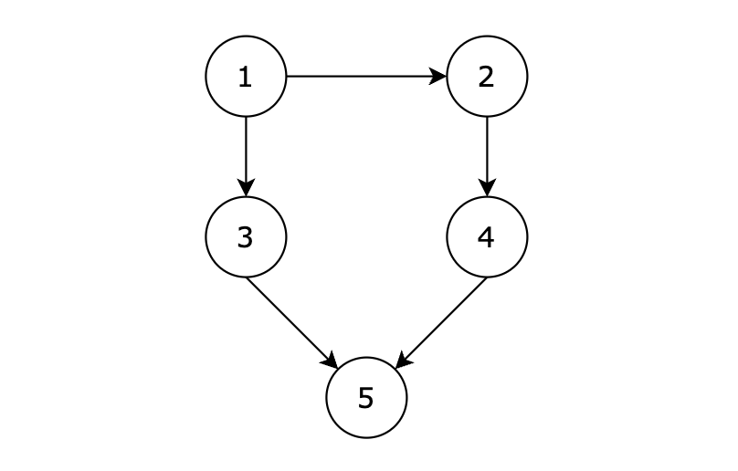
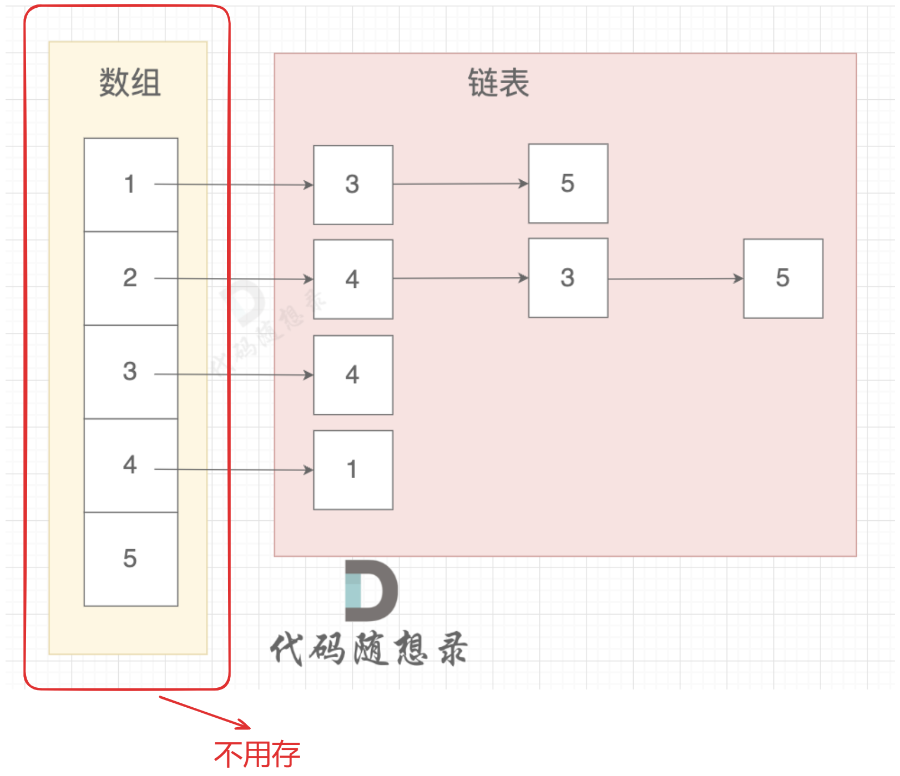

### 一、图论理论基础

[图论理论基础 | 代码随想录 (programmercarl.com)](https://programmercarl.com/kamacoder/图论理论基础.html#连通性)

（1）图的类型：有向图、无向图；

（2）图的构造：邻接矩阵，邻接表；

（3）连通分量：无向图专有，其内的极大连通子图；强/弱连通分量：有向图专有，极大强/弱连通子图；

（4）遍历方式：深度优先遍历DFS，广度优先遍历BFS；

### 二、深度优先搜索（Depth-First Search,DFS）理论基础

[深度优先搜索理论基础 | 代码随想录 (programmercarl.com)](https://programmercarl.com/kamacoder/图论深搜理论基础.html#dfs-与-bfs-区别)

本质就是回溯，模板参考**递归三部曲**即可；

### 三、卡码网--98.所有可达路径

> ###### 题目描述
>
> 给定一个有 n 个节点的有向无环图，节点编号从 1 到 n。请编写一个函数，找出并返回所有从节点 1 到节点 n 的路径。每条路径应以节点编号的列表形式表示。
>
> ###### 输入描述
>
> 第一行包含两个整数 N，M，表示图中拥有 N 个节点，M 条边
>
> 后续 M 行，每行包含两个整数 s 和 t，表示图中的 s 节点与 t 节点中有一条路径
>
> ###### 输出描述
>
> 输出所有的可达路径，路径中所有节点之间空格隔开，每条路径独占一行，存在多条路径，路径输出的顺序可任意。如果不存在任何一条路径，则输出 -1。
>
> **注意输出的序列中，最后一个节点后面没有空格！** 例如正确的答案是 `1 3 5`,而不是 `1 3 5 `， 5后面没有空格！
>
> ###### 输入示例
>
> ```
> 5 5
> 1 3
> 3 5
> 1 2
> 2 4
> 4 5
> ```
>
> ###### 输出示例
>
> ```
> 1 3 5
> 1 2 4 5
> ```
>
> ###### 提示信息
>
> 
>
> **用例解释：**
>
> 有五个节点，其中的从 1 到达 5 的路径有两个，分别是 1 -> 3 -> 5 和 1 -> 2 -> 4 -> 5。
>
> 因为拥有多条路径，所以输出结果为：
>
> 1 3 5
> 1 2 4 5
>
> 或
>
> 1 2 4 5
> 1 3 5
> 都算正确。

[98. 所有可达路径 (kamacoder.com)](https://kamacoder.com/problempage.php?pid=1170)

[代码随想录 (programmercarl.com)](https://programmercarl.com/kamacoder/0098.所有可达路径.html#本题代码)

#### 1、思路

1. **邻接矩阵＆邻接表存图**

    ```c++
    // 邻接矩阵存图
    vector<vector<int>> graph(nodeNum + 1, vector<int>(nodeNum + 1, 0));
    // 输入每条边的连接关系
    for (int i = 0; i < edgeNum; i++)
    {
        int node1;
        int node2;
        cin >> node1 >> node2;
        graph[node1][node2] = 1;
    }
    
    // 邻接表存图
    vector<list<int>> graph(nodeNum + 1);
    // 邻接表中不需要存起始元素，用表索引代表即可，否则在遍历时需要从第二个节点开始
    // for (int i = 1; i <= nodeNum; i++) {
    //     graph[i].push_back(i);
    // }
    // 输入图的各边
    for (int i = 0; i < edgeNum; i++) {
        int node1;
        int node2;
        cin >> node1 >> node2;
    
        graph[node1].push_back(node2);
    }
    ```

2. **深度优先搜索dfs**

    ```c++
    /// @brief 对邻接矩阵存储的图进行深度优先遍历
    /// @param graph 邻接矩阵
    /// @param destinationNode 目的节点
    /// @param currentNode 当前节点
    void dfs(vector<vector<int>> &graph, int destinationNode, int currentNode)
    {
        // 终止条件：找到
        if (currentNode == destinationNode)
        {
            singlePath.push_back(currentNode);
            result.push_back(singlePath);
            return;
        }
    
        // 将当前节点加入单条路径中
        singlePath.push_back(currentNode);
        // GraphPrint::printSinglePath(singlePath);
    
        // 遍历当前节点的所有相连节点
        for (int i = 1; i < graph[0].size(); i++)
        {
            // 找到相连节点i
            if (graph[currentNode][i] == 1)
            {
                dfs(graph, destinationNode, i); // 从节点i继续深入搜索
                singlePath.pop_back();          // 从节点i搜索结束，回溯
            }
        }
    }
    ```

3. **结果输出处理**

    ```c++
    // 处理结果输出
        static void printResult(vector<vector<int>> &result)
        {
            // 处理没有路径的情况
            if (result.empty())
            {
                cout << -1;
                return;
            }
    
            // 打印所有路径
            for (int i = 0; i < result.size(); i++)
            {
                for (int j = 0; j < result[i].size(); j++)
                {
                    // 最后一个元素不跟空格
                    if (j != result[i].size() - 1)
                    {
                        cout << result[i][j] << " ";
                    }
                    else
                    {
                        cout << result[i][j];
                    }
                }
                // 最后一行不打印换行符
                if (i != result.size() - 1)
                {
                    cout << endl;
                }
            }
        }
    ```

#### 2、注意点

- 输出结路径结果时记得处理没有路径的情况：输出-1；
- 打印路径时**最后一个节点时不跟空格；**
- 打印路径时**最后一行不跟换行符；**
- 邻接表中不需要存起始元素，用数组索引表示即可，否则在遍历时需要从第二个节点开始
    

#### 3、代码

##### （1）邻接矩阵实现

```c++
#include <iostream>
#include <list>
#include <vector>
using namespace std;

// 全局变量存储结果
vector<int> singlePath;
vector<vector<int>> result;

class GraphPrint {
  public:
    // 打印单条路径
    static void printSinglePath(vector<int> &singlePath)
    {
        for (int i : singlePath) {
            cout << i << '\t';
        }
        cout << endl;
    }

    // 打印图的邻接矩阵结构
    static void printGraph(vector<vector<int>> graph)
    {
        for (int i = 1; i < graph.size(); i++) {
            for (int j = 1; j < graph[0].size(); j++) {
                cout << graph[i][j] << '\t';
            }
            cout << endl;
        }
    }

    // 处理结果输出
    static void printResult(vector<vector<int>> &result)
    {
        // 处理没有路径的情况
        if (result.empty()) {
            cout << -1;
            return;
        }

        // 打印所有路径
        for (int i = 0; i < result.size(); i++) {
            for (int j = 0; j < result[i].size(); j++) {
                // 最后一个元素不跟空格
                if (j != result[i].size() - 1) {
                    cout << result[i][j] << " ";
                }
                else {
                    cout << result[i][j];
                }
            }
            // 最后一行不打印换行符
            if (i != result.size() - 1) {
                cout << endl;
            }
        }
    }
};

/// @brief 对邻接矩阵存储的图进行深度优先遍历
/// @param graph 邻接矩阵
/// @param destinationNode 目的节点
/// @param currentNode 当前节点
void dfs(vector<vector<int>> &graph, int destinationNode, int currentNode)
{
    // 终止条件：找到
    if (currentNode == destinationNode) {
        singlePath.push_back(currentNode);
        result.push_back(singlePath);
        return;
    }

    // 将当前节点加入单条路径中
    singlePath.push_back(currentNode);
    // GraphPrint::printSinglePath(singlePath);

    // 遍历当前节点的所有相连节点
    for (int i = 1; i < graph[0].size(); i++) {
        // 找到相连节点i
        if (graph[currentNode][i] == 1) {
            dfs(graph, destinationNode, i); // 从节点i继续深入搜索
            singlePath.pop_back();          // 从节点i搜索结束，回溯
        }
    }
}

void solve(void)
{

    // 输入节点数和边数
    int nodeNum;
    int edgeNum;
    cin >> nodeNum >> edgeNum;

    // 图的邻接矩阵定义
    vector<vector<int>> graph(nodeNum + 1, vector<int>(nodeNum + 1, 0));
    // 输入每条边的连接关系
    for (int i = 0; i < edgeNum; i++) {
        int node1;
        int node2;
        cin >> node1 >> node2;
        graph[node1][node2] = 1;
    }
    // GraphPrint::printGraph(graph);
    // 深搜逻辑
    dfs(graph, nodeNum, 1);

    // 处理输出
    GraphPrint::printResult(result);
    cin.get();
}

int main()
{
    solve();

    cin.get();
    return 0;
}
```

##### （2）邻接表实现

```c++
#include <iostream>
#include <list>
#include <vector>
using namespace std;

// 全局变量存储结果
vector<int> singlePath;
vector<vector<int>> result;

class GraphPrint {
  public:
    // 打印单条路径
    static void printSinglePath(vector<int> &singlePath)
    {
        for (int i : singlePath) {
            cout << i << '\t';
        }
        cout << endl;
    }

    // 打印图的结构
    static void printGraph(vector<list<int>> graph)
    {
        for (auto i : graph) {
            for (auto j : i) {
                cout << j << '\t';
            }
            cout << endl;
        }
    }

    // 处理结果输出
    static void printResult(vector<vector<int>> &result)
    {
        // 处理没有路径的情况
        if (result.empty()) {
            cout << -1;
            return;
        }

        // 打印所有路径
        for (int i = 0; i < result.size(); i++) {
            for (int j = 0; j < result[i].size(); j++) {
                // 最后一个元素不跟空格
                if (j != result[i].size() - 1) {
                    cout << result[i][j] << " ";
                }
                else {
                    cout << result[i][j];
                }
            }
            // 最后一行不打印换行符
            if (i != result.size() - 1) {
                cout << endl;
            }
        }
    }
};

/// @brief 对邻接矩阵存储的图进行深度优先遍历
/// @param graph 邻接矩阵
/// @param destinationNode 目的节点
/// @param currentNode 当前节点
void dfs(vector<list<int>> &graph, int destinationNode, int currentNode)
{
    if (currentNode == destinationNode) {
        result.push_back(singlePath);
        return;
    }

    // 遍历当前节点为头结点的链表
    for (int i : graph[currentNode]) {

        singlePath.push_back(i); // 将当前节点放入单条路径中
        // GraphPrint::printSinglePath(singlePath);
        dfs(graph, destinationNode, i); // 基于当前节点继续深入遍历
        singlePath.pop_back();          // 回溯
        // GraphPrint::printSinglePath(singlePath);
    }
}

void solve(void)
{
    // 输入节点数和边数
    int nodeNum;
    int edgeNum;
    cin >> nodeNum >> edgeNum;

    // 图的邻接表定义
    vector<list<int>> graph(nodeNum + 1);
    // 邻接表中不需要存起始元素，用表索引代表即可，否则在遍历时需要从第二个节点开始
    // for (int i = 1; i <= nodeNum; i++) {
    //     graph[i].push_back(i);
    // }
    // 输入图的各边
    for (int i = 0; i < edgeNum; i++) {
        int node1;
        int node2;
        cin >> node1 >> node2;

        graph[node1].push_back(node2);
    }

    // GraphPrint::printGraph(graph);
    // 深搜逻辑
    // 先把节点1放入作为起点
    singlePath.push_back(1);
    dfs(graph, nodeNum, 1);

    // 处理输出
    GraphPrint::printResult(result);
    cin.get();
}

int main()
{
    solve();

    cin.get();
    return 0;
}
```

### 四、广度优先搜索（Breadth-First Search,BFS）理论基础

[广度优先搜索理论基础 | 代码随想录 (programmercarl.com)](https://programmercarl.com/kamacoder/图论广搜理论基础.html)

**逐圈外扩**，直至找到目标点；