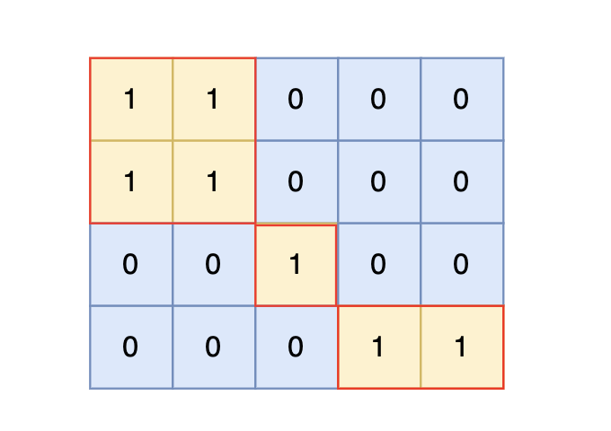

### 五、99. 岛屿数量——深搜

> ###### 题目描述
>
> 给定一个由 1（陆地）和 0（水）组成的矩阵，你需要计算岛屿的数量。岛屿由水平方向或垂直方向上相邻的陆地连接而成，并且四周都是水域。你可以假设矩阵外均被水包围。
>
> ###### 输入描述
>
> 第一行包含两个整数 N, M，表示矩阵的行数和列数。
>
> 后续 N 行，每行包含 M 个数字，数字为 1 或者 0。
>
> ###### 输出描述
>
> 输出一个整数，表示岛屿的数量。如果不存在岛屿，则输出 0。
>
> ###### 输入示例
>
> ```
> 4 5
> 1 1 0 0 0
> 1 1 0 0 0
> 0 0 1 0 0
> 0 0 0 1 1
> ```
>
> ###### 输出示例
>
> ```
> 3
> ```
>
> ###### 提示信息
>
> ###### 
>
> 根据测试案例中所展示，岛屿数量共有 3 个，所以输出 3。

[99. 岛屿数量 (kamacoder.com)](https://kamacoder.com/problempage.php?pid=1171)

[代码随想录 (programmercarl.com)](https://programmercarl.com/kamacoder/0099.岛屿的数量深搜.html#思路)

#### 1、思路

1. 依次遍历地图，找到未访问过的陆地节点时，岛屿数量++，并通过深搜将与节点相连的所有陆地节点标记未已访问；
2. 深搜：一个劲先往一个方向（向上）搜，直至遇见海水节点或越界，再回溯换方向；

#### 2、注意点

#### 3、代码

```c++
#include <iostream>
#include <vector>
using namespace std;

int result = 0;
// 四个方向相对于当前节点的坐标偏移：
// 上(x,y+1)、下(x,y-1)、左(x-1,y)、右(x+1,y)
int directionOffset[4][2] = {{0, 1}, {0, -1}, {-1, 0}, {1, 0}};

void print2DVec(vector<vector<int>> &Vec)
{
    for (auto i : Vec) {
        for (auto j : i) {
            cout << j << '\t';
        }
        cout << endl;
    }
}

/// @brief 深搜，将所有与(curX,curY)相连的陆地标记为已访问
/// @param map 地图
/// @param visitFlag 访问标记
/// @param curX 当前行
/// @param curY 当前列
void dfs(vector<vector<int>> &map, vector<vector<int>> &visitFlag, int curX,
         int curY)
{
    // 当前节点的位置越界，直接返回
    if (curX < 0 || curX > map.size() - 1 || curY < 0 ||
        curY > map[0].size() - 1) {
        return;
    }
    // 当前节点已经访问过或访问到海洋，直接返回
    else if (visitFlag[curX][curY] == 1 || map[curX][curY] == 0) {
        return;
    }

    // 将当前节点标记为已访问
    visitFlag[curX][curY] = 1;

    // 继续搜索上下左右位置
    for (int i = 0; i < 4; i++) {
        int newX = curX + directionOffset[i][0];
        int newY = curY + directionOffset[i][1];
        dfs(map, visitFlag, newX, newY);
    }
}

void solve()
{
    // 输入地图
    int mapRows;
    int mapColumns;
    cin >> mapRows >> mapColumns;
    // 地图
    vector<vector<int>> map(mapRows, vector<int>(mapColumns));
    for (int i = 0; i < map.size(); i++) {
        for (int j = 0; j < map[0].size(); j++) {
            cin >> map[i][j];
        }
    }
    // cout << "map:" << endl;
    // print2DVec(map);

    // 访问标记
    vector<vector<int>> visitFlag(mapRows, vector<int>(mapColumns, 0));

    // 深搜逻辑：找到陆地位置后，将result+1，并通过dfs将与该位置连接的陆地都标记为已访问
    for (int i = 0; i < map.size(); i++) {
        for (int j = 0; j < map[0].size(); j++) {
            // 找到尚未访问过的陆地
            if (map[i][j] == 1 && visitFlag[i][j] == 0) {
                result++;
                dfs(map, visitFlag, i, j);
            }
        }
    }
    // cout << "visitFlag:" << endl;
    // print2DVec(visitFlag);

    cout << result;
    cin.get();
}

int main()
{
    solve();

    cin.get();
    return 0;
}
```

### 六、99.岛屿数量——广搜

> 题目描述参考上题

[99. 岛屿数量 (kamacoder.com)](https://kamacoder.com/problempage.php?pid=1171)

[代码随想录 (programmercarl.com)](https://programmercarl.com/kamacoder/0099.岛屿的数量广搜.html#思路)

#### 1、思路

- 用队列完成广搜，类比二叉树的层序遍历

#### 2、注意点

- 用一个二维数组表示上下左右的偏移

    ```c++
    // 四个方向相对于当前节点的坐标偏移：注意x是行，y是列
    // 右(x,y+1)、左(x,y-1)、上(x-1,y)、下(x+1,y)
    int directionOffset[4][2] = {{0, 1}, {0, -1}, {-1, 0}, {1, 0}};
    ```

- 必须在加入队列时就标记为已访问，否则会导致有些节点重复入队，运行超时
    

#### 3、代码

```c++
#include <iostream>
#include <queue>
#include <vector>
using namespace std;

int result = 0;
// 四个方向相对于当前节点的坐标偏移：注意x是行，y是列
// 右(x,y+1)、左(x,y-1)、上(x-1,y)、下(x+1,y)
int directionOffset[4][2] = {{0, 1}, {0, -1}, {-1, 0}, {1, 0}};
struct Node {
    int x;
    int y;
};

void print2DVec(vector<vector<int>> &Vec)
{
    for (auto i : Vec) {
        for (auto j : i) {
            cout << j << '\t';
        }
        cout << endl;
    }
}

/// @brief 广搜，将所有与(curX,curY)相连的陆地标记为已访问
/// @param map 地图
/// @param visitFlag 访问标记
/// @param x 传入节点的行
/// @param y 传入节点的列
void bfs(vector<vector<int>> &map, vector<vector<int>> &visitFlag, int x, int y)
{
    queue<Node> que;

    que.push({x, y});    // 将当前节点加入队列
    visitFlag[x][y] = 1; // 标记为已访问
    // cout << "visit:" << endl;
    // cout << '(' << x << ',' << y << ')' << endl;
    // print2DVec(visitFlag);

    while (!que.empty()) {
        // 取出队首元素
        Node curNode = que.front();
        que.pop();
        // 遍历队首元素的相邻节点
        for (int i = 0; i < 4; i++) {
            Node newNode;
            newNode.x = curNode.x + directionOffset[i][0];
            newNode.y = curNode.y + directionOffset[i][1];
            // 节点坐标越界，直接跳过
            if (newNode.x < 0 || newNode.x > map.size() - 1 || newNode.y < 0 ||
                newNode.y > map[0].size() - 1) {
                continue;
            }
            // 遇到未访问过的陆地元素，则将其入队，并标记为已访问
            else if (map[newNode.x][newNode.y] == 1 &&
                     visitFlag[newNode.x][newNode.y] == 0) {
                que.push(newNode);
                // 必须在加入队列时就标记为已访问，否则会重复入队
                visitFlag[newNode.x][newNode.y] = 1;
                // cout << "visit:" << endl;
                // cout << '(' << newNode.x << ',' << newNode.y << ')' << endl;
                // print2DVec(visitFlag);
            }
        }
    }
}

void solve()
{
    // 输入地图
    int mapRows;
    int mapColumns;
    cin >> mapRows >> mapColumns;
    // 地图
    vector<vector<int>> map(mapRows, vector<int>(mapColumns));
    for (int i = 0; i < map.size(); i++) {
        for (int j = 0; j < map[0].size(); j++) {
            cin >> map[i][j];
        }
    }
    // cout << "map:" << endl;
    // print2DVec(map);

    // 访问标记
    vector<vector<int>> visitFlag(mapRows, vector<int>(mapColumns, 0));

    // 广搜逻辑：找到陆地位置后，将result+1，并通过bfs将与该位置连接的陆地都标记为已访问
    for (int i = 0; i < map.size(); i++) {
        for (int j = 0; j < map[0].size(); j++) {
            // 找到尚未访问过的陆地
            if (map[i][j] == 1 && visitFlag[i][j] == 0) {
                result++;
                bfs(map, visitFlag, i, j);
            }
        }
    }
    // cout << "visitFlag:" << endl;
    // print2DVec(visitFlag);

    cout << result;
    cin.get();
}

int main()
{
    solve();

    cin.get();
    return 0;
}
```

