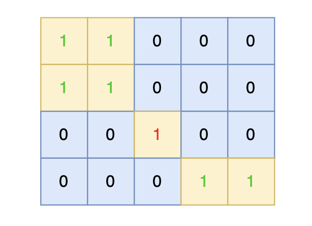
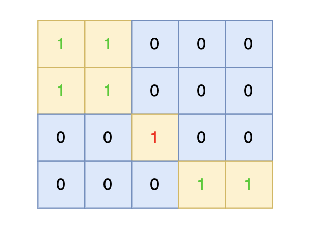
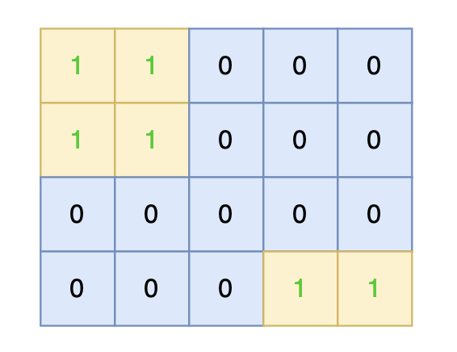
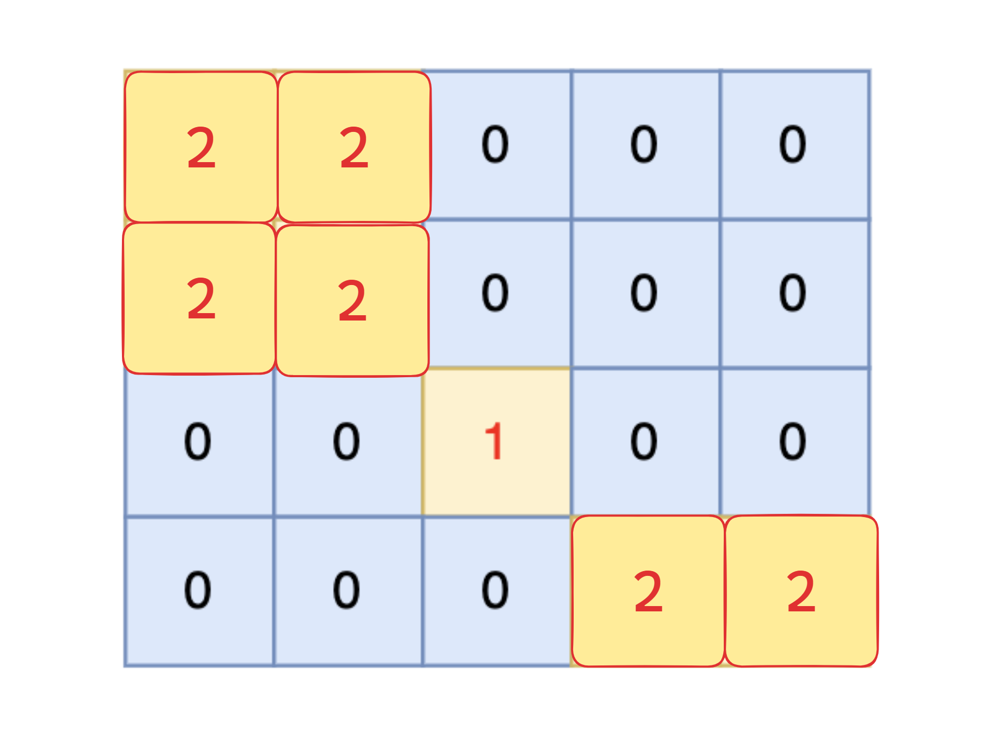
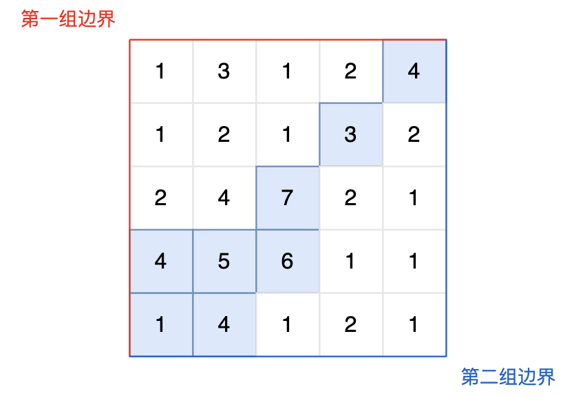

### 八、卡码网-101.孤岛的总面积

> ###### 题目描述
>
> 给定一个由 1（陆地）和 0（水）组成的矩阵，岛屿指的是由水平或垂直方向上相邻的陆地单元格组成的区域，且完全被水域单元格包围。孤岛是那些位于矩阵内部、所有单元格都不接触边缘的岛屿。
>
> 
>
> 现在你需要计算所有孤岛的总面积，岛屿面积的计算方式为组成岛屿的陆地的总数。
>
> ###### 输入描述
>
> 第一行包含两个整数 N, M，表示矩阵的行数和列数。之后 N 行，每行包含 M 个数字，数字为 1 或者 0。
>
> ###### 输出描述
>
> 输出一个整数，表示所有孤岛的总面积，如果不存在孤岛，则输出 0。
>
> ###### 输入示例
>
> ```
> 4 5
> 1 1 0 0 0
> 1 1 0 0 0
> 0 0 1 0 0
> 0 0 0 1 1
> ```
>
> ###### 输出示例
>
> ```
> 1
> ```
>
> ###### 提示信息
>
> 
>
> 
>
> 在矩阵中心部分的岛屿，因为没有任何一个单元格接触到矩阵边缘，所以该岛屿属于孤岛，总面积为 1。

[101. 孤岛的总面积 (kamacoder.com)](https://kamacoder.com/problempage.php?pid=1173)

[代码随想录 (programmercarl.com)](https://programmercarl.com/kamacoder/0101.孤岛的总面积.html)

#### 1、思路

##### （1）思路1

- 延续上述的遍历思路，在搜索相邻陆地的过程中，一旦新坐标越界（接触边缘），说明当前岛屿并非孤岛，不统计该岛屿的面积；
- 否则将岛屿面积叠加到结果中；

##### （2）思路2

- 沿着边缘查找陆地，并通过dfs/bfs搜出接触边缘的岛屿，将其改为海洋节点（0）；
- 遍历整个图，统计所有剩下陆地的数量即可；

#### 2、注意点

#### 3、代码

##### （1）思路1

```c++
#include <algorithm>
#include <iostream>
#include <queue>
#include <vector>
using namespace std;

int IsolatedIslandArea = 0;  // 孤岛面积
int curIslandArea = 0;       // 当前岛屿面积
int isIsolatedIsland = true; // 标记岛屿是否孤岛

// 在四个方向上相对于当前节点的坐标偏移：注意x是行，y是列
// 右(x,y+1)、左(x,y-1)、上(x-1,y)、下(x+1,y)
int directionOffset[4][2] = {{0, 1}, {0, -1}, {-1, 0}, {1, 0}};

struct Node {
    int x;
    int y;
};

/// @brief
/// 广度优先遍历，将所有与传入节点相连的陆地标记为已访问，并统计岛屿大小
/// @param map 地图矩阵
/// @param visitFlag 访问标记数组
/// @param x 传入节点的行
/// @param y 传入节点的列
void bfs(vector<vector<int>> &map, vector<vector<int>> &visitFlag, int x, int y)
{
    queue<Node> que;

    que.push({x, y});    // 将当前节点加入队列
    visitFlag[x][y] = 1; // 将当前节点标记为已访问
    curIslandArea++;     // 当前岛屿面积+1

    while (!que.empty()) {
        // 取出队首元素
        Node curNode = que.front();
        que.pop();
        // 遍历队首元素的相邻节点
        for (int i = 0; i < 4; i++) {
            Node newNode;
            newNode.x = curNode.x + directionOffset[i][0];
            newNode.y = curNode.y + directionOffset[i][1];
            // 节点坐标越界，则标记当前岛屿并非孤岛，且跳过节点
            if (newNode.x < 0 || newNode.x > map.size() - 1 || newNode.y < 0 ||
                newNode.y > map[0].size() - 1) {
                isIsolatedIsland = false; // 标记当前岛屿并非孤岛
                continue;
            }
            // 遇到未访问过的陆地元素，则将其入队，并标记为已访问
            else if (map[newNode.x][newNode.y] == 1 &&
                     visitFlag[newNode.x][newNode.y] == 0) {
                que.push(newNode);
                // 必须在加入队列时就标记为已访问，否则会重复入队
                visitFlag[newNode.x][newNode.y] = 1;
                // 当前岛屿面积++
                curIslandArea++;
            }
        }
    }
}

void solve()
{
    // 输入地图
    int mapRows;
    int mapColumns;
    cin >> mapRows >> mapColumns;
    // 地图
    vector<vector<int>> map(mapRows, vector<int>(mapColumns));
    for (int i = 0; i < map.size(); i++) {
        for (int j = 0; j < map[0].size(); j++) {
            cin >> map[i][j];
        }
    }
    // cout << "map:" << endl;
    // print2DVec(map);

    // 访问标记
    vector<vector<int>> visitFlag(mapRows, vector<int>(mapColumns, 0));

    // 广搜逻辑：找到陆地位置后，通过bfs统计与该位置连接的陆地面积
    for (int i = 0; i < map.size(); i++) {
        for (int j = 0; j < map[0].size(); j++) {
            // 找到尚未访问过的陆地
            if (map[i][j] == 1 && visitFlag[i][j] == 0) {
                curIslandArea = 0;       // 初始化当前岛屿面积为0
                isIsolatedIsland = true; // 初始化孤岛标志位
                bfs(map, visitFlag, i, j);

                // 如果当前岛屿是孤岛，则将其面积叠加到结果中
                if (isIsolatedIsland) {
                    IsolatedIslandArea += curIslandArea;
                }
            }
        }
    }

    cout << IsolatedIslandArea;
    cin.get();
}

int main()
{
    solve();

    cin.get();
    return 0;
}
```

##### （2）思路2

```

```

### 九、卡码网-102.沉没孤岛

> 给定一个由 1（陆地）和 0（水）组成的矩阵，岛屿指的是由水平或垂直方向上相邻的陆地单元格组成的区域，且完全被水域单元格包围。孤岛是那些位于矩阵内部、所有单元格都不接触边缘的岛屿。
>
> 
>
> 现在你需要将所有孤岛“沉没”，即将孤岛中的所有陆地单元格（1）转变为水域单元格（0）。
>
> ###### 输入描述
>
> 第一行包含两个整数 N, M，表示矩阵的行数和列数。
>
> 之后 N 行，每行包含 M 个数字，数字为 1 或者 0，表示岛屿的单元格。
>
> ###### 输出描述
>
> 输出将孤岛“沉没”之后的岛屿矩阵。 注意：每个元素后面都有一个空格
>
> ###### 输入示例
>
> ```
> 4 5
> 1 1 0 0 0
> 1 1 0 0 0
> 0 0 1 0 0
> 0 0 0 1 1
> ```
>
> ###### 输出示例
>
> ```
> 1 1 0 0 0
> 1 1 0 0 0
> 0 0 0 0 0
> 0 0 0 1 1
> ```
>
> ###### 提示信息
>
> 
>
> 
>
> 将孤岛沉没。
>
> 
>
> 

[102. 沉没孤岛 (kamacoder.com)](https://kamacoder.com/problempage.php?pid=1174)

[代码随想录 (programmercarl.com)](https://programmercarl.com/kamacoder/0102.沉没孤岛.html)

#### 1、思路

- 遍历地图边缘，将接触到边缘的节点值修改为2；
    
- 遍历整个地图，将值为2的节点改为1，将节点值为1的节点改为0；

#### 2、注意点

- 搜边缘的时候可以左右一起搜，上下一起搜；

#### 3、代码

```c++
#include <iostream>
#include <vector>
using namespace std;

// 按上、下、左、右顺序搜索
int directionOffset[4][2]{{-1, 0}, {1, 0}, {0, -1}, {0, 1}};
void print2DVec(vector<vector<int>> &Vec)
{
    for (auto i : Vec) {
        for (auto j : i) {
            cout << j << '\t';
        }
        cout << endl;
    }
}

void dfs(vector<vector<int>> &map, int row, int col)
{

    // 越界
    if (row < 0 || row > map.size() - 1 || col < 0 || col > map[0].size() - 1) {
        return;
    }
    // 并非未遍历过的陆地节点
    else if (map[row][col] != 1) {
        return;
    }

    // 将当前节点值标记为2
    map[row][col] = 2;
    // cout << '(' << row << ',' << col << ')' << endl;
    // print2DVec(map);
    // 向四个方向深搜
    for (int i = 0; i < 4; i++) {
        int newRow = row + directionOffset[i][0];
        int newCol = col + directionOffset[i][1];
        dfs(map, newRow, newCol);
    }
}

void solve()
{
    int mapRows = 0;
    int mapColumns = 0;
    cin >> mapRows >> mapColumns;

    vector<vector<int>> map(mapRows, vector<int>(mapColumns));
    for (int i = 0; i < mapRows; i++) {
        for (int j = 0; j < mapColumns; j++) {
            cin >> map[i][j];
        }
    }

    // 遍历地图边缘，将接触边缘的陆地节点数值都改为2
    for (int j = 0; j < map[0].size(); j++) { // 遍历第0行和最后1行
        if (map[0][j] == 1) {
            dfs(map, 0, j);
        }
        if (map[map.size() - 1][j] == 1) {
            dfs(map, map.size() - 1, j);
        }
    }

    for (int i = 0; i < map.size(); i++) { // 遍历第0列和最后1列
        if (map[i][0] == 1) {
            dfs(map, i, 0);
        }
        if (map[i][map[0].size() - 1] == 1) {
            dfs(map, i, map[0].size() - 1);
        }
    }

    // 遍历地图，遇到遇到2变为1，遇到1变为0
    for (int i = 0; i < map.size(); i++) {
        for (int j = 0; j < map[0].size(); j++) {
            if (map[i][j] == 2) {
                map[i][j] = 1;
            }
            else if (map[i][j] == 1) {
                map[i][j] = 0;
            }
        }
    }

    print2DVec(map);

    cin.get();
}

int main()
{
    solve();

    cin.get();
    return 0;
}

```

### 十一、卡码网103.水流问题

> ###### 题目描述
>
> 现有一个 N × M 的矩阵，每个单元格包含一个数值，这个数值代表该位置的相对高度。矩阵的左边界和上边界被认为是第一组边界，而矩阵的右边界和下边界被视为第二组边界。
>
> 矩阵模拟了一个地形，当雨水落在上面时，水会根据地形的倾斜向低处流动，但只能从较高或等高的地点流向较低或等高并且相邻（上下左右方向）的地点。我们的目标是确定那些单元格，从这些单元格出发的水可以达到第一组边界和第二组边界。
>
> ###### 输入描述
>
> 第一行包含两个整数 N 和 M，分别表示矩阵的行数和列数。 
>
> 后续 N 行，每行包含 M 个整数，表示矩阵中的每个单元格的高度。
>
> ###### 输出描述
>
> 输出共有多行，每行输出两个整数，用一个空格隔开，表示可达第一组边界和第二组边界的单元格的坐标，输出顺序任意。
>
> ###### 输入示例
>
> ```
> 5 5
> 1 3 1 2 4
> 1 2 1 3 2
> 2 4 7 2 1
> 4 5 6 1 1
> 1 4 1 2 1
> ```
>
> ###### 输出示例
>
> ```
> 0 4
> 1 3
> 2 2
> 3 0
> 3 1
> 3 2
> 4 0
> 4 1
> ```
>
> ###### 提示信息
>
> 
>
> 
>
> 图中的蓝色方块上的雨水既能流向第一组边界，也能流向第二组边界。所以最终答案为所有蓝色方块的坐标。

[103. 水流问题 (kamacoder.com)](https://kamacoder.com/problempage.php?pid=1175)

[代码随想录 (programmercarl.com)](https://programmercarl.com/kamacoder/0103.水流问题.html#优化)

#### 1、思路

#### 2、注意点

#### 3、代码

```c++
#include <iostream>
#include <vector>
using namespace std;

int directionOffset[4][2] = {{0, -1}, {0, 1}, {-1, 0}, {1, 0}};

void print2DVec(vector<vector<int>> &Vec)
{
    for (auto i : Vec) {
        for (auto j : i) {
            cout << j << '\t';
        }
        cout << endl;
    }
}

void dfs(vector<vector<int>> &heightMap, vector<vector<int>> &VisitedFlag,
         int row, int col)
{

    if (VisitedFlag[row][col] == 1) {
        return;
    }

    // 当前节点标记为已访问
    VisitedFlag[row][col] = 1;

    for (int i = 0; i < 4; i++) {
        int newRow = row + directionOffset[i][0];
        int newCol = col + directionOffset[i][1];

        // 跳过越界节点
        if (newRow < 0 || newRow > heightMap.size() - 1 || newCol < 0 ||
            newCol > heightMap[0].size() - 1) {
            continue;
        }

        if (heightMap[newRow][newCol] >= heightMap[row][col]) {
            dfs(heightMap, VisitedFlag, newRow, newCol);
        }
    }
}

void solve()
{
    // 处理输入
    int mapRows;
    int mapColums;
    cin >> mapRows >> mapColums;

    vector<vector<int>> heightMap(mapRows, vector<int>(mapColums));
    for (int i = 0; i < mapRows; i++) {
        for (int j = 0; j < mapColums; j++) {
            cin >> heightMap[i][j];
        }
    }

    // 已访问标记
    vector<vector<int>> firstGroup_VisitedFlag(mapRows,
                                               vector<int>(mapColums, 0));
    vector<vector<int>> SecondGroup_VisitedFlag(mapRows,
                                                vector<int>(mapColums, 0));

    // 从两组边界向更高的位置逆向搜索
    for (int i = 0; i < heightMap.size(); i++) {
        // 左边界
        dfs(heightMap, firstGroup_VisitedFlag, i, 0);

        // 右边界
        dfs(heightMap, SecondGroup_VisitedFlag, i, heightMap[0].size() - 1);
    }

    for (int j = 0; j < heightMap[0].size(); j++) {
        // 上边界
        dfs(heightMap, firstGroup_VisitedFlag, 0, j);

        // 下边界
        dfs(heightMap, SecondGroup_VisitedFlag, heightMap.size() - 1, j);
    }
    // cout << "first:" << endl;
    // print2DVec(firstGroup_VisitedFlag);
    // cout << "second:" << endl;
    // print2DVec(SecondGroup_VisitedFlag);

    // 处理输出
    // cout << "result:" << endl;
    for (int i = 0; i < heightMap.size(); i++) {
        for (int j = 0; j < heightMap[0].size(); j++) {
            if (firstGroup_VisitedFlag[i][j] && SecondGroup_VisitedFlag[i][j]) {
                cout << i << ' ' << j << endl;
            }
        }
    }

    cin.get();
}

int main()
{
    solve();

    cin.get();
    return 0;
}

```

### 