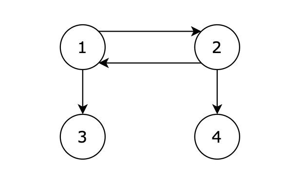

### 十三、卡码网-110.字符串接龙

> 字典 strList 中从字符串 beginStr 到 endStr 的转换序列（序列：多个字符串的集合）是一个按下述规格形成的序列： 
>
> 1. 序列中第一个字符串是 beginStr。
> 2. 序列中最后一个字符串是 endStr。 
> 3. 每次转换只能改变一个字符。 
> 4. 转换过程中的中间字符串必须是字典 strList 中的字符串，且strList里的每个字符串只用使用一次。 
>
> 给你两个字符串 beginStr 和 endStr 和一个字典 strList，找到从 beginStr 到 endStr 的最短转换序列中的字符串数目。如果不存在这样的转换序列，返回 0。
>
> ###### 输入描述
>
> 第一行包含一个整数 N，表示字典 strList 中的字符串数量。 第二行包含两个字符串，用空格隔开，分别代表 beginStr 和 endStr。 后续 N 行，每行一个字符串，代表 strList 中的字符串。
>
> ###### 输出描述
>
> 输出一个整数，代表从 beginStr 转换到 endStr 需要的最短转换序列中的字符串数量。如果不存在这样的转换序列，则输出 0。
>
> ###### 输入示例
>
> ```
> 6
> abc def
> efc
> dbc
> ebc
> dec
> dfc
> yhn
> ```
>
> ###### 输出示例
>
> ```
> 4
> ```
>
> ###### 提示信息
>
> 从 startStr 到 endStr，在 strList 中最短的路径为 abc -> dbc -> dec -> def，所以输出结果为 4，如图：
>
> 

[110. 字符串接龙 (kamacoder.com)](https://kamacoder.com/problempage.php?pid=1183)

[代码随想录 (programmercarl.com)](https://programmercarl.com/kamacoder/0110.字符串接龙.html#思路)

#### 1、思路

1. 求最短路径，使用广度优先搜索BFS，广搜找到endStr就代表找到了最短路径；
2. 逐个改变字符串中的字母（从a~z），若在字典中找到了改变后的新字符串，则代表两个字符串之间有连接（是无向图中可以互相到达的节点）；
3. 从beginStr一直遍历直至找到endStr；

#### 2、注意点

1. 最开始要将**beginStr放入映射map中，表示其已经被访问过**，否则当beginStr也在字典中时，最终路径长度会多出1；

    ```c++
    unordered_map<string, int> map_String2PathLenght; // map存储字符串和路径长度的映射关系
    map_String2PathLenght[beginStr] = 1; // 初始化map
    ```

2. **找到endStr的判断必须放在字典搜索的前面**，否则当endStr也在字典中时，最终路径长度会多出1；

    ```c++
    // 先
    if (newStr == endStr) {
        ...
    }
    // 后
    if (strList.find(newStr) != strList.end() &&
                        map_String2PathLenght.find(newStr) ==
                            map_String2PathLenght.end()) {
    	...
    }
    ```

3. **在循环外部定义变量，在循环内更新变量**，可以减小申请空间的开销

#### 3、代码

```c++
#include <iostream>
#include <queue>
#include <string>
#include <unordered_map>
#include <unordered_set>
#include <vector>
using namespace std;

int pathLength = 0;

void solve()
{
    /* 处理输入 */
    int strListSize = 0;
    cin >> strListSize;

    string beginStr;
    string endStr;
    cin >> beginStr >> endStr;

    unordered_set<string> strList;
    for (int i = 0; i < strListSize; i++) {
        string tmpStr;
        cin >> tmpStr;
        strList.insert(tmpStr);
    }
    /* 输入结束 */

    /* 广搜寻找最短路径 */

    unordered_map<string, int>
        map_String2PathLenght; // map存储字符串和路径长度的映射关系
    map_String2PathLenght[beginStr] = 1; // 初始化map

    queue<string> bfsQueue;  // bfs队列
    bfsQueue.push(beginStr); // 初始化bfs队列

    while (!bfsQueue.empty()) {

        string curStr = bfsQueue.front();
        bfsQueue.pop();

        // 依次更改当前字符串的每个字符，查看字典中是否有更改后的字符串
        string newStr;
        for (int i = 0; i < curStr.size(); i++) {
            // 在循环外部定义变量，在循环内更新变量，可以减小申请空间的开销
            newStr = curStr;
            for (int j = 0; j < 26; j++) {

                newStr[i] = 'a' + j; // 每个字符都遍历26个字母

                // 找到endStr
                // 找到endStr的判断必须放在字典搜索的前面，否则当endStr也在字典中时路径会多出1
                if (newStr == endStr) {
                    pathLength = map_String2PathLenght[curStr] + 1;
                    cout << pathLength;
                    cin.get();
                    return;
                }

                // 在字典中找到了更改后的新字符串，且还未被访问过
                if (strList.find(newStr) != strList.end() &&
                    map_String2PathLenght.find(newStr) ==
                        map_String2PathLenght.end()) {

                    // 入队
                    bfsQueue.push(newStr);

                    // 将该字符串标记为已访问
                    // 字符串对应的路径长度++
                    map_String2PathLenght[newStr] =
                        map_String2PathLenght[curStr] + 1;
                }
            }
        }
    }
    /* 寻找最短路径结束 */
}

int main()
{
    solve();

    cin.get();
    return 0;
}

```

### 十四、卡码网-105.有向图的完全可达性

> ###### 题目描述
>
> 给定一个有向图，包含 N 个节点，节点编号分别为 1，2，...，N。现从 1 号节点开始，如果可以从 1 号节点的边可以到达任何节点，则输出 1，否则输出 -1。
>
> ###### 输入描述
>
> 第一行包含两个正整数，表示节点数量 N 和边的数量 K。 后续 K 行，每行两个正整数 s 和 t，表示从 s 节点有一条边单向连接到 t 节点。
>
> ###### 输出描述
>
> 如果可以从 1 号节点的边可以到达任何节点，则输出 1，否则输出 -1。
>
> ###### 输入示例
>
> ```
> 4 4
> 1 2
> 2 1
> 1 3
> 2 4
> ```
>
> ###### 输出示例
>
> ```
> 1
> ```
>
> ###### 提示信息
>
> 
>
> 
>
> 从 1 号节点可以到达任意节点，输出 1。

[105. 有向图的完全可达性 (kamacoder.com)](https://kamacoder.com/problempage.php?pid=1177)

[代码随想录 (programmercarl.com)](https://programmercarl.com/kamacoder/0105.有向图的完全可达性.html#思路)

#### 1、思路

1. 有向图的单节点完全路径遍历，即寻找从1出发的所有路径；

2. 仅从节点1出发，正常深搜即可；

3. 可以用set存储已经遍历过的节点，便于进行递归终止条件的判断；

    ```c++
    if (visitedFlag.find(node) != visitedFlag.end()) {
            return;
    }
    ```

#### 2、注意点

- 主逻辑中不需要遍历其他节点，仅从节点1出发遍历即可；

#### 3、代码

```c++
#include <iostream>
#include <list>
#include <unordered_set>
#include <vector>
using namespace std;

void dfs(vector<list<int>> &graph, int node, unordered_set<int> &visitedFlag)
{
    // 当前节点已经访问过
    if (visitedFlag.find(node) != visitedFlag.end()) {
        return;
    }

    // 标记当前节点已访问过
    visitedFlag.insert(node);

    // 继续访问相连的其他节点
    for (auto i : graph[node]) {
        dfs(graph, i, visitedFlag);
    }
}

void solve()
{
    /* 处理输入 */
    int nodeNum = 0;
    int edgeNum = 0;
    cin >> nodeNum >> edgeNum;

    // 邻接表实现
    vector<list<int>> graph(nodeNum + 1);
    int node1 = 0;
    int node2 = 0;
    for (int i = 0; i < edgeNum; i++) {
        cin >> node1 >> node2;
        graph[node1].push_back(node2);
    }
    /* 输入结束 */

    /* 从节点1出发，深搜查找所有能到达的节点 */
    // 用set保存已经访问过的节点
    unordered_set<int> visitedFlag;
    // 深搜
    dfs(graph, 1, visitedFlag);
    /* 深搜结束 */

    if (visitedFlag.size() == nodeNum) {
        cout << 1;
    }
    else {
        cout << -1;
    }

    cin.get();
}

int main()
{
    solve();

    cin.get();
    return 0;
}
```

### 十五、106.岛屿的周长

[代码随想录 (programmercarl.com)](https://programmercarl.com/kamacoder/0106.岛屿的周长.html#思路)

[106. 岛屿的周长 (kamacoder.com)](https://kamacoder.com/problempage.php?pid=1178)

#### 1、思路

#### 2、注意点

#### 3、代码

```c++
#include <iostream>
#include <vector>
using namespace std;

int result = 0;
int directionOffset[4][2] = {{-1, 0}, {1, 0}, {0, -1}, {0, 1}};

void solve()
{
    /* 处理输入 */
    int mapRows = 0;
    int mapColumns = 0;
    cin >> mapRows >> mapColumns;

    vector<vector<int>> map(mapRows, vector<int>(mapColumns));
    for (int row = 0; row < mapRows; row++) {
        for (int col = 0; col < mapColumns; col++) {
            cin >> map[row][col];
        }
    }
    /* 输入结束 */

    /* 遍历节点 */
    for (int row = 0; row < map.size(); row++) {
        for (int col = 0; col < map[0].size(); col++) {
            if (map[row][col] == 1) {
                // cout << "(" << row << "," << col << ")";
                for (int i = 0; i < 4; i++) {
                    int newRow = row + directionOffset[i][0];
                    int newCol = col + directionOffset[i][1];
                    // 越界
                    if (newRow < 0 || newRow > map.size() - 1 || newCol < 0 ||
                        newCol > map[0].size() - 1) {
                        result++;
                        // cout << "result:" << result << endl;
                    }
                    // 遇到海洋
                    else if (map[newRow][newCol] == 0) {
                        result++;
                    }
                }
            }
        }
    }
    /* 遍历结束 */
    cout << result;
    cin.get();
}

int main()
{
    solve();

    cin.get();
    return 0;
}
```

