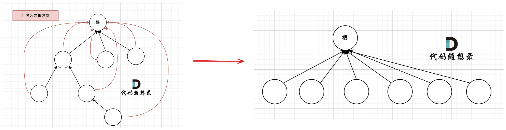

### 十六、并查集理论基础

[代码随想录 (programmercarl.com)](https://programmercarl.com/kamacoder/0107.寻找存在的路径.html#思路)

[B站：图论——并查集(详细版)](https://www.bilibili.com/video/BV1jv411a7LK?p=2&vd_source=efdaa126e8affd01b06188fe27db7747)

#### 1、作用

- 并查集是一个集合，其中存储了各节点之间的连通性关系；
- 并查集的作用是**查找两个节点之间是否存在连通性**，适用于**解决node1到node2之间有没有路径的问题**；

#### 2、实现

1. 用数组root表示：root[node]表示节点node的根节点，如果两个节点的根节点相同，代表两节点之间是连通的；

    ```c++
    // root初始化
    void init(int num)
    {
        root.resize(num + 1);
    	// 将每个节点的根节点设为自己    
        for (int i = 0; i <= num; i++) {
            root[i] = i;
        }
    }
    ```

2. 查找node的根节点，注意每次都进行路径压缩，让每个在并查集中的节点都**指向同一个根节点**，减小查找的开销；
    

    ```c++
    /* 查找node1的根节点 */
    int findRoot(int node)
    {
        if (root[node] == node) {
            return node;
        }
        else {
            root[node] = findRoot(root[node]); // 路径压缩
        }
        return root[node];
    }
    ```

3. 将两个节点加入同一个并查集：查找node1和node2的根节点，如果根节点不相同，将node1的根节点指向node2的根节点，则获得了同一个根节点；

    ```c++
    /* 将节点node1和node2加入同一个并查集 */
    void join(int node1, int node2)
    {
        int node1_root = findRoot(node1);
        int node2_root = findRoot(node2);
    
        if (node1_root == node2_root) {
            return;
        }
    
        root[node1_root] = node2_root;
    }
    ```

4. 判断两个节点是否在同一个并查集中：查找根节点是否相同即可；

    ```c++
    /* 查询node1和node2是否在同一并查集中 */
    bool isSame(int node1, int node2)
    {
        int node1_root = findRoot(node1);
        int node2_root = findRoot(node2);
        return node1_root == node2_root;
    }
    ```

    ### 十七、卡码网-107.寻找存在的路径

    [代码随想录 (programmercarl.com)](https://programmercarl.com/kamacoder/0107.寻找存在的路径.html#思路)

    [107. 寻找存在的路径 (kamacoder.com)](https://kamacoder.com/problempage.php?pid=1179)

    #### 1、思路

    - 将连通的节点都加入并查集，最后查找目标节点和源节点之间是否连通即可；

    #### 2、代码

    ```c++
    #include <iostream>
    #include <vector>
    using namespace std;
    
    class MyUnionSearchSet {
      public:
        vector<int> root;
        void init(int num)
        {
            root.resize(num + 1);
            for (int i = 0; i <= num; i++) {
                root[i] = i;
            }
        }
    
        /* 查找node1的根节点 */
        int findRoot(int node)
        {
            if (root[node] == node) {
                return node;
            }
            else {
                root[node] = findRoot(root[node]); // 路径压缩
            }
    
            return root[node];
        }
    
        /* 将节点node1和node2加入同一个并查集 */
        void join(int node1, int node2)
        {
            int node1_root = findRoot(node1);
            int node2_root = findRoot(node2);
    
            if (node1_root == node2_root) {
                return;
            }
    
            root[node1_root] = node2_root;
        }
    
        /* 查询node1和node2是否在同一并查集中 */
        bool isSame(int node1, int node2)
        {
            int node1_root = findRoot(node1);
            int node2_root = findRoot(node2);
    
            return node1_root == node2_root;
        }
    
        /* 打印并查集 */
        void printRoot()
        {
            for (int i : root) {
                cout << i << " ";
            }
            cout << endl;
        }
    };
    
    void solve()
    {
        MyUnionSearchSet unionSearchset;
    
        int nodeNum = 0;
        int edgeNum = 0;
        cin >> nodeNum >> edgeNum;
    
        /* 初始化并查集 */
        unionSearchset.init(nodeNum);
    
        /* 将输入的节点加入并查集 */
        int node1 = 0;
        int node2 = 0;
        for (int i = 0; i < edgeNum; i++) {
            cin >> node1 >> node2;
            unionSearchset.join(node1, node2);
        }
        // unionSearchset.printRoot();
    
        int sourceNode = 0;
        int destinationNode = 0;
        cin >> sourceNode >> destinationNode;
    
        /* 查找源节点到目的节点是否在同一个并查集中 */
        if (unionSearchset.isSame(sourceNode, destinationNode)) {
            cout << 1;
        }
        else {
            cout << 0;
        }
    
        cin.get();
    }
    
    int main()
    {
        solve();
    
        cin.get();
        return 0;
    }
    ```

    