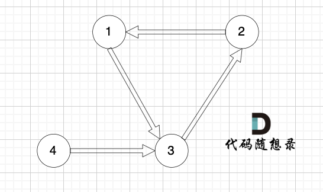

### 十八、卡码网-108.冗余连接

> ###### 题目描述
>
> ​	树可以看成是一个图（拥有 n 个节点和 n - 1 条边的连通无环无向图）。 
>
> ​	现给定一个拥有 n 个节点（节点标号是从 1 到 n）和 n 条边的连通无向图，请找出一条可以删除的边，删除后图可以变成一棵树。
>
> ###### 输入描述
>
> 第一行包含一个整数 N，表示图的节点个数和边的个数。
>
> 后续 N 行，每行包含两个整数 s 和 t，表示图中 s 和 t 之间有一条边。
>
> ###### 输出描述
>
> 输出一条可以删除的边。如果有多个答案，请删除标准输入中最后出现的那条边。
>
> ###### 输入示例
>
> ```
> 3
> 1 2
> 2 3
> 1 3
> ```
>
> ###### 输出示例
>
> ```
> 1 3
> ```
>
> ###### 提示信息
>
> 
>
> 
>
> 图中的 1 2，2 3，1 3 等三条边在删除后都能使原图变为一棵合法的树。但是 1 3 由于是标准输出里最后出现的那条边，所以输出结果为 1 3

[108. 冗余连接 (kamacoder.com)](https://kamacoder.com/problempage.php?pid=1181)

[代码随想录 (programmercarl.com)](https://programmercarl.com/kamacoder/0108.冗余连接.html#思路)

#### 1、思路

1. 将节点的边逐个加入并查集；
2. 一旦发现当前两个节点已经在并查集中，说明再加入这两个节点的边会在原来的树上形成环，则记录该边；
3. 将最后一次记录的边输出；

#### 2、注意点

- 注意要初始化并查集！

#### 3、代码

```c++
#include <iostream>
#include <vector>
using namespace std;

class UnionSearchSet {
  public:
    vector<int> root;

    void initSet(int setSize)
    {
        root.resize(setSize);
        for (int i = 0; i < root.size(); i++) {
            root[i] = i;
        }
    }

    int findRoot(int node)
    {
        if (root[node] == node) {
            return node;
        }
        root[node] = findRoot(root[node]); // 路径压缩
        return root[node];
    }

    void joinSet(int node1, int node2)
    {
        int node1Root = findRoot(node1);
        int node2Root = findRoot(node2);
        if (node1Root == node2Root) {
            return;
        }
        root[node1Root] = node2Root;
    }

    bool isInTheSameSet(int node1, int node2)
    {
        int node1Root = findRoot(node1);
        int node2Root = findRoot(node2);
        if (node1Root == node2Root) {
            return true;
        }
        return false;
    }

    void printSet()
    {
        for (int i : root) {
            cout << i << " ";
        }
        cout << endl;
    }
};

void printResult(int result1, int result2)
{
    cout << result1 << " " << result2;
    cin.get();
}

void solve()
{
    UnionSearchSet mySet;

    /* 处理输入，并将每个节点加入并查集 */
    int nodeNum = 0;
    cin >> nodeNum;
    // 初始化并查集
    mySet.initSet(nodeNum + 1);

    int result1 = 0;
    int result2 = 0;
    int node1 = 0;
    int node2 = 0;
    for (int i = 0; i < nodeNum; i++) {
        cin >> node1 >> node2;
        if (mySet.isInTheSameSet(node1, node2)) {
            result1 = node1;
            result2 = node2;
            continue;
        }
        mySet.joinSet(node1, node2);
    }
    /* 处理结束 */

    printResult(result1, result2);
}

int main()
{
    solve();

    cin.get();
    return 0;
}
```

### 十九、卡码网-109.冗余连接II

> ###### 题目描述
>
> ​	有向树指满足以下条件的有向图。该树只有一个根节点，所有其他节点都是该根节点的后继。该树除了根节点之外的每一个节点都有且只有一个父节点，而根节点没有父节点。有根树拥有 n 个节点和 n - 1 条边。 
>
> ​	输入一个有向图，该图由一个有着 n 个节点(节点编号 从 1 到 n)，n 条边，请返回一条可以删除的边，使得删除该条边之后该有向图可以被当作一颗有向树。
>
> ###### 输入描述
>
> 第一行输入一个整数 N，表示有向图中节点和边的个数。 
>
> 后续 N 行，每行输入两个整数 s 和 t，代表 s 节点有一条连接 t 节点的单向边
>
> ###### 输出描述
>
> 输出一条可以删除的边，若有多条边可以删除，请输出标准输入中最后出现的一条边。
>
> ###### 输入示例
>
> ```
> 3
> 1 2
> 1 3
> 2 3
> ```
>
> ###### 输出示例
>
> ```
> 2 3
> ```
>
> ###### 提示信息
>
> 
>
> 
>
> 在删除1->2或2->3 后有向图可以变为一棵合法的有向树，较后的是2->3 所以输出 2 3 

[109. 冗余连接II (kamacoder.com)](https://kamacoder.com/problempage.php?pid=1182)

[代码随想录 (programmercarl.com)](https://programmercarl.com/kamacoder/0109.冗余连接II.html#思路)

#### 1、思路

1. 题目中给出的节点和边相当于：**一棵合法的有向树+一条边**，我们就是要找出这条边；

2. 合法的有向树中，除根节点入度为0，其余节点的入度均为1；因此加入一条边后可能会造成以下两种情况：

    1. 某节点入度变为2，也有如下两种子情况；因此在删除时需要判断**删除该边后是否仍是一棵合法的树，**事实上就是**判断会不会成环**，**如果不成环，根据题目条件必然是一棵合法的树**；

        1.1 随意删掉一条指向该节点的边即可：图中删掉1->3或2->3都可以；
        

        1.2 必须删掉某条特定的边：图中必须删掉1->3这条边
        ****

    2. 某节点和根节点连起来了，使得根节点的入度变为1（此时无入度为2的节点，**所有节点入度均为1**）：例如下图成环，此时删掉**最后一次出现的成环边**即可；
        **成环边：将边的两端节点加入并查集时发现两节点已经在并查集中；**
        

#### 2、注意点

- 在第一种情况下（某节点入度为2），删除一条边后，如果成环就不是合法的树，否则在题目条件下必然是合法的树；
- 在第二种情况下（成环，），删掉最后一次出现的成环边；

#### 3、代码

```c++
#include <iostream>
#include <vector>
using namespace std;

class UnionSearchSet {
  public:
    vector<int> root;

    void initSet(int SetSize)
    {
        root.resize(SetSize);
        for (int i = 0; i < SetSize; i++) {
            root[i] = i;
        }
    }

    int findRoot(int node)
    {
        if (root[node] == node) {
            return root[node];
        }
        root[node] = findRoot(root[node]);
        return root[node];
    }

    void joinSet(int node1, int node2)
    {
        int node1Root = findRoot(node1);
        int node2Root = findRoot(node2);

        if (node1Root == node2Root) {
            return;
        }
        root[node1Root] = node2Root;
    }

    bool isInTheSameSet(int node1, int node2)
    {
        int node1Root = findRoot(node1);
        int node2Root = findRoot(node2);
        return node1Root == node2Root;
    }

    void printSet()
    {
        for (int i : root) {
            cout << i << " ";
        }
        cout << endl;
    }
};

void getEdge_WhoCreateTwoInDegree(vector<int> &InDegreeOfNode,
                                  vector<pair<int, int>> &edges,
                                  vector<pair<int, int>> &edgesCreateTwoDegree)
{
    for (int i = 0; i < edges.size(); i++) {
        if (InDegreeOfNode[edges[i].second] == 2) {
            edgesCreateTwoDegree.push_back(edges[i]);
        }
    }
}

bool isTree_AfterDeleteEdge(vector<pair<int, int>> &edges,
                            pair<int, int> &deletedEdge, int nodeNum)
{
    UnionSearchSet mySet;
    mySet.initSet(nodeNum + 1);
    for (int i = 0; i < edges.size(); i++) {
        if (edges[i] == deletedEdge) {
            continue;
        }

        // 当前边的两个节点已经在树中，再加入则会构成环，无法构成树
        if (mySet.isInTheSameSet(edges[i].first, edges[i].second)) {
            return false;
        }

        mySet.joinSet(edges[i].first, edges[i].second);
    }
    return true;
}

void deleteEdge_WhoCreateTwoInDegree(
    vector<pair<int, int>> &edges, vector<pair<int, int>> &edgesCreateTwoDegree,
    int nodeNum)
{
    // 逆序遍历，因为要输出偏后的边
    for (int i = edgesCreateTwoDegree.size() - 1; i >= 0; i--) {
        if (isTree_AfterDeleteEdge(edges, edgesCreateTwoDegree[i], nodeNum)) {
            cout << edgesCreateTwoDegree[i].first << " "
                 << edgesCreateTwoDegree[i].second;
            return;
        }
    }
}

void deleteEdge_WhoCreateCircle(vector<pair<int, int>> &edges, int nodeNum)
{
    UnionSearchSet mySet;
    mySet.initSet(nodeNum + 1);

    for (int i = 0; i < edges.size(); i++) {
        if (mySet.isInTheSameSet(edges[i].first, edges[i].second)) {
            cout << edges[i].first << " " << edges[i].second;
            return;
        }
        mySet.joinSet(edges[i].first, edges[i].second);
    }
}

void solve()
{
    int nodeNum = 0;
    cin >> nodeNum;

    int sourceNode = 0;
    int destinationNode = 0;

    vector<int> InDegreeOfNode(nodeNum + 1);
    vector<pair<int, int>> edges;
    vector<pair<int, int>> edgesCreateTwoDegree;

    for (int i = 0; i < nodeNum; i++) {
        cin >> sourceNode >> destinationNode;

        edges.push_back({sourceNode, destinationNode});
        InDegreeOfNode[destinationNode]++;
    }

    getEdge_WhoCreateTwoInDegree(InDegreeOfNode, edges, edgesCreateTwoDegree);

    if (!edgesCreateTwoDegree.empty()) {
        deleteEdge_WhoCreateTwoInDegree(edges, edgesCreateTwoDegree, nodeNum);
    }
    else {
        deleteEdge_WhoCreateCircle(edges, nodeNum);
    }
    cin.get();
}

int main()
{
    solve();

    cin.get();
    return 0;
}
```

