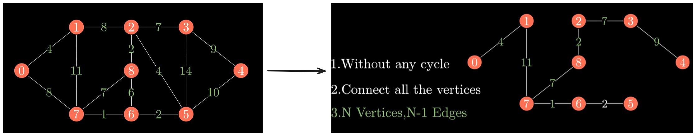
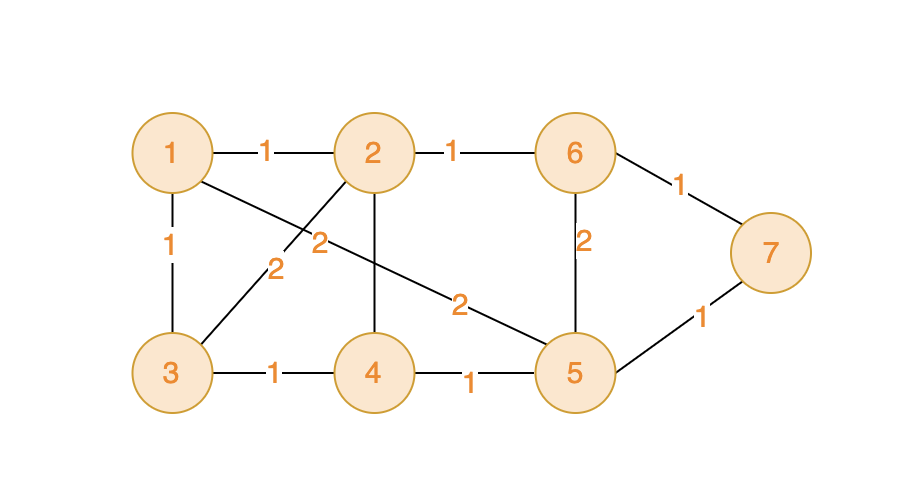

### 十八、最小生成树基础

【最小生成树(Kruskal(克鲁斯卡尔)和Prim(普里姆))算法动画演示】https://www.bilibili.com/video/BV1Eb41177d1?vd_source=efdaa126e8affd01b06188fe27db7747

#### 1、概念

##### （1）生成树

- 在一个**无向有权图G**中，取出（生成出）一个**连通子图V（所有节点都相连）**，V构成一棵**树型结构（无环便是树）；**
    
- 树的三个特点：无环、所有顶点都必须相连、N个顶点的生成树树有N-1条边；

##### （2）最小生成树

- 在**无向有权图G**的所有生成树中，**各条边权值和最小**的生成树称为最小生成树

### 2、算法实现

##### （1）Kruskal算法——维护边

1. **算法逻辑**

    1. 将所有边根据权值升序排列，从权值最小的边开始，将其两端节点添加入并查集中；

    2. 一旦遇到某条边的两端顶点已经在并查集中，代表此条边会破环生成树（让树成环），跳过它；

    3. 对于N个节点的图，如果已经加入了N-1条边，则查找到了最小生成树的所有边；

    4. GIF来源于上述B站视频

        

2. **优缺点及适用情况**

    1. 排序并维护边，整体过程较容易理解；
    2. 适用于稀疏图，即边的数量相对节点数量较少（远少于n的平方）；

3. **时间复杂度：O(mlogn)，m是边数，n是节点数；**

4. **空间复杂度：O(m)，需要存储每条边；**

##### （2）Prim算法——维护节点

1. **算法逻辑**

    1. 将节点分为两个集合，已选集合P和未选集合Q（用一个bool数组描述即可）；

    2. 维护一个集合distance：从已选集合P到未选集合Q的各条边；

    3. 在集合中找到权值最小的边，将与该边相连的节点Qi加入P中；

    4. 更新两个节点集合P、Q，更新边长集合distance，直至将所有节点纳入已选集合P；

    5. GIF来源于上述B站视频

        

2. **适用情况：**只需要维护节点，因此适用于边较多的稠密图；

3. **时间复杂度：O(n^2)，遍历所有节点，对每个节点需要遍历distance；**

4. **空间复杂度：O(n^2)，需要邻接矩阵存图；**

### 十九、最小生成树-Kruskal算法（维护边）

> 在世界的某个区域，有一些分散的神秘岛屿，每个岛屿上都有一种珍稀的资源或者宝藏。国王打算在这些岛屿上建公路，方便运输。
>
> 不同岛屿之间，路途距离不同，国王希望你可以规划建公路的方案，如何可以以最短的总公路距离将 所有岛屿联通起来（注意：这是一个无向图）。 
>
> 给定一张地图，其中包括了所有的岛屿，以及它们之间的距离。以最小化公路建设长度，确保可以链接到所有岛屿。
>
> ###### 输入描述
>
> 第一行包含两个整数V 和 E，V代表顶点数，E代表边数 。顶点编号是从1到V。例如：V=2，一个有两个顶点，分别是1和2。
>
> 接下来共有 E 行，每行三个整数 v1，v2 和 val，v1 和 v2 为边的起点和终点，val代表边的权值。
>
> ###### 输出描述
>
> 输出联通所有岛屿的最小路径总距离
>
> ###### 输入示例
>
> ```
> 7 11
> 1 2 1
> 1 3 1
> 1 5 2
> 2 6 1
> 2 4 2
> 2 3 2
> 3 4 1
> 4 5 1
> 5 6 2
> 5 7 1
> 6 7 1
> ```
>
> ###### 输出示例
>
> ```
> 6
> ```
>
> ###### 提示信息
>
> 数据范围：
> 2 <= V <= 10000;
> 1 <= E <= 100000;
> 0 <= val <= 10000;
>
> 如下图，可见将所有的顶点都访问一遍，总距离最低是6.
>
> 

[53. 寻宝（第七期模拟笔试） (kamacoder.com)](https://kamacoder.com/problempage.php?pid=1053)

[代码随想录 (programmercarl.com)](https://programmercarl.com/kamacoder/0053.寻宝-Kruskal.html#拓展一)

#### 1、思路

- 最小生成树的模板题，本题解采用Kruskal算法；

#### 2、注意点

1. 并查集的joinSet方法中，不要把**赋值运算符 = **写成**比较运算符 == ；**

2. 实现升序排序：

    ```c++
    bool ascendingSort(Edge edge1, Edge edge2) { return edge1.val < edge2.val; }
    sort(edges.begin(), edges.end(), ascendingSort);
    ```

3. 剪枝过程

    ```c++
    // 剪枝
    if (num_SelectedEdges == nodeNum - 1) {
        /*  注意要break而不能在此处直接输出答案
         否则当“原图本来就已经是最小生成树”时，会
         直接遍历完所有边退出循环而不输出结果 */
        break;
    }
    
    // 错误代码
    if (num_SelectedEdges == nodeNum - 1) {
        cout << weightSum;
        return;
    }
    ```

#### 3、代码

```c++
#include <algorithm>
#include <iostream>
#include <vector>
using namespace std;

class UnionSearchSet {
  private:
    vector<int> root;

  public:
    void initSet(int setSize)
    {
        root.resize(setSize);
        for (int i = 0; i < setSize; i++) {
            root[i] = i;
        }
    }

    int findRoot(int node)
    {
        if (root[node] == node) {
            return root[node];
        }
        root[node] = findRoot(root[node]); // 路径压缩
        return root[node];
    }

    void joinSet(int node1, int node2)
    {
        int node1Root = findRoot(node1);
        int node2Root = findRoot(node2);

        if (node1Root == node2Root) {
            return;
        }

        root[node1Root] = node2Root; // 别写成== T_T
    }

    bool isInTheSameSet(int node1, int node2)
    {
        int node1Root = findRoot(node1);
        int node2Root = findRoot(node2);

        return node1Root == node2Root;
    }

    void printSet()
    {
        for (int i : root) {
            cout << i << " ";
        }
        cout << endl;
    }
};

struct Edge {
    int node1;
    int node2;
    int val;
};

bool ascendingSort(Edge edge1, Edge edge2) { return edge1.val < edge2.val; }

void printResult(int result) { cout << result; }

void solve()
{
    int WeightSum = 0;

    /* 输入 */
    int nodeNum = 0;
    int edgeNum = 0;
    cin >> nodeNum >> edgeNum;

    int node1 = 0;
    int node2 = 0;
    int val = 0;
    vector<Edge> edges(edgeNum);
    for (int i = 0; i < edgeNum; i++) {
        cin >> edges[i].node1 >> edges[i].node2 >> edges[i].val;
    }
    /* 输入结束 */

    sort(edges.begin(), edges.end(), ascendingSort);

    int num_SelectedEdges = 0;
    UnionSearchSet mySet;
    mySet.initSet(nodeNum + 1);

    for (Edge i : edges) {

        // 剪枝
        if (num_SelectedEdges == nodeNum - 1) {
            /*  注意要break而不能在此处直接输出答案
             否则当“原图本来就已经是最小生成树”时，会
             直接遍历完所有边退出循环而不输出结果 */
            break;
        }

        if (!mySet.isInTheSameSet(i.node1, i.node2)) {

            mySet.joinSet(i.node1, i.node2);
            WeightSum += i.val;
            // cout << "WeightSum:" << WeightSum << endl;
            num_SelectedEdges++;
            // cout << "num_SelectedEdges:" << num_SelectedEdges << endl;
        }
    }
    printResult(WeightSum);
    cin.get();
}

int main()
{
    solve();

    cin.get();
    return 0;
}
```

### 二十、最小生成树-Prim算法（维护节点）

#### 1、思路

- 根据Prim算法的思想解答即可；

#### 2、注意点

- 在使用INT_MAX时必须包含头文件：`#include <climits>`；
- minDistance初始化为`INT_MAX-1`，以便于在函数`findNearestNode()`中顺利**将第1个节点加入树中**；

#### 3、代码

```c++
#include <climits>
#include <iostream>
#include <vector>
using namespace std;

struct Edge {
    int node1;
    int node2;
    int weight;
};

using Node = int;

Node findNearestNode(vector<bool> &isInTheTree, vector<int> &minDistance)
{
    int curMinDistance = INT_MAX;
    int curNearestNode = 0;
    for (int i = 1; i < minDistance.size(); i++) {
        bool findCloserExternalNode =
            (minDistance[i] < curMinDistance) && (isInTheTree[i] == false);

        if (findCloserExternalNode) {
            curMinDistance = minDistance[i];
            curNearestNode = i;
        }
    }
    return curNearestNode;
}

void addNearestNodeToTree(Node nearestNode, vector<bool> &isInTheTree)
{
    isInTheTree[nearestNode] = true;
}

void updateMinDistance(Node addedNode, vector<bool> &isInTheTree,
                       vector<int> &minDistance, vector<vector<int>> &map)
{
    for (int i = 1; i < map[0].size(); i++) {
        bool findShorterEdge_with_ExternalNode =
            (!isInTheTree[i]) && (map[addedNode][i] != 0) &&
            (map[addedNode][i] < minDistance[i]);

        if (findShorterEdge_with_ExternalNode) {
            minDistance[i] = map[addedNode][i];
        }
    }
}

void printDistanceSum(vector<int> &minDistance)
{
    int distanceSum = 0;
    for (int i : minDistance) {
        if (i != INT_MAX - 1) {
            distanceSum += i;
        }
    }
    cout << distanceSum;
}

void solve()
{
    /* 输入 */
    int nodeNum = 0;
    int edgeNum = 0;
    cin >> nodeNum >> edgeNum;

    int node1 = 0;
    int node2 = 0;
    int weight = 0;
    // 邻接矩阵存图
    vector<vector<int>> map(nodeNum + 1, vector<int>(nodeNum + 1, 0));
    for (int i = 0; i < edgeNum; i++) {
        cin >> node1 >> node2 >> weight;
        map[node1][node2] = weight;
        map[node2][node1] = weight;
    }
    /* 输入结束 */

    vector<bool> isInTheTree(nodeNum + 1, false);

    /*
        初始化为了INT_MAX - 1是为了在函数findNearestNodez中
        能成功地将第一个节点加入树中;
    */
    vector<int> minDistance(nodeNum + 1, INT_MAX - 1);

    int loop = nodeNum;
    while (loop--) {

        Node nearestNode = findNearestNode(isInTheTree, minDistance);

        addNearestNodeToTree(nearestNode, isInTheTree);

        updateMinDistance(nearestNode, isInTheTree, minDistance, map);
        
    }

    printDistanceSum(minDistance);
    cin.get();
}

int main()
{
    solve();

    cin.get();
    return 0;
}
```

