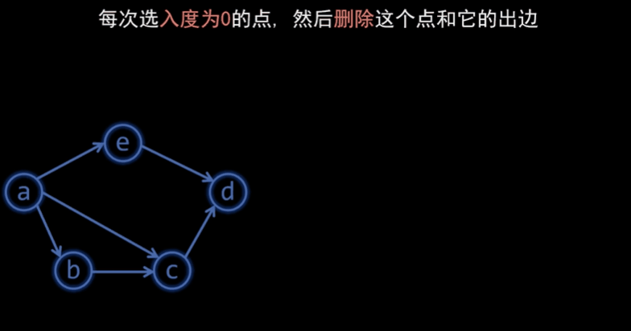
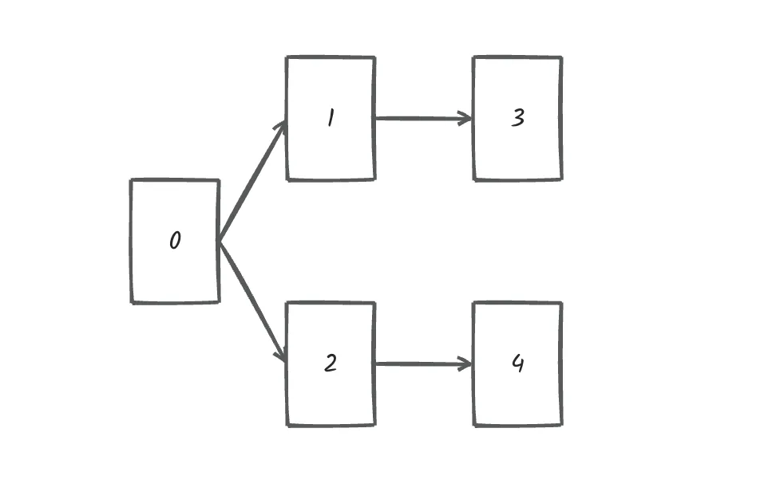

### 二十一、拓扑排序

#### 1、基础知识

[代码随想录 (programmercarl.com)](https://programmercarl.com/kamacoder/0117.软件构建.html#拓扑排序的思路)

[图-拓扑排序-bilibili](https://www.bilibili.com/video/BV1XV411X7T7?vd_source=efdaa126e8affd01b06188fe27db7747)

##### （1）使用场景

- **实际场景：**
    1. 在有依赖关系的各个文件中，找到下载的顺序；例如A依赖于B，C依赖于A，则下载顺序应该为：B->A->C；
    2. 大学排课的时候，必须先上A课，再上B课，最后上C课，因此上课顺序为：A->B->C；
- **抽象：**
    1. 在有向无环图中（有向则代表了依赖关系），找到连通所有节点的一条路径（可能不唯一）；
    2. 同时也可以用来**判断有向图中是否存在环**；

##### （2）算法逻辑

1. 在图中**找到入度为0的节点（入度为0代表该节点没有上层依赖）**，将其连同出边一起从图中删除，并将节点加入结果序列；
2. 直至图中节点全部删除，即找到了我们想要的序列；
3. 如果在**图中仍有节点时发现已经没有入度为0的节点，代表图中有环；**
    

#### 2、题目

[117. 软件构建 (kamacoder.com)](https://kamacoder.com/problempage.php?pid=1191)

> ###### 题目描述
>
> 某个大型软件项目的构建系统拥有 N 个文件，文件编号从 0 到 N - 1，在这些文件中，某些文件依赖于其他文件的内容，这意味着如果文件 A 依赖于文件 B，则必须在处理文件 A 之前处理文件 B （0 <= A, B <= N - 1）。请编写一个算法，用于确定文件处理的顺序。
>
> ###### 输入描述
>
> 第一行输入两个正整数 N, M。表示 N 个文件之间拥有 M 条依赖关系。
>
> 后续 M 行，每行两个正整数 S 和 T，表示 T 文件依赖于 S 文件。
>
> ###### 输出描述
>
> 输出共一行，如果能处理成功，则输出文件顺序，用空格隔开。 
>
> 如果不能成功处理（相互依赖），则输出 -1。
>
> ###### 输入示例
>
> ```
> 5 4
> 0 1
> 0 2
> 1 3
> 2 4
> ```
>
> ###### 输出示例
>
> ```
> 0 1 2 3 4
> ```
>
> ###### 提示信息
>
> 文件依赖关系如下：
>
> 
>
> 
>
> 
>
> 所以，文件处理的顺序除了示例中的顺序，还存在
>
> 0 2 4 1 3
>
> 0 2 1 3 4
>
> 等等合法的顺序。

##### （1）注意点

- 从图中删除节点不用真删，标记一下，并将其出边连接的节点入度-1即可；

##### （2）代码

```c++
#include <iostream>
#include <list>
#include <vector>
using namespace std;

#define NodeWithZeroInDegree_DoNotExist -1

typedef int Node;

void printResultSequece(vector<int> &resultSequece)
{
    for (int i = 0; i < resultSequece.size(); i++) {
        if (i == resultSequece.size() - 1) {
            cout << resultSequece[i];
        }
        else {
            cout << resultSequece[i] << " ";
        }
    }
}

Node findNode_WithZeroInDegree(vector<int> &nodeInDegree,
                               vector<bool> &isInTheMap)
{
    for (int i = 0; i < nodeInDegree.size(); i++) {
        if ((nodeInDegree[i] == 0) && isInTheMap[i] == true) {
            return i;
        }
    }
    return NodeWithZeroInDegree_DoNotExist;
}

void handlePossibleCycle(Node nodeWithZeroIndegree, vector<int> &resultSequece,
                         int nodeNum)
{
    bool existCycle =
        (nodeWithZeroIndegree == NodeWithZeroInDegree_DoNotExist) &&
        (resultSequece.size() != nodeNum);
    if (existCycle) {
        resultSequece.clear();
        resultSequece.push_back(-1);
        printResultSequece(resultSequece);
        exit(0);
    }
}

void handleNode_WithZeroInDegree(const Node nodeWithZeroIndegree,
                                 vector<int> &nodeInDegree,
                                 const vector<list<int>> &map,
                                 vector<bool> &isInTheMap,
                                 vector<int> &resultSequece)
{
    for (int i : map[nodeWithZeroIndegree]) {
        nodeInDegree[i]--;
    }
    isInTheMap[nodeWithZeroIndegree] = false;
    resultSequece.push_back(nodeWithZeroIndegree);
}

void solve()
{
    /* 输入 */
    int nodeNum = 0;
    int edgeNum = 0;
    cin >> nodeNum >> edgeNum;

    vector<list<int>> map(nodeNum);
    vector<int> nodeInDegree(nodeNum, 0);
    vector<bool> isInTheMap(nodeNum, true);

    int node1 = 0;
    int node2 = 0;
    for (int i = 0; i < edgeNum; i++) {
        cin >> node1 >> node2;
        map[node1].push_back(node2);
        nodeInDegree[node2]++;
    }
    /* 输入结束 */

    vector<int> resultSequece; // 结果序列

    while (resultSequece.size() < nodeNum) {

        Node nodeWithZeroIndegree =
            findNode_WithZeroInDegree(nodeInDegree, isInTheMap);

        handlePossibleCycle(nodeWithZeroIndegree, resultSequece, nodeNum);

        handleNode_WithZeroInDegree(nodeWithZeroIndegree, nodeInDegree, map,
                                    isInTheMap, resultSequece);
    }

    printResultSequece(resultSequece);
}

int main()
{
    solve();

    system("pause");
    return 0;
}
```

### 二十二、最短路径—dijkstra算法（朴素版）

#### 1、基础知识

##### （1）应用场景：寻找无向单源最短路径，即从一特定节点出发，分别到图中所有其他节点的最短路径；

##### （2）算法逻辑：

1. 寻找当前未访问过的节点中，距离源节点最近的节点（只能从已访问节点走）；
2. 将最近的节点纳入已访问集合（有点像Prim算法，维护已访问和未访问集合）；
3. 由于已访问集合中加入了新节点，因此更新可能接触到的节点及其距离源节点的最短距离；
    

#### 2、题目 

##### （1）注意点

- 注意处理找不到最短路径的情况

    ```c++
    if (minDistance.back() == INT_MAX) {
            cout << -1;
            return;
    }
    ```

##### （2）代码

```c++
#include <climits>
#include <iostream>
#include <vector>
using namespace std;

#define VISITED true
#define UNVISITED false

typedef int Node;
void getInput(int &nodeNum, int &edgeNum, vector<vector<int>> &map)
{
    cin >> nodeNum >> edgeNum;
    map.resize(nodeNum + 1);
    for (int i = 0; i < map.size(); i++) {
        map[i].resize(nodeNum + 1);
    }

    int node1 = 0;
    int node2 = 0;
    int edgeWeight = 0;
    for (int i = 0; i < edgeNum; i++) {
        cin >> node1 >> node2 >> edgeWeight;
        map[node1][node2] = edgeWeight;
    }
}

Node findNearestUnvisitedNode(const vector<int> &minDistance,
                              const vector<bool> &isVisited)
{
    int curMinDistance = INT_MAX;
    Node curNode = 0;
    for (int i = 1; i < minDistance.size(); i++) {
        bool curNode_UnvisitedAndcloser =
            (isVisited[i] == UNVISITED) && (minDistance[i] < curMinDistance);
        if (curNode_UnvisitedAndcloser) {
            curMinDistance = minDistance[i];
            curNode = (Node)i;
        }
    }
    return curNode;
}

void putNodeInVisited(Node newAddedNode, vector<bool> &isVisited)
{
    isVisited[newAddedNode] = VISITED;
}

void updateMinDistance(int newAddedNode, const vector<vector<int>> &map,
                       vector<int> &minDistance)
{
    for (int i = 1; i < map[0].size(); i++) {
        bool thereIsShorterPath = (map[newAddedNode][i] != 0) &&
                                  ((minDistance[newAddedNode] +
                                    map[newAddedNode][i]) < minDistance[i]);
        if (thereIsShorterPath) {
            minDistance[i] = minDistance[newAddedNode] + map[newAddedNode][i];
        }
    }
}

void printResult(const vector<int> &minDistance)
{
    // 注意处理找不到最短路径的情况
    if (minDistance.back() == INT_MAX) {
        cout << -1;
        return;
    }
    cout << minDistance.back();
}

void solve()
{
    int nodeNum = 0;
    int edgeNum = 0;
    vector<vector<int>> map(nodeNum + 1, vector<int>(nodeNum + 1));

    getInput(nodeNum, edgeNum, map);

    vector<int> minDistance(nodeNum + 1, INT_MAX);
    minDistance[1] = 0;
    vector<bool> isVisited(nodeNum + 1, UNVISITED);

    int loops = nodeNum;
    while (loops--) {

        Node NearestUnvisitedNode =
            findNearestUnvisitedNode(minDistance, isVisited);

        putNodeInVisited(NearestUnvisitedNode, isVisited);

        updateMinDistance(NearestUnvisitedNode, map, minDistance);

    }
    printResult(minDistance);
}

int main()
{
    solve();

    system("pause");
    return 0;
}
```

