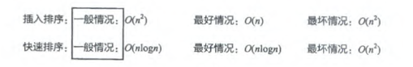
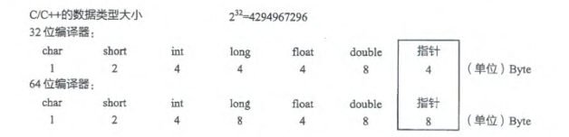
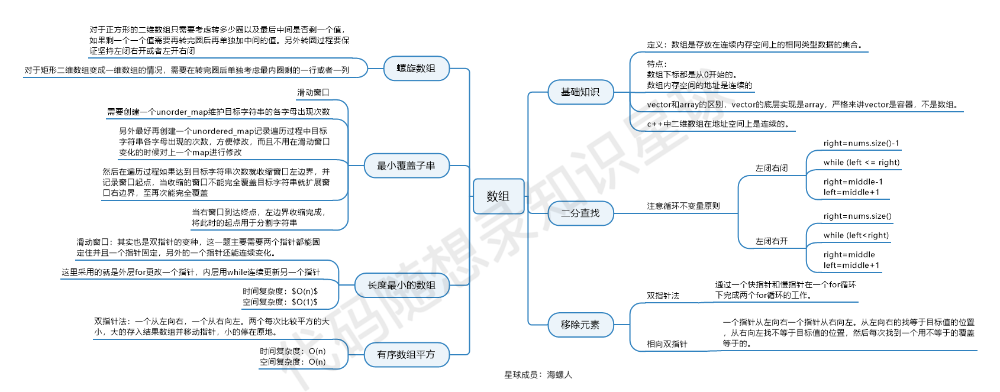
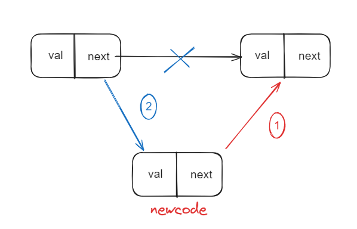
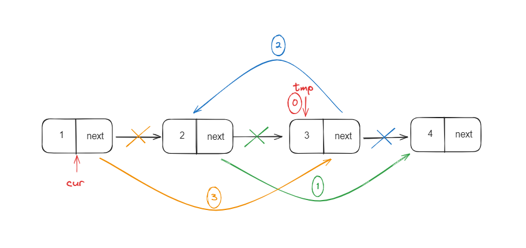
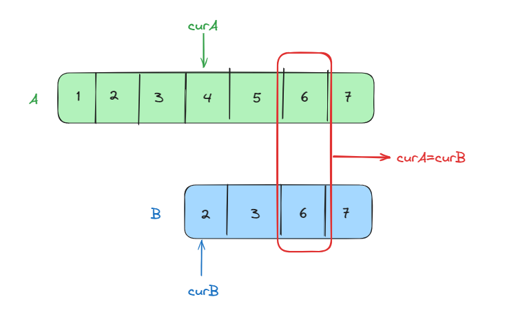

# 《代码随想录》 笔记

[MrYoungg/Random-Thoughts-of-Code: 代码随想录-刷题笔记 (github.com)](https://github.com/MrYoungg/Random-Thoughts-of-Code)

# chap 2 程序性能分析

## 1、时间复杂度

### （1）大O的定义

1. 《算法导论》中的严格定义是指算法时间复杂度的上界（即最差情况），但日常定义中通常指一般情况；
    
2. 时间复杂度的本质
    - 时间复杂度本质是个函数y=f(n)，其中y是算法执行的代码总行数，n是数据的规模；
    - O(1)代表着f(n)是常函数，O(logn)代表着f(n)是对数函数（底数无关，仅考虑趋势），O(n)代表着f(n)是一次函数...以此类推；f(n)仅为趋势函数，考虑最高次项即可；


### （2）递归思想剖析

1. **主要思想**：逆向思维，要解决某个多层问题，先解决其下一层的简单问题，直至推导到最简的已解决问题——类比数学归纳法；

2. **实例**
   
    1. **求斐波那契数列的某项**
    
        ```c++
        // 递归计算斐波那契数列第n项
        // Part 0：函数定义——既能用于原问题也能用于子问题
        int Fibonacci(int n)
        {
            // part 1：确定递归的反弹条件（最简、已解决的子问题）
            if (n == 0)
            {
                return 0;
            }
            if (n == 1)
            {
                return 1;
            }
        
            // Part 2: 递归调用--先解决更简一层的子问题
            int tmp1 = Fibonacci(n - 1);
            int tmp2 = Fibonacci(n - 2);
        
            // Part 3：递推到当前层
            return tmp1 + tmp2;
        }
        
        ```
    
    2. **求某个数的阶乘**
    
        ```c++
        // 计算n的阶乘
        int Factorial(int n)
        {
            // Part 1:反弹条件
            if (n == 1)
            {
                return 1;
            }
            if (n == 0)
            {
                return 1;
            }
        
            // Part 2:递归调用
            int tmp = Factorial(n - 1) * n;
        
            // Part 3：递推到当前层
            return tmp;
        }
        ```

### （3）递归的时间复杂度分析

1. 递归时间复杂度=每次递归调用的复杂度×递归的深度（即递归次数）；

2. 举例：上述求斐波那契数的递归算法中，每次递归的时间复杂度为2，共递归了n次，则时间复杂度为O(2^n)，呈指数级别的增长！！

    ```c++
    //优化,关键在于减少一次递归
    int Fibonacci(int first,int second,int n)
    {
        if(n<=0)
        {
            return 0;
        }
        if(n<3)
        {
            return 1;
        }
        else if(n==3)
        {
            return first+second;
        }
        else
        {
            return Fibonacci(second,second+firts,n-1);
        }
    }
    ```

## 2、程序内存

### （1）程序运行时内存管理

1. **固定部分**
    1. 代码段：存储程序的二进制代码；
    2. 数据段：已初始化的全局变量、静态变量、常量；
    3. BSS段：未初始化的上述变量；
2. **动态变化部分**
    1. 堆：程序员自己分配（在C/C++中需要手动释放）；
    2. 栈：存放函数调用过程中出现的传入参数、局部变量、返回值；

### （2）内存空间

1. 变量所占空间大小
    
2. 为什么要有内存对齐
    1. 平台原因：不是所有的硬件平台都能随机寻址，某些平台只能在特定的地址下访问特定的数据类型；
    2. 硬件架构原因——提升性能
        - CPU数据总线有一定的宽度，通常是32bits或64bits，因此可以同时读取4B或8B的数据，如果内存空间对齐良好，那么CPU一次就可以读取一整个int变量；如果对齐性较差，一个int则需要分两次读取再合并，显然效率较低；
        - 现代计算机都有缓存设计，缓存的读取是以缓存行为单位的，通常一行是64B或更大，对齐能够尽量保证想要读取的数据不会被拆分到两行，读取效率更高；

## 3、空间复杂度

### （1）空间复杂度的定义

1. 空间复杂度不考虑程序**可执行文件**的大小，仅考虑运行时占用的内存；
2. 运行时大小受以下因素影响：动态库的链接、动态内存分配、栈的增长等；
3. 和时间复杂度类似，空间复杂度本质也是函数y=f(n)，n仍为数据规模，y为算法所占内存空间大小（可以以字节为单位），f(n)是趋势函数，仅考虑最高次项；

### （2）以空间换时间是常见的操作

1. **要求**：给出n个小写字母a~z的集合，找出出现次数最多的字母，并输出该字母；

2. **暴力解法**：两层for循环查找；

    ```c++
    void func(const vector<char>& a)
    {
        char result;//记录出现次数最多的字母
        int max_num=0;//记录最多的出现次数
        
        for(int i = 0; i < a.size(); i++)
        {
            int tmp_num=0;//记录a[i]出现的次数
            for(int j = 0; j < a.size(); j++)
            {
                if(a[i]==a[j])
                {
                    tmp_num++;//a[i]出现的次数+1
                }
            }
            if(tmp_num > max_num)//判断a[i]是不是当前出现最多的字母
            {
                max_num = tmp_num;
                result=a[i];
            }
        }
    }
    ```

3. **用空间换时间**：定义长度为26的数组存储每个字母出现的次数；

    ```c++
    void func(const vector<char>& a)
    {
        int times_record[26]={0};//记录26个字母出现的次数
        char result;
        int max_num;
        
        for(int i = 0;i < a.size();i++)
        {
            times_record[a[i]-'a']++;
        }
        
        for(int i=0;i<26;i++)
        {
            if(time_record[i]>max_num)
            {
                max_num=time_record[i];
                result=i+'a';
            }
        }
    }
    ```

    

# chap 3 数组

## 一、二分查找

[704. 二分查找](https://leetcode.cn/problems/binary-search/description/)

[代码随想录文章](https://programmercarl.com/0704.%E4%BA%8C%E5%88%86%E6%9F%A5%E6%89%BE.html)

[代码随想录视频讲解](https://www.bilibili.com/video/BV1fA4y1o715)

### 1、概述

​    背景：在有序数组中，寻找目标值；

​    思想：通过判断数组中间值是否和目标值相等，更新搜索区间，直到找到目标值或搜索结束；

​    时间复杂度：O(log n)；

​    空间复杂度：O(1)；

### 2、注意点

1. 右区间初始值是 **nums.size()** 还是 **nums.size()-1** ？
2. while循环的判断条件是**left<right** 还是 **left<=right** ？
3. 区间边界更新值left（right）=**middle** 还是**middle+1（middle-1）**？

### 3、决定因素——自定义的区间特性

#### （1）左闭右闭

​	① 右区间初始值为nums.size()-1；

​	② left<=right为合法区间，以此为循环判断条件；

​	③ 因为区间包含边界值，更新边界时left=middle+1，right=middle-1；

#### （2）左闭右开

​	① 右区间初始值为nums.size()；

​	② left<=right为不合法区间，应以left<right为循环判断条件；

​	③ 因为左区间包含边界值，更新边界时left=middle+1；

​	④ 但右区间不包含边界值，更新边界时right=middle；

### 4、代码

```c++
class Solution {
public:
    int search(vector<int>& nums, int target) {
        int left=0,right=nums.size()-1;//左闭右闭写法
        while(left<=right){
            int middle=(left+right)/2;
            if(target>nums[middle]){
                left=middle+1;
            }
            else if(target<nums[middle]){
                right=middle-1;
            }
            else{
                return middle;
            }
        }
       return -1;
    }
};
```

### 5、其他题目

#### （1）搜索插入位置

[ 力扣题目链接：搜索插入位置 ](https://leetcode.cn/problems/search-insert-position/)

1. 概述：给定一个排序数组和一个目标值，在数组中找到目标值，并返回其索引。如果目标值不存在于数组中，返回它将会被按顺序插入的位置。
2. 思想：利用有序数组，采用二分法，分析后发现只有四种可能情况
    1. 在数组中找到目标值：直接在while循环中返回
    2. 在数组首位加入目标值
    3. 在数组中间加入目标值
    4. 在数组末尾加入目标值
    5. **经分析，后三种情况均应返回left值**

#### （2）在排序数组中查找元素的第一个和最后一个位置

[34.在排序数组中查找元素的第一个和最后一个位置](https://programmercarl.com/0034.在排序数组中查找元素的第一个和最后一个位置.html)

#### （3）x的平方根

[69.x 的平方根](https://leetcode.cn/problems/sqrtx/)

#### （4）有效的完全平方数

[367.有效的完全平方数](https://leetcode.cn/problems/valid-perfect-square/)

## 二、移除元素——快慢指针

[27. 移除元素](https://leetcode.cn/problems/remove-element/)

[代码随想录文章讲解](https://programmercarl.com/0027.%E7%A7%BB%E9%99%A4%E5%85%83%E7%B4%A0.html)

[代码随想录视频讲解](https://www.bilibili.com/video/BV12A4y1Z7LP)

### 1、概述

#### （1）题目

​		给定一个数组nums和目标值val，在nums其中找到并删除val，并返回最后剩下的数组的长度，要求只能在原数组中操作。

#### （2）思考

​		考虑一下，为什么题目不要求返回移除元素后的数组？事实上数组中的元素是不能被删除的，只能被覆盖，而且其在内存空间上连续分布，返回数组意义不大；

### 2、思想

#### （1）暴力解法

1. 外层for循环遍历数组，内层for循环覆盖数组中与val相等的元素；

2. 代码

    ```c++
    class Solution
    {
        public:
        int removeElement(vector<int> &nums, int val)
        {
            int size = nums.size();
        	for (int i = 0; i < size; i++)
        	{
            	if (nums[i] == val) // 找到等于val的数组元素
            	{
                	for (int j = i; j < size - 1; j++)
                	{
                    	nums[j] = nums[j + 1]; // 将其覆盖
                	}
                	i--;
                	size--;
            	}
        	}
        	return size;
        }
        
    }
    ```

    

#### （2）双指针法——快慢指针

1. **思想**

    1. 定义两个指针（fast、slow），fast指针依次指向数组的每个元素，slow指针指向的是更新之后数组的下标。

    2. 若快指针指向的元素 **不等于** val，则将该元素的值赋给慢指针所指向的下标（放入更新数组中）；

    3. 若快指针指向的元素 **等于** val，则快指针继续后移，跳过该元素（不放入更新数组中）。

        

2. **代码**

    1. **自敲**

        ```c++
        class Solution {
        public:
            int removeElement(vector<int>& nums, int val) {
            
            int fast = 0;
            int slow = 0;
        
            while (fast < nums.size())
            {
                while (nums[fast] == val)//数组中的元素等于val
                {
                    fast++;//fast动，slow不动
                    if (fast == nums.size())
                    {
                        return slow;
                    }
                }
                nums[slow] = nums[fast];//将slow的值和fast的值同步
                fast++;
                slow++;
            }
            return slow;
            }
        };
        ```

    2. **优化**

        ```c++
        class Solution {
        public:
            int removeElement(vector<int>& nums, int val) {
                
            int fast = 0;//快指针
            int slow = 0;//慢指针
            while (fast < nums.size())
            {
        
                if (nums[fast] != val)//此处判断考虑不等于的情况更简洁
                {
                    nums[slow] = nums[fast];
                    fast++;
                    slow++;
                    continue;
                }
                fast++;
            }
            return slow;
        }
        };
        ```

### 4、其他题目

#### （1）删除排序数组中的重复项

[26.删除排序数组中的重复项](https://leetcode.cn/problems/remove-duplicates-from-sorted-array/)

#### （2）移动0

[283.移动零](https://leetcode.cn/problems/move-zeroes/)

## 三、有序数组的平方

[977.有序数组的平方](https://leetcode.cn/problems/squares-of-a-sorted-array/)

[代码随想录文章讲解](https://programmercarl.com/0977.%E6%9C%89%E5%BA%8F%E6%95%B0%E7%BB%84%E7%9A%84%E5%B9%B3%E6%96%B9.html)

[代码随想录视频讲解](https://www.bilibili.com/video/BV1QB4y1D7ep)

### 1、概述

​		给你一个按 **非递减顺序** 排序的整数数组 `nums`，返回 **每个数字的平方** 组成的新数组，要求也按 **非递减顺序** 排序。

### 2、思想

1. 观察数组结构不难发现，平方后较大的数必然在数组两头（首尾），考虑双指针法（前后指针）;
2. 定义一个新数组result，k指针初始指向result的末尾（因为新数组也要非递减排序）;
3. 前指针（front）初始指向nums首个元素，后指针（back）初始指向nums末尾元素，判断nums[front]^2和nums[back]^2的大小关系，将较大的移入result中，更新k值，同时更新front和back值。


### 3、代码

```c++
class Solution {
public:
    vector<int> sortedSquares(vector<int>& nums) {
    
     // 定义储存结果的数组
    vector<int> result(nums.size(), 0);

    // 定义头尾指针
    int head = 0;
    int tail = nums.size() - 1;

    // 定义结果数组指针，从末尾开始遍历；
    int result_p = result.size() - 1;

    // 循环判断，平方值较大的放入result中；尾指针小于头指针时停止循环；
    while (head <= tail)
    {
        if (nums[head] * nums[head] >
            nums[tail] * nums[tail])
        {
            result[result_p] = nums[head] * nums[head];//注意要用平方后的值替代
            head++;
        }
        else
        {
            result[result_p] = nums[tail] * nums[tail];//注意要用平方后的值替代
            tail--;
        }
        result_p--;//注意结果数组指针是--
    }
    return result;
}
};
```

### 4、注意点

- while循环必须包含front=back的情况，否则会遗漏front=back同时指向的元素；
- result数组应该从后往前遍历；

## 四、长度最小的子数组

[209.长度最小的子数组](https://leetcode.cn/problems/minimum-size-subarray-sum/)

[文章讲解](https://programmercarl.com/0209.%E9%95%BF%E5%BA%A6%E6%9C%80%E5%B0%8F%E7%9A%84%E5%AD%90%E6%95%B0%E7%BB%84.html)

[视频讲解](https://www.bilibili.com/video/BV1tZ4y1q7XE)

### 1、概述

1. 给定一个含有 n个正整数的数组和一个正整数 target **。**
2. 找出该数组中满足 **其总和大于等于 target** 的长度最小的 **连续子数组** [numsl, numsl+1, ..., numsr-1, numsr] ，并返回其长度**。**如果不存在符合条件的子数组，返回 0 。

**示例 ：**

```
输入：target = 7, nums = [2,3,1,2,4,3]
输出：2
解释：子数组 [4,3] 是该条件下的长度最小的子数组。
```

### 2、题解

1. **暴力解法——双循环（超出时间限制）**

    ```c++
    class Solution {
    public:
        int minSubArrayLen(int target, vector<int>& nums) {
            int head = 0;           // 子数组头
            int tail = 0;           // 子数组末尾
            int length = INT32_MAX; // 子数组长度
    
            for (head; head < nums.size(); head++)
            {
                int sum = 0; // 子数组的和
                for (tail = head; tail < nums.size(); tail++)
                {
                    sum = sum + nums[tail];
                    if (sum >= target)
                    {
                        length = ((tail - head + 1) < length) ? (tail - head + 1) : length;
                        // cout << "head:" << head<<" ";
                        // cout << "tail:" << tail << " ";
                        // cout<<"length:"<<length<<endl;
                        break;//找到符合的即可跳出内层循环，不需要再关注更长的子数组
                    }
                }
            }
            return length == INT32_MAX ? 0 : length;
        }
    };
    ```

    

2. **优化解法——滑动窗口**

    1. 题目需要找到最短的连续子串，考虑滑动窗口（Slid Window），本质上也是双指针。

    2. 左边缘（left）和右边缘（right）分别指向滑动窗口的首尾元素，初始时均指向nums首元素，窗口长度Win_Length（Tail-Head+1）为1；定义Sum为窗口内元素的和，初始值为0。

    3. **自敲——26行有问题**

        ```c++
        class Solution
        {
        public:
            int minSubArrayLen(int target, vector<int> &nums)
            {
        
                int left = 0;
                int right = 0;
                int length = INT32_MAX;
                int sum = 0;
        
                while (right < nums.size())
                {
                    if (sum >= target)
                    {
                        length = (right - left + 1) < length ? (right - left + 1) : length;
                        sum -= nums[left];
                        cout << "left:" << left << " ";
                        cout << "right:" << right << " ";
                        cout << "sum:" << sum << " ";
                        cout << "length:" << length << endl;
                        left++;
                    }
                    else
                    {
                        right++; // 无法在right++的同时保证不越界
                        sum += nums[right];
                    }
                }
                return length == INT32_MAX ? 0 : length;
            }
        };
        ```
    4. **优化——AC**
    
        ```c++
        class Solution
        {
        public:
            int minSubArrayLen(int target, vector<int> &nums)
            {
                int left = 0;
                int right = 0;
                int length = INT32_MAX;
                int sum = 0;
        
                for (right; right < nums.size(); right++) // right在++的同时能够保证不越界
                {
                    sum += nums[right]; // 保证每次right++的同时sum改变
                    while (sum >= target)
                    {
        
                        length = (right - left + 1) < length ? (right - left + 1) : length;
                        // cout << "left:" << left << " ";
                        // cout << "right:" << right << " ";
                        // cout << "sum:" << sum << " ";
                        // cout << "length:" << length << endl;
                        sum -= nums[left];
                        left++;
                    }
                }
                return length == INT32_MAX ? 0 : length;
            }
        };
        ```

### 3、注意点

1. 在for循环中判断并更新right，可以保证right每次的++都不越界；
2. 善用双目运算符（：？）来取代if...else...逻辑；

## 五、螺旋矩阵Ⅱ

[59.长度最小的子数组](https://leetcode.cn/problems/spiral-matrix-ii/)

[文章讲解](https://programmercarl.com/0059.%E8%9E%BA%E6%97%8B%E7%9F%A9%E9%98%B5II.html)

[视频讲解](https://www.bilibili.com/video/BV1SL4y1N7mV/)

### 1、概述

​    给你一个正整数 n ，生成一个包含 1 到 n2 所有元素，且元素按顺时针顺序螺旋排列的 n x n 正方形矩阵 。

​    **示例 1：**


### 2、思想

1. 按照：上行、右列、下行、左列的顺序一圈圈依次给n阶矩阵赋值，若n为单数则在最后单独给矩阵中间位置赋值。

2. 关键在于考虑循环不变量：每一行（列）都遵循一种赋值方式——左闭右开或左开右闭。如左闭右开：当前行（列）的首个元素由当前行负责赋值，最后一个元素由下一列（行）负责赋值。
    

3. **自敲代码**

    ```c++
    #include <iostream>
    using namespace std;
    #include <vector>
    class Solution
    {
    public:
        vector<vector<int>> generateMatrix(int n)
        {
    
            // 声明且初始化数组，如果不初始化则不能直接用“=”赋值，需要用push_back
            vector<vector<int>> result(n, vector<int>(n, 0));
    
            int loops = n / 2;      // 循环次数（转几圈）
            int edge_loops = n - 1; // 每条边需要循环的次数（所谓的循环不变量！）个人感觉比用offset更简洁
            int current_row = 0;    // 当前行
            int current_col = 0;    // 当前列
            int current_num = 1;    // 填入的数字
    
            for (int i = 0; i < loops; i++)
            {
                // 上边
                for (int j = 0; j < edge_loops; j++)
                {
                    cout << "row:" << current_row << "; ";
                    cout << "col:" << current_col << "; ";
                    cout << "num:" << current_num << endl;
                    result[current_row][current_col] = current_num;
                    current_num++; // 填入的数字每次++
                    current_col++; // 改变列，行不变
                }
    
                // 右边
                for (int j = 0; j < edge_loops; j++)
                {
                    cout << "row:" << current_row << "; ";
                    cout << "col:" << current_col << "; ";
                    cout << "num:" << current_num << endl;
                    result[current_row][current_col] = current_num;
                    current_num++; // 填入的数字每次++
                    current_row++; // 改变行，列不变
                }
    
                // 下边
                for (int j = 0; j < edge_loops; j++)
                {
                    cout << "row:" << current_row << "; ";
                    cout << "col:" << current_col << "; ";
                    cout << "num:" << current_num << endl;
                    result[current_row][current_col] = current_num;
                    current_num++;
                    current_col--; // 改变列，行不变
                }
    
                // 左边
                for (int j = 0; j < edge_loops; j++)
                {
                    cout << "row:" << current_row << "; ";
                    cout << "col:" << current_col << "; ";
                    cout << "num:" << current_num << endl;
                    result[current_row][current_col] = current_num;
                    current_num++;
                    current_row--; // 改变行，列不变
                }
    
                // 将当前的行、列转移到内一层
                current_row++;
                current_col++;
                // 每条边的循环次数减2
                edge_loops -= 2;
            }
    
            // 处理中间的方格（n为单数时才存在）
            if (n % 2 == 1)
            {
                result[n / 2][n / 2] = n * n; // 赋值的数组索引为(n/2,n/2),列一下就找到规律了
            }
    
            return result;
        }
    };
    ```

### 3、注意点

1. 用vector创建二维数组：`vector<vector<int>> Result(n,vector<int>(n,0));`必须初始化，否则**不能用“=”逐元素赋值**，要用**push_back()方法**；
2. 每一行（列）都遵循一种赋值方式——**左闭右开（笔者选取）**或左开右闭；
3. 每转一圈，行、列均**+1**，每条边上的循环次数**-2**；
4. 最中间的位置，索引应该为**(n/2,n/2)**；n=1,(0,0)；n=3,(1,1)；n=5,(2,2)；

### 5、其他题目

#### （1）螺旋遍历二维数组

[力扣题目链接：螺旋遍历二维数组](https://leetcode.cn/problems/shun-shi-zhen-da-yin-ju-zhen-lcof/submissions/490202066/)

## 六、总结

### 1、二分查找

关键在于循环条件（或者说跳出循环的条件）的确定；

### 2、移除元素

快慢指针的思想，事实上可以将慢指针看成指向一个空数组的指针，更好理解；

### 3、有序数组的平方

注意观利用题目给出的条件，利用其两头大中间小的特点，头尾指针解决；

### 4、长度最小子数组

两层循环可以看成滑动窗口的冗余版，每次窗口前沿移动时，后沿都需要从前沿开始遍历；删掉这部分冗余即可；

### 5、螺旋矩阵

紧抓每次循环中的循环不变量！！



# chap 4 链表

### 一、移除链表元素

[203. 移除链表元素 - 力扣（LeetCode）](https://leetcode.cn/problems/remove-linked-list-elements/)

[文章题解](https://programmercarl.com/0203.移除链表元素.html#算法公开课)

[视频题解](https://www.bilibili.com/video/BV18B4y1s7R9/)

#### 1、关键思想

1. 为链表设置**虚拟头结点**，使得头结点的删除与其他节点归一化；
2. 注意最后要返回**虚拟头结点的next节点**；

#### 2、代码

```c++
/**
 * Definition for singly-linked list.
 * struct ListNode {
 *     int val;
 *     ListNode *next;
 *     ListNode() : val(0), next(nullptr) {}
 *     ListNode(int x) : val(x), next(nullptr) {}
 *     ListNode(int x, ListNode *next) : val(x), next(next) {}
 * };
 */
class Solution {
public:
    ListNode* removeElements(ListNode* head, int val) {
        // 设置虚拟头结点
        ListNode *dummy_head = new ListNode(0, head);
        ListNode *cur_node = dummy_head;

        // 删除元素
        while (cur_node->next != nullptr)
        {
            if (cur_node->next->val == val)
            {
                ListNode *tmp = cur_node->next;
                cur_node->next = cur_node->next->next;
                delete tmp;
            }
            else
            {
                cur_node = cur_node->next;
            }
        }
        head = dummy_head->next;
        delete dummy_head;
        return head;
    }
};
```

### 3、注意点

1. C++的结构体中，`ListNode(int x, ListNode *next) : val(x), next(next)`是带有结构体**“成员初始化列表”**的构造函数；
2. new作为运算符可以放在构造函数之前，意味着调用相应的构造函数及其参数列表初始化该结构体类型的对象，并返回指向该对象的指针；例如`ListNode *dummy_head = new ListNode(0, head);`；

### 二、设计链表

[707. 设计链表 - 力扣（LeetCode）](https://leetcode.cn/problems/design-linked-list/submissions/537956653/)

[文字题解](https://programmercarl.com/0707.设计链表.html#思路)

[视频题解](https://www.bilibili.com/video/BV1FU4y1X7WD)

#### 1、注意点

1. 涉及到第n个节点的值时，注意判断n的合法性；

2. 在第n个节点前插入节点时，保证cur->next指向第n个节点（这样才能成功操作插入），分两步走;
    

3. 注意在private中添加成员：

    ```c++
    ListNode *_dummy_head;
    int _size;
    ```
4. 提交时删除调试的cout代码，否则可能导致超时；
#### 2、代码实现

```c++
class MyLinkedList
{
public:
    struct ListNode
    {
        int val;
        ListNode *next;
        ListNode(int val, ListNode *next) : val(val), next(next){};
    };

    MyLinkedList()
    {
        _dummy_head = new ListNode(0, nullptr);
        _size = 0;
    }

    // 获取索引为index的链表节点的val
    // 如果index无效，返回-1
    int get(int index)
    {
        // cout << "get start:";
        // printList(_dummy_head);

        ListNode *cur = _dummy_head;
        if (index > _size - 1 || index < 0)
        {
            return -1;
        }
        while (index != 0)
        {
            cur = cur->next;
            index--;
        }

        // cout << "get end:";
        // cout << "get val:" << cur->next->val << " ";
        // printList(_dummy_head);
        return cur->next->val;
    }

    // 在头部插入值为val的节点
    void addAtHead(int val)
    {
        // cout << "addAtHead start:";
        // printList(_dummy_head);

        ListNode *new_node = new ListNode(val, nullptr);
        new_node->next = _dummy_head->next;
        _dummy_head->next = new_node;
        _size++;

        // cout << "addAtHead end:";
        // printList(_dummy_head);
    }

    // 在链表尾部插入元素
    void addAtTail(int val)
    {
        // cout << "addAtTail start:";
        // printList(_dummy_head);

        ListNode *cur = _dummy_head;
        ListNode *new_node = new ListNode(val, nullptr);
        while (cur->next != nullptr)
        {
            cur = cur->next;
        }
        cur->next = new_node;
        _size++;

        // cout << "addAtTail end:";
        // printList(_dummy_head);
    }

    // 在第index个节点前插入值为val的节点；
    // 如果index小于0或index大于链表长度，则直接返回空
    // 要保证cur->next指向index节点，才能利用cur插入节点
    void addAtIndex(int index, int val)
    {
        // cout << "addAtIndex start:";
        // printList(_dummy_head);

        if (index < 0 || index > _size)
        {
            return;
        }
        ListNode *cur = _dummy_head;
        ListNode *new_node = new ListNode(val, nullptr);
        while (index != 0)
        {
            cur = cur->next;
            index--;
        }
        new_node->next = cur->next;
        cur->next = new_node;
        _size++;

        // cout << "addAtIndex end:";
        // printList(_dummy_head);
    }

    // 删除第index个结点，如果下标无效，直接返回空
    void deleteAtIndex(int index)
    {
        // cout << "deleteAtIndex start:";
        // cout << "size:" << _size << endl;
        // printList(_dummy_head);
        if (index < 0 || index > _size - 1)
        {
            return;
        }
        ListNode *cur = _dummy_head;
        while (index != 0)
        {
            cur = cur->next;
            index--;
        }
        ListNode *tmp = cur->next;
        cur->next = cur->next->next;
        delete tmp;
        tmp = nullptr;
        _size--;

        // cout << "deleteAtIndex end:";
        // printList(_dummy_head);
    }

private:
    ListNode *_dummy_head;
    int _size;

    void printList(ListNode *head)
    {
        ListNode *cur = head;
        while (cur->next != nullptr)
        {
            cout << cur->next->val << "->";
            cur = cur->next;
        }
        cout << endl;
    }
};

/**
 * Your MyLinkedList object will be instantiated and called as such:
 * MyLinkedList* obj = new MyLinkedList();
 * int param_1 = obj->get(index);
 * obj->addAtHead(val);
 * obj->addAtTail(val);
 * obj->addAtIndex(index,val);
 * obj->deleteAtIndex(index);
 */
```

### 三、翻转链表

#### 1、主要思想

1. 双指针，注意tmp暂存节点；

#### 2、代码

```c++
class Solution
{
public:
    ListNode *reverseList(ListNode *head)
    {
        ListNode *cur = head;
        ListNode *pre = NULL;

        while (cur != nullptr)
        {
            ListNode *tmp = cur->next;
            cur->next = pre;
            pre = cur;
            cur = tmp;
        }
        return pre;
    }
};
```

### 四、两两交换链表中的节点

[24.两两交换链表中的节点](https://leetcode.cn/problems/swap-nodes-in-pairs/)****

[文章题解](https://programmercarl.com/0024.两两交换链表中的节点.html#算法公开课)

[视频题解](https://www.bilibili.com/video/BV1YT411g7br/?vd_source=1e61d896f0ce15962eab39c0507f505d)

#### 1、解题思路

如下解法可以仅使用一个tmp值；



#### 2、注意点

1. 可以将循环条件设置为`while(cur->next != nullptr && cur->next->next != nullptr)`；在C++中，&&运算符是从左至右运算的，且while循环有短路特性，若`cur->next==nullptr `，则不会再判断后续条件，因此不会导致空指针访问；

2. 也可以如下，但else分支一定要写；

    ```c++
    while(cur->next!=nullptr)
    {
        if(cur->next->next!=nullptr)
        {
            ...
        }
        else
        {
            break;//必须要有else语句的break，否则在奇数个节点时会陷入死循环；
        }
    }
    ```

    

#### 3、代码

```c++
/**
 * Definition for singly-linked list.
 * struct ListNode {
 *     int val;
 *     ListNode *next;
 *     ListNode() : val(0), next(nullptr) {}
 *     ListNode(int x) : val(x), next(nullptr) {}
 *     ListNode(int x, ListNode *next) : val(x), next(next) {}
 * };
 */
class Solution {
public:
    ListNode* swapPairs(ListNode* head) {

        ListNode* dummy_head = new ListNode(0,head);
        ListNode* cur = dummy_head;
        
        while(cur->next!=nullptr)
        {
            if(cur->next->next!=nullptr)
            {
                ListNode *tmp=cur->next->next;  // 暂存节点
                cur->next->next=tmp->next;      // 步骤1
                tmp->next=cur->next;            // 步骤2
                cur->next=tmp;                  // 步骤3
                
                cur=cur->next->next;             // 后移
            }
            else
            {
                break;//必须要有else语句的break，否则在奇数个节点时会陷入死循环；
            }
        }

        head=dummy_head->next;
        delete dummy_head;
        return head;
    }
};
```

### 五、删除链表的倒数第n个节点

[9.删除链表的倒数第N个节点](https://leetcode.cn/problems/remove-nth-node-from-end-of-list/)

[代码随想录 (programmercarl.com)](https://programmercarl.com/0019.删除链表的倒数第N个节点.html#算法公开课)

[链表遍历学清楚！ | LeetCode：19.删除链表倒数第N个节点-哔哩哔哩_bilibili](https://www.bilibili.com/video/BV1vW4y1U7Gf/?vd_source=1e61d896f0ce15962eab39c0507f505d)

#### 1、思路

快慢指针，思维惯性是逐个遍历，但事实上可以自行添加标记点；

#### 2、注意点

1. 快指针要走n+1步，保证slow指向被删节点的前一个节点；
2. // 题目说明了：1 <= n <= size，因此不用考虑节点不存在的情况；

#### 3、代码

```c++
/**
 * Definition for singly-linked list.
 * struct ListNode {
 *     int val;
 *     ListNode *next;
 *     ListNode() : val(0), next(nullptr) {}
 *     ListNode(int x) : val(x), next(nullptr) {}
 *     ListNode(int x, ListNode *next) : val(x), next(next) {}
 * };
 */
class Solution
{
public:
    ListNode *removeNthFromEnd(ListNode *head, int n)
    {
        ListNode *dummy_head = new ListNode(0, head);
        ListNode *fast = dummy_head;
        ListNode *slow = dummy_head;

        n += 1; // 快指针提前移动n+1步，使得slow指向被删节点的前一个节点；

        // 先移动快指针
        while (n-- && fast != nullptr)
        {
            fast = fast->next;
        }

        // 快慢指针再一起移动
        while (fast != nullptr)
        {
            slow = slow->next;
            fast = fast->next;
        }
        // 题目说明了：1 <= n <= size，因此不用考虑节点不存在的情况；
        slow->next = slow->next->next;

        head = dummy_head->next;
        return head;
    }
};
```

### 六、链表相交

[面试题 02.07. 链表相交 - 力扣（LeetCode）](https://leetcode.cn/problems/intersection-of-two-linked-lists-lcci/)

[代码随想录 (programmercarl.com)](https://programmercarl.com/面试题02.07.链表相交.html#思路)

#### 1、思路

1. 遍历计算出两个链表的长度；
2. 将长链表的遍历指针与短链表头对齐；
3. 两个数组的指针同步开始遍历，找到相等的指针即找到相交的节点；
    

#### 2、注意点

1. 两个链表谁长谁短需要一个if...else来区别；
2. 计算完链表长度后记得重置cur指针；

#### 3、代码

```c++
/**
 * Definition for singly-linked list.
 * struct ListNode {
 *     int val;
 *     ListNode *next;
 *     ListNode(int x) : val(x), next(NULL) {}
 * };
 */
class Solution {
public:
    ListNode *getIntersectionNode(ListNode *headA, ListNode *headB) {
        ListNode *curA = headA;
        ListNode *curB = headB;
        int lengthA = 0;
        int lengthB = 0;

        // 计算两个链表的长度
        while (curA != nullptr)
        {
            lengthA++;
            curA = curA->next;
        }
        while (curB != nullptr)
        {
            lengthB++;
            curB = curB->next;
        }

        //重置curA和curB！！
        curA = headA;
        curB = headB;

        // A较长
        if (lengthA > lengthB)
        {
            // 计算长度差
            int length_gap = lengthA - lengthB;

            // 将长链表的遍历起点与短链表头对齐
            while (length_gap--)
            {
                curA = curA->next;
            }
        }
        else // B较长
        {
            // 计算长度差
            int length_gap = lengthB - lengthA;

            // 将长链表的遍历起点与短链表头对齐
            while (length_gap--)
            {
                curB = curB->next;
            }
        }

        // 寻找相交节点
        while (curA != curB)
        {
            curA = curA->next;
            curB = curB->next;
            if (curA == nullptr || curB == nullptr) // 没有相交节点
            {
                return nullptr;
            }
        }
        return curA;
    }
};
```

### 七、环形链表

#### 1、思路

1. 如何判断有没有环：快慢指针，快指针速度为2，慢指针速度为1，如果快慢指针会相遇，则代表有环；
2. 如何找到环的入口
    1. 设如下变量
        
    2. 快指针走的路程：`x + y + n (y + z)`，n代表在环中转的圈数；
    3. 慢指针走的路程：`x + y`；
    4. 可以得到等式：`(x + y) * 2 = x + y + n (y + z)`，化简为`x = (n - 1) (y + z) + z`；可以看出，x等于z加上n-1圈，因此，如果慢指针从相遇处继续前进，新的cur指针从头结点前进，它们最终必然会在环的入口节点相遇；

#### 2、注意点

下述代码可以在逻辑上优化， 减少代码量；（如26行所言）

#### 3、代码

```c++
class Solution
{
private:
    int CYCLE = 1;
    int NOCYCLE = 0;

public:
    ListNode *detectCycle(ListNode *head)
    {
        ListNode *fast = head;    // 快指针
        ListNode *slow = head;    // 慢指针
        int cycle_flag = NOCYCLE; // 链表环标志位

        // 判断是否存在环
        while (fast != nullptr && fast->next != nullptr)
        {
            fast = fast->next->next;
            slow = slow->next;
            if (fast == slow)
            {
                cycle_flag = CYCLE;
                break;
            }
        }
		
        //可以将有环部分代码并入到while循环中的if判断内部
        if (cycle_flag == NOCYCLE) // 没有环
        {
            return nullptr;
        }
        else // 有环
        {
            ListNode *cur = head;
            while (cur != slow) // slow从相遇处开始走，cur从head开始走，相遇处即为环的入口
            {
                cur = cur->next;
                slow = slow->next;
            }
            return cur;
        }
   
};
```


# chap 5 哈希表

### 一、哈希表基础知识

[代码随想录 (programmercarl.com)](https://programmercarl.com/哈希表理论基础.html#常见的三种哈希结构)

### 二、有效字母的异位词

[242. 有效的字母异位词 - 力扣（LeetCode）](https://leetcode.cn/problems/valid-anagram/description/)

[代码随想录 (programmercarl.com)](https://programmercarl.com/0242.有效的字母异位词.html#算法公开课)

[学透哈希表，数组使用有技巧！Leetcode：242.有效的字母异位词_哔哩哔哩_bilibili](https://www.bilibili.com/video/BV1YG411p7BA/)

#### 1、思想

1. 定义一个数组（size=26，数组本质上就是一个哈希表，哈希函数为y=x），记录字符串中所有字母出现的次数；
2. 遍历第二个字符串，将出现的字母依次在数组中-1,；
3. 遍历数组，如果数组全为0，代表找到了字母异位词，否则说明不是异位词；

#### 2、注意点

1. 访问数组元素时，下标为str[]-‘a’；

#### 3、代码

```c++
class Solution {
public:
    bool isAnagram(string s, string t) {
        int record[26]={0};
        for(int i=0;i<s.size();i++)
        {
            record[s[i]-'a']++;
        }
        for(int i=0;i<t.size();i++)
        {
            record[t[i]-'a']--;
        }
        for(int i =0;i<26;i++)
        {
            if(record[i]!=0)
            {
                return false;
            }
        }
        return true;
    }
};
```

### 二、两个数组的交集

[349. 两个数组的交集 - 力扣（LeetCode）](https://leetcode.cn/problems/intersection-of-two-arrays/)

[代码随想录 (programmercarl.com)](https://programmercarl.com/0349.两个数组的交集.html#思路)

[学透哈希表，set使用有技巧！Leetcode：349. 两个数组的交集_哔哩哔哩_bilibili](https://www.bilibili.com/video/BV1ba411S7wu/?vd_source=1e61d896f0ce15962eab39c0507f505d)

#### 1、思路

1. 将nums1放入哈希表实现的`unordered_set`中；
    - **set**：有序+不允许重复
    - **unordered_set**：无序+不允许重复
    - **unordered_multiset**：无序+允许重复
2. 遍历nums2，通过`nums1_set.find(num)`寻找nums1中是否存在当前遍历到的元素；
3. 如果存在，将其加入result（即最后输出的子集），result也用`unordered_set`结构，目的是为了去重（unordered_set结构在insert()的时候，不会重复插入）;

#### 2、注意点

1.  `for(int num:nums2)`在C++11中可以用来遍历容器；
2. 可以用begin和end迭代器初始化容器：`unordered_set<int> nums1_set(nums1.begin(),nums1.end());`和`vector<int>(result.begin(),result.end());`

#### 3、代码

```c++
class Solution {
public:
    vector<int> intersection(vector<int>& nums1, vector<int>& nums2) {
        unordered_set<int> result;
        unordered_set<int> nums1_set(nums1.begin(),nums1.end());

        for(int num:nums2)
        {
            if(nums1_set.find(num)!=nums1_set.end())
            {
                result.insert(num);
            }
        }

        return vector<int>(result.begin(),result.end());

    }
};
```

### 三、快乐数

[202. 快乐数 - 力扣（LeetCode）](https://leetcode.cn/problems/happy-number/submissions/538604819/)

[代码随想录 (programmercarl.com)](https://programmercarl.com/0202.快乐数.html#思路)

#### 1、思想

1. 将每次求出来的”各位的平方和“放入一个`unordered_set`中，如果发现已存在，说明发生了循环——不是快乐数；
2. 如果“各位的平方和”出现1，则代表是快乐数；

#### 2、注意点

1. `getSum(int n)`函数的实现；

2. 如何判断record_set中是否已经存在传入的元素

    1. insert()方法会返回一个pair对象，其有两个元素，pair.first：元素插入的位置或已存在的位置；pair.second：true=插入成功，false=元素已存在，插入失败；


    ```c++
    //pair的通用形式
    template <class T1, class T2>
    struct pair {
        T1 first;
        T2 second;
    }
    ```

    1. 也可以通过find()方法实现

    ```c++
    if(record_set.find(num)!=record_set.end())
    {
    	return false;
    }
    else
    {
        record_set.insert(num);
    }
    ```


#### 3、代码

```c++
#include <iostream>
using namespace std;
#include <vector>
#include <unordered_set>

class Solution
{
public:
    int getSum(int n)
    {
        int sum = 0;
        while (n != 0)
        {
            sum += (n % 10) * (n % 10);
            n /= 10;
        }
        return sum;
    }
    bool isHappy(int n)
    {
        unordered_set<int> record_set;
        int num = n;
        while (1)
        {
            num = getSum(num);
            if (num == 1)
            {
                return true;
            }

            // 用flag来承接insert()返回的pair对象；
            // pair.first：元素插入的位置或已存在的位置；
            // pair.second：true=插入成功，false=元素已存在，插入失败；
            auto flag = record_set.insert(num);

            if (flag.second == false)
            {
                return false;
            }
        }
    }
};
```

### 四、两数之和

[1. 两数之和 - 力扣（LeetCode）](https://leetcode.cn/problems/two-sum/description/)

[代码随想录 (programmercarl.com)](https://programmercarl.com/0001.两数之和.html#思路)

[梦开始的地方，Leetcode：1.两数之和，学透哈希表，map使用有技巧！_哔哩哔哩_bilibili](https://www.bilibili.com/video/BV1aT41177mK/)

#### 1、思想

1. 构造一个`unordered_map`，遍历一次数组，在`unordered_map`中寻找是否存在`（target-nums[i]）`；
2. 如果不存在，将当前遍历的元素数据->元素索引以key->value的形式存入`unordered_map`中；
3. 如果存在，证明找到符合要求的两个数，返回i和map中元素的value；

#### 2、注意点

1. record_map.find()方法返回值为：
    1. **元素存在**：指向该元素的迭代器；
    2. **元素不存在**：返回end迭代器；
    3. 值得注意的是，其迭代器的内部实现是**pair对象**，first=key，second=value；
2. 注意遍历完数组后仍未找到，代表无符合的两数，返回空数组；

#### 3、代码

```c++
#include <iostream>
#include <vector>
#include <unordered_map>
using namespace std;

class Solution
{
public:
    vector<int> twoSum(vector<int> &nums, int target)
    {
        unordered_map<int, int> record_map;

        for (int i = 0; i < nums.size(); i++)
        {
            int diff = target - nums[i];
            auto map_flag = record_map.find(diff);

            if (map_flag != record_map.end())
            {
                return {map_flag->second, i};
            }
            else
            {
                record_map.insert(make_pair(nums[i], i));
            }
        }
        return {NULL};
    }
};
```

